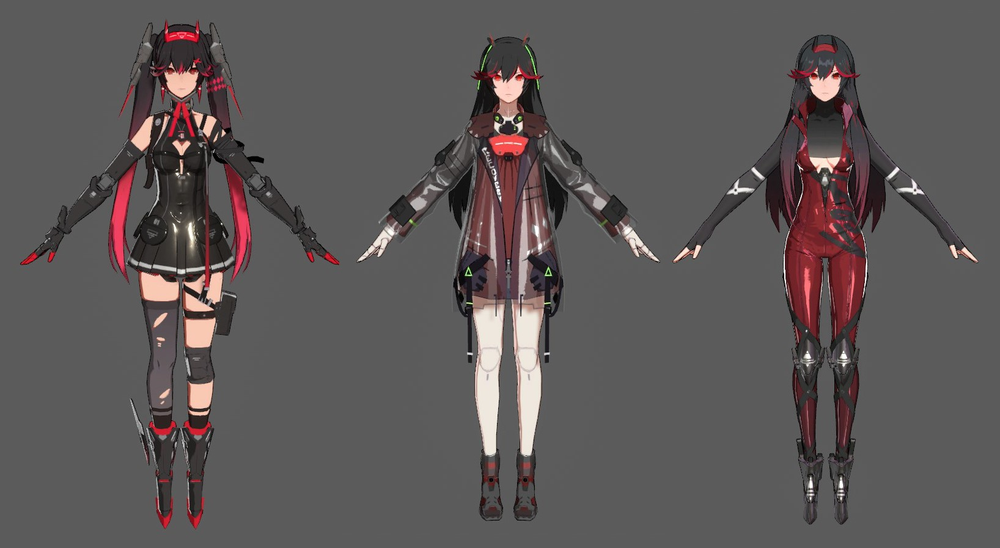

# Toon Shading Collection 二次元角色卡通渲染效果分析收集/速查手册/小百科

*↑自制，二次元著名游戏角色渲染还原……截图镇楼*

---

国内游戏界的大二次元时代已经拉开帷幕，作为渲染狗，是该做好准备迎接变天了。

鉴于卡通渲染资料比较零散，每看一篇文章/研究一份源码，都能发现一些新的取巧骚操作，于是乎想尝试一下能不能全部整理到一起，作为速查手册或小百科使用。另外也可以通过比较不同做法，实现成熟方案的新排列组合或启发全新的灵感。

目前还在编辑中，暂时放在GitHub，可能的话会为此建立有直接目录导航的wiki主页。文字和图片可能有大量纯摘抄，参考文章的链接都会放在附件。本库仅用于知识分享，绝不盈利。

如有错误缺漏，有幸被路过的大佬发现的话，欢迎指正补充。如果有大佬愿意参与共同编辑就更好了，一个人梳理起来还蛮费劲的。

 

------

个人吐槽一下，作为同人原创都搞过的小透明宅，总觉得卡通渲染不一定要追求“跟别人不一样的独特风格”，可能受大众欢迎（有爆火出圈潜力）的画风/渲染效果只有有限的标准答案……

 

------

## [(。・∀・)ノ点击这里开始阅读](/正文)

*已基本完成所有计划章节初稿~目前持续修订中*~

如果图片刷不开，请等待一下再试——或者直接下载整份库再用本地编辑器打开每份MD文档——或者告诉我更好的放图片的方法，不知道为啥GitHub老刷不开图QAQ……

 

---

## TODO：

+ ~~脸部光影新技巧~~
+ ~~更新简化版伪光追相关投影~~
+ ~~勾边分类重新梳理，添加类边缘光式深度差描边~~
+ ~~⚪神角色还原截图替换新版（改深度勾边光）~~
+ ~~透视问题等，新增镜头专门章节~~
+ ~~环境光内容补充~~
+ ~~边缘光修订，风格化部位补充~~
+ ~~眼睛渲染修订~~
+ ~~PBR魔改思路参考更新等~~
+ ~~材质分析思路等~~
+ 更多材质效果罗列
+ ~~后期效果补充~~
+ ~~头发高光补充~~
+ ~~笔触风格化相关滤波器补充~~
+ 
+ 
+ ~~参考文献列表更新1~~
+ 

…… （未完待续）

