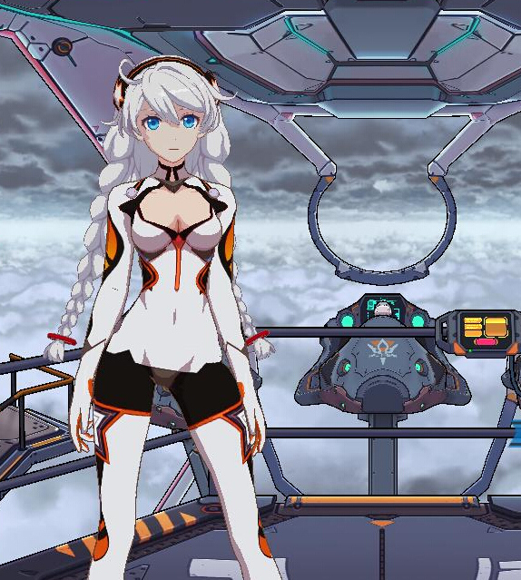

# Toon Shading Collection 

## CH01 - Art Styles 卡通画风概述

先对卡通渲染做大致分类：

------

 **美式卡通：**

着色——

- 色彩比较连续、有渐变色，接近真实感光照。
- 阴影和高光方面通常也有夸张和变形。
- 着色风格很大程度上依赖于艺术家定义的tone色调。

造型——

- 人物造型夸张。

典型例子——《军团要塞2》

------

**日式卡通：**

着色——

- 趋向于大片纯色色块。
- 明暗交界分明。（不连续渐变）

造型——

- 人物造型比美式写实。

典型例子——《崩坏3》

