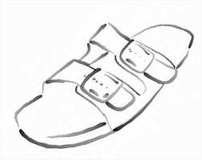

# Toon Shading Collection 

## CH02 - Outline 描边/勾边

*↑来自《GRAVITY DAZE重力眩暈》：角色模型的画线是背面膨胀法，背景的勾边是后处理实现的。*

 

边缘的本质——深度或法线上不连续的位置。

因为很难找到一种方法同时实现良好的内外描边效果，所以通常需要采用多种描边方法配合。

 

------

### 外描边

- #### 基于视角的勾边

**原理：**当视线和表面相切时，这个切点位置附近的像素点就是模型的边缘。这个本质跟rim边缘光相同。

 

**基础公式：** dot(viewDir, normal)^{k} 

点乘结果越接近于0，说明这个表面更大可能是在侧向的视角方向，则我们可以将其当作轮廓边缘进行描边。得出的值可以直接作为“边缘程度”，也可以作为纹理坐标采样预定义的轮廓纹理（颜色渐变）。

  

**优点：**

- 直接在base pass内计算，性能开销极低。

**缺点：**

- 线宽粗细差别大，不易控制。尤其是在较为扁平的表面会变得非常宽。

*↑视角勾边法的不均匀性*

 

**视觉优化：**

- 可以对扁平表面指定更窄的宽度权重，尽量控制勾边粗细。
- 可以以此为基础，添加风格化的渐变映射。
- 有观点建议这类描边可以跟光线方向结合，近光的位置描边细一点。

 

**常见应用场合：**

- 均匀弯曲度的表面，如纯球体
- 风格化的描边，如对粗细要求比较自由的水墨效果。

 

*↑《Okami大神》使用了视角内勾边*

- #### 基于过程几何的描边

**原理：**描边本身是单独几何体，正面模型绘制结束后，改用正面剔除再绘制一遍，此时VS中顶点要沿着法线方向膨胀一定距离，在FS中用纯色输出。

 

**基础公式：**v.vertex.xyz = v.vertex.xyz + v.normal * _OutlineWidth;

 

**优点：**

- 线宽较均匀，也容易做粗细变化。
- 实现简单。
- 容易单独分区指定描边颜色。

**缺点：**

- 很难对面片结构勾边，只对体积结构正常描边。
- 每个需要描边的模型在渲染时都多贡献一个pass，两倍draw call在需描边模型数量过多时有潜在性能影响。
- 描边的宽度会随着物体离相机的远近而变化，描边的宽度现在是相对世界空间不变的，这相机拉近后，描边就会变粗。

 

**视觉优化：**

- 使用mask贴图或顶点色的一个通道值，控制描边宽度大小。

*↑轮廓线可以按照美术的需要去设定逐顶点粗细变化。勾边没有粗细变化（上）和有粗细变化（下）的对比*

- 使用mask贴图或顶点色的一个通道值，为局部调整描边的z深度，越大则描边越不可见。这是为了隐藏一些靠近模型中心的细节。

- 局部裁剪描边，比如眼睛睫毛等部分的描边可以直接舍弃。另外也可以把换成把描边宽度设为0。当然不需要勾边的部位也可以单独建模并且直接不加勾边pass。

- 硬边上的法线分叉导致的勾边断裂问题，要靠合并硬边顶点上不同法线的方向，再把这个修正法线结果存进顶点信息中，模型空间的法线可以存进顶点的NORMAL或TANGENT里，顶点色或其它UV只能存切线空间的法线。

 

**常见应用场合：**角色描边，尤其是日式卡通中，往往需要粗细有变化的描边去体现角色不同部位的特征。

 

 

- ##### 变体1——Z-bias描边

**原理：**分别有2类，①通过在观察空间，将模型沿z轴移动然后绘制描边层来进行实现。②绘制背面，但不膨胀，而是把背面顶点的Z值稍微向前偏移一点点，使得背面的些许部分显示出来形成描边效果。

**缺点：**某些视角下存在瑕疵。

- ##### 变体2——在NDC空间膨胀

**原理：**主要实现方式是将法线转到ndc空间再挤出（忽略深度方向，较扁平化），然后需要注意获得屏幕宽高比，否则描边边缘会出现不均匀的情况。

 

**优点：**

- 描边位置在所有几何描边中维持得最好。
- 解决了了原版算法中描边宽度随相机远近变化的问题。

 

- #### 基于过程几何的描边

**原理：**在图片上查找相邻像素颜色、深度或法线不连续的位置。将原始颜色信息、深度信息、法线信息以贴图的形式传入，运用边缘检测算法寻找这些位置上的像素，最后将按不同方法计算的描边合并起来。

 

**注意：**

- Roberts算子对边缘比较敏感，适合具有陡峭边缘且含噪声少的图像
- Sobel算子对噪声较多的图像处理效果更好

 

**优点：**

- 可以勾勒出足够多的细节。
- 某些算法可以保持描边线宽一致。

**缺点：**

- 后处理的性能压力，需要额外的法线和深度信息。（延迟渲染中，法线和深度已经是G-buffer的一部分，此时不会增加性能负担。）
- 描边出现的位置较难控制，同一套描边参数运用于整个画面，很难根据细节单独控制特定区域的描边细节度，容易出现过度描边。
- 很难对每个物体单独指定描边颜色。

 

**视觉优化：**

- 在进行正常绘制的阶段用stencil     buffer标记出需要描边的物体，然后用一个全屏的后处理，对stencil buffer标记的像素进行边缘检测。
- 可以对边缘检测结果再进行一次模糊处理，借此来扩大和柔化特定物体的描边效果。

 

**常见应用场合：**

背景的描边比较常用后处理方案，而角色因为要避免过度描边所以比较少见。

美式卡通对角色渲染的“干净”程度要求不高，也比较常用后处理描边。

------

### 内描边

*↑原神的手绘永久描边，直接画在基础色贴图上*

 

模型上不靠近边缘位置的复杂细节、面片结构等地方，很难通过外描边算法做描边，最后总是需要手工伪勾边。

尤其是几何法，想实现内描边的话必须把细节都做成体积，这样不利于面数精简。

 

- #### 贴图手绘描边

这就是直接在基础色贴图上画勾边。原神也采用了这种方法，在面片边缘和一般表面上都手绘了细节描线。

 

**优点：**方便，直观，好画。

**缺点：**贴图大小精度总是有限的，只要放大就容易看见锯齿。

 

**常见应用场合：**项目允许使用足够的贴图尺寸，相机最近距离不会太夸张，不在乎视觉上一定的锯齿化，希望尽可能精简面数，不能接受单独为内描边处理UV的劳动，美术人员不想努力了（？）。

- #### 模型UV卡线

- ##### 本村线

由《罪恶装备》TA本村氏提出的方案。贴图上的横线和竖线的边缘不会锯齿化，只有斜线和曲线会锯齿化。因此可以利用水平线和垂直线，通过UV卡出边缘绝对干净的线条。

 

**优点：**

- 放大后无死角抗锯齿。

**缺点：**

- 美术人员卡UV非常痛苦，需要强大的抽象能力。
- 还会扭曲贴图上的文字和花纹，花纹要另外做成贴花。
- 勾边会占模型面数。

**常见应用场合：**项目要求贴图尺寸尽量小、相机凑得尽量近、内勾线尽量无锯齿但可接受一定程度折线形状，不需要手绘感、纯色无渐变的传统赛璐璐风比较适用，否则UV拉伸后很难维持局部细节。

 

- ##### 描边使用独立uv壳

把描边uv单独拆分出来。

 

**优点：**

- 完美抗锯齿。
- 卡UV难度比本村线低，更直观。 

**缺点：**

- 需要的描边越多越顺滑，越增加模型面数，可能比本村线更加费面数，且可能更占用贴图位置。

 

**常见应用场合：**类似本村线，但希望不给美术太大压力，且对模型面数要求不严的情况。

 

 

 

------

### 风格化描边

（待续）

