# Toon Shading Collection 

## CH02 - Outline 描边/勾边

描边也叫轮廓边，早期描边主要的作用是补充动画中色块的细节，把转折的结构表现出来，所以这个时候描边叫做轮廓边会更合适一点。另外轮廓边并不一定是黑色的，在动画的场景中轮廓边大多以亮线的高光形态来表示，就像右图中的亮线勾边一样，人物上则一般是以黑色的轮廓线偏多一点。

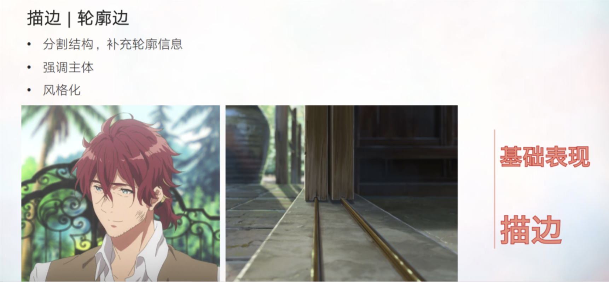

然后到现在的描边除了强调主体这样的用途之外，更多的就是承载风格化表现的特征了。像《无主之地》这种就是直接将描边作为自身的风格。

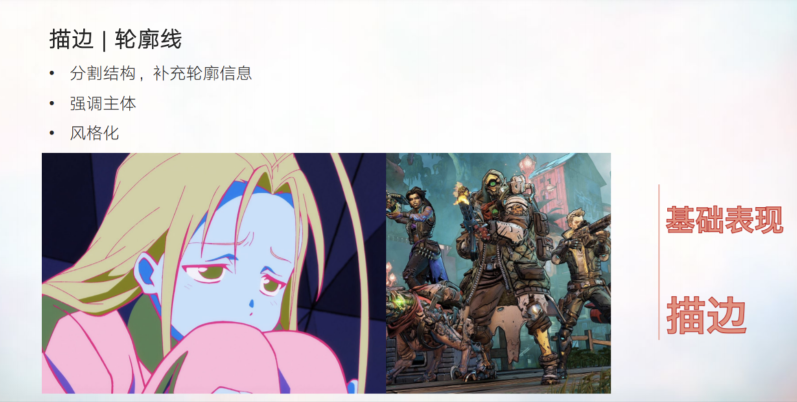

边缘的物理本质——深度或法线上不连续的位置。

描边主要分为外描边和内描边。因为很难找到一种方法同时实现良好的内外描边效果，所以通常需要采用多种描边方法配合。

*↑来自《GRAVITY DAZE重力眩暈》：角色模型的画线是背面膨胀法，背景的勾边是后处理实现的。*

 

 

------

### 外描边

- #### 基于视角的勾边

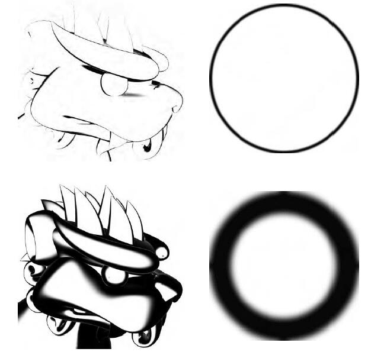

**原理：** 当视线和表面相切时，这个切点位置附近的像素点就是模型的边缘。这个本质跟rim边缘光相同。

  

**基础公式：** dot(viewDir, normal)^{k} 

点乘结果越接近于0，说明这个表面更大可能是在侧向的视角方向，则我们可以将其当作轮廓边缘进行描边。得出的值可以直接作为“边缘程度”，也可以作为纹理坐标采样预定义的轮廓纹理（颜色渐变）。

   

**优点：**

- 直接在base pass内计算，性能开销极低。

**缺点：**

- 线宽粗细差别大，不易控制。尤其是在较为扁平的表面会变得非常宽。

*↑视角勾边法的不均匀性*

  

**视觉优化：**

- 可以对扁平表面指定更窄的宽度权重，尽量控制勾边粗细。
- 可以以此为基础，添加风格化的渐变映射。
- 有观点建议这类描边可以跟光线方向结合，近光的位置描边细一点。

  

**常见应用场合：**

- 均匀弯曲度的表面，如纯球体
- 风格化的描边，如对粗细要求比较自由的水墨效果。

  

*↑《Okami大神》使用了视角内勾边*

 

 

- #### 基于过程几何的描边

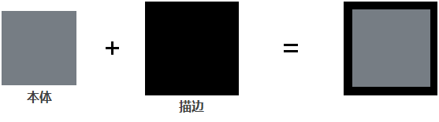

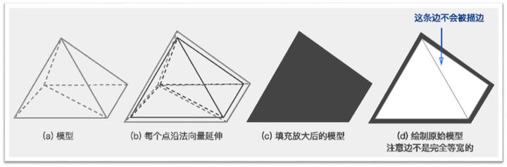

**原理：** 描边本身是单独几何体，正面模型绘制结束后，改用正面剔除再绘制一遍，此时VS中顶点要沿着法线方向膨胀一定距离，在FS中用纯色输出。

  

**基础公式：** v.vertex.xyz = v.vertex.xyz + v.normal * _OutlineWidth;

  

**优点：**

- 线宽较均匀，也容易做粗细变化。
- 实现简单。
- 容易单独分区指定描边颜色。
- 对大多数物体来说有不错的描边效果。

**缺点：**

- 很难对面片结构勾边，只对体积结构正常描边。
- 每个需要描边的模型在渲染时都多贡献一个pass，两倍draw call在需描边模型数量过多时有潜在性能影响。

  

**性能优化：**

- 描边pass顺序放在base pass后，可以裁剪掉膨胀的描边模型深度被主模型覆盖的像素。
- 大块物体的描边颜色通常一致，虽然可以放到材质上，但如果将它放到顶点上并做一个全局colormap，所有物体的描边就都可以用同一个材质绘制。

  

**视觉优化：**

- 暗处勾边色彩饱和度建议提高，否则容易看不清楚。
- 如果只是简单的进行扩展的话，有可能导致背面的面片沿法线进行扩展后的Z值比原先需要渲染的面片的Z值小，盖住前面需要渲染的面片，导致模型渲染出错，这种情况在凹模型容易出现。 我们需要对变换后的法线进行一个扁平化处理（如normal.z = -0.4），让模型轮廓成为一个平面。

  

- 使用mask贴图或顶点色的一个通道值，控制描边宽度大小。这还可以消除开放边界勾边分离的问题。

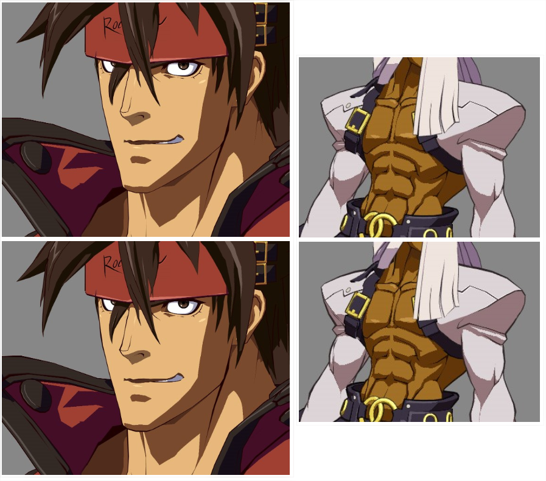

*↑轮廓线可以按照美术的需要去设定逐顶点粗细变化。勾边没有粗细变化（上）和有粗细变化（下）的对比*

  

- 使用mask贴图或顶点色的一个通道值，为局部调整描边的z深度，越大则描边越不可见。这是为了隐藏一些靠近模型中心的细节。远处人物的内描线也可以这样裁掉，只保留最外一圈描线。

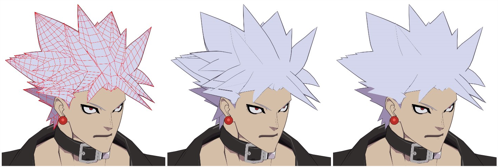

- 局部裁剪描边，比如眼睛睫毛等部分的描边可以直接舍弃。另外也可以把换成把描边宽度设为0。当然不需要勾边的部位也可以单独建模并且直接不加勾边pass。
- 局部插值切线和法线(令法线偏向切线而变弱)来作为描线方向。它也会让侧面描线比正面描线更容易出现，但过渡区域比上面方法更平滑。而且可以直接在原描边法线信息上修改数据，不需要额外通道储存。但在隐藏正面描线的时候也会减弱侧面描线，可能有些时候会消除不干净。比较适合用来处理下巴到脖子那条线，可以看到线条变细的过度。
- 模型内部出现的杂乱线，也可以使用stencil buffer去除。

  

- 描边的宽度会随着物体离相机的远近而变化，描边的宽度现在是相对世界空间不变的，这相机拉近后，描边就会变粗。因此需要按相机远近动态调整勾边宽度。

  

- 硬边上的法线分叉导致的勾边断裂问题，要靠合并硬边顶点上不同法线的方向，再把这个修正法线结果存进顶点信息中，模型空间的法线可以存进顶点的NORMAL或TANGENT里，顶点色或其它UV只能存切线空间的法线。另外也可以不做硬边，要硬边的地方全部做成倒角的连续边，不过这会增加面数。

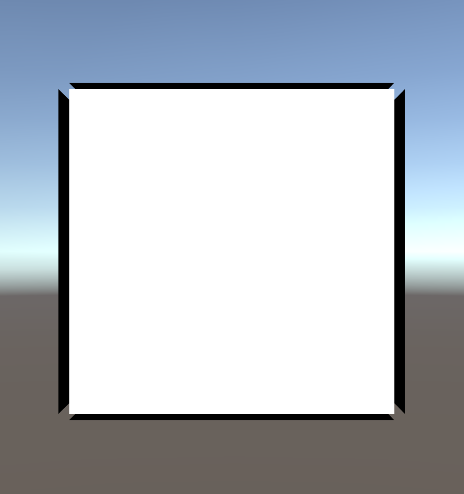

  

**常见应用场合：** 角色描边，尤其是日式卡通中，往往需要粗细有变化的描边去体现角色不同部位的特征。

  

 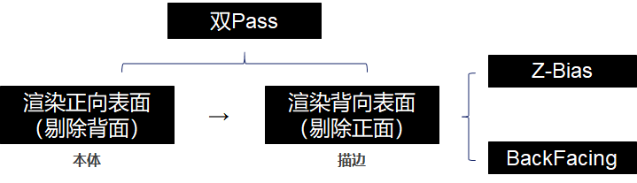

- ##### 变体1——Z-bias描边

**原理：** 分别有2类，①通过在观察空间，将模型沿z轴移动然后绘制描边层来进行实现。②绘制背面，但不膨胀，而是把背面顶点的Z值稍微向前偏移一点点，使得背面的些许部分显示出来形成描边效果。

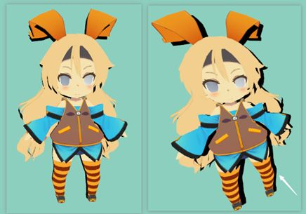

**缺点：** 某些视角下存在瑕疵。

 

- ##### 变体2——在NDC空间膨胀

**原理：** 主要实现方式是将法线转到ndc空间再挤出（忽略深度方向，较扁平化），然后需要注意获得屏幕宽高比，否则描边边缘会出现不均匀的情况。

  

**优点：**

- 描边位置在所有几何描边中维持得最好。
- 解决了了原版算法中描边宽度随相机远近变化的问题。

  

 

##### 描边控制参数方案参考

1. 要考虑的信息有：宽度，勾边在哪个距离范围有宽度变化，深度偏移或裁剪，颜色，膨胀方向（修复法线方向）等。
2. 顶点数据4通道，法线仅存XY方向，剩下2通道可控制Z偏移和宽度。
3. 顶点数据4通道，法线存XYZ方向，同时用法线长度表示粗细，剩1通道可作为Z偏移。
4. 勾边颜色可以不占顶点色RGB通道，而是仅存储一个索引值。
5. 大块物体的描边颜色通常一致，虽然是可以放到材质上，但如果将它放到顶点上并做一个全局的colormap，所有物体的描边就都可以用同一个材质绘制。

  

 

- #### 基于后处理的描边

**原理：** 在图片上查找相邻像素颜色、深度或法线等不连续的位置。将屏幕空间下的原始颜色信息、深度信息、法线信息、物体ID信息等以贴图的形式传入，运用边缘检测算子来探测出相邻两个像素点之间的指定信息差异较大的情况，最后将按不同方法计算的描边合并起来。

  

**注意：**

- 常见的边缘检测算子有：Sobel算子、Canny算子、Laplace算子、Robert算子和Prewitt算子。
- Roberts算子对边缘比较敏感，适合具有陡峭边缘且含噪声少的图像。
- Sobel算子对噪声较多的图像处理效果更好。

  

**优点：**

- 可以勾勒出足够多的细节，同时实现内勾边和外勾边。
- 某些算法可以保持描边线宽一致，比较适合统一外轮廓描线宽度。
- 性能开销固定（基于渲染目标的分辨率），不会因为被渲染的物体突然增多而增加额外的计算压力。

**缺点：**

- 后处理的性能压力，需要额外的法线和深度信息。（延迟渲染中，法线和深度已经是G-buffer的一部分，此时不会增加性能负担。前向渲染中，性能开销会比较大，需要手动生成基于屏幕的法线信息和深度信息。）
- 描边出现的位置较难控制，如果我们想实现距离相关的线宽，我们只能在几个像素的范围内调整它。同一套描边参数运用于整个画面，很难根据细节单独控制特定区域的描边细节度，容易出现过度描边。
- 很难对每个物体单独指定描边颜色。

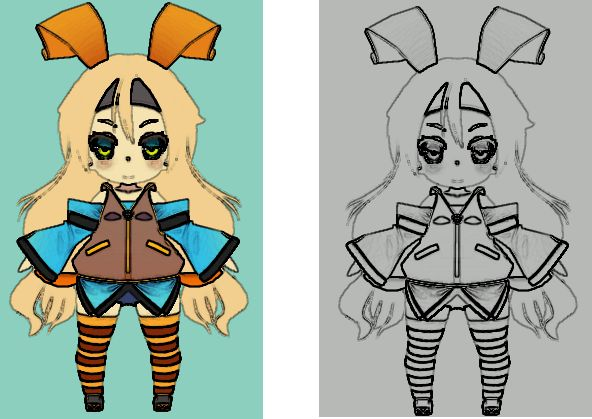

  

**视觉优化：**

- 在进行正常绘制的阶段用stencil buffer标记出需要描边的物体，然后用一个全屏的后处理，对stencil buffer标记的像素进行边缘检测。
- 可以对边缘检测结果再进行一次模糊处理，借此来扩大和柔化特定物体的描边效果。
- 用外描边（忽略比自己深度低的部分的贡献），还是双侧都有？如果用外描边，好处就是和扩边描边表现比较一致，双侧则更容易实现描边的软过渡（消除锯齿）。但也可以是靠TAA来消除这部分锯齿。

  

**常见应用场合：**

背景的描边比较常用后处理方案，而角色因为要避免过度描边所以比较少见。

美式卡通对角色渲染的“干净”程度要求不高，也比较常用后处理描边。

通常应用于延迟渲染的项目中，因为该方法需要G-Buffer中的深度信息、法线信息和物体ID信息等。

*↑游戏《无主之地》使用Sobel算子来实现描边*

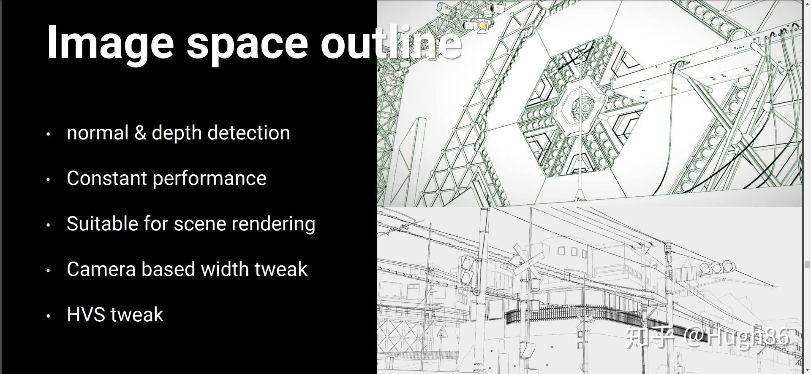

*↑崩坏3采用基于深度和法线的边缘检测法来勾勒地图上建筑物的描边*

 

 

- #### 深度差描边

既然基于视角点乘法线方向的算法既可以用于描边也可以用于边缘光，那么用来做等宽边缘光的屏幕空间深度差算法（见边缘光篇）理论上也可以做勾边。实现细节跟深度和法线检测的后处理方法稍有差异。

**优点：**

- 采样深度次数可以降到仅一次。
- 不增加额外pass。

**缺点：**

- 既然是基于法线方向，硬边法线断裂的问题就会存在。可另存一份连续的法线信息缓解。
- 边缘像素采样超出屏幕范围时可能会出错，需要特殊处理。
- 深度差不大就会丢失勾边。

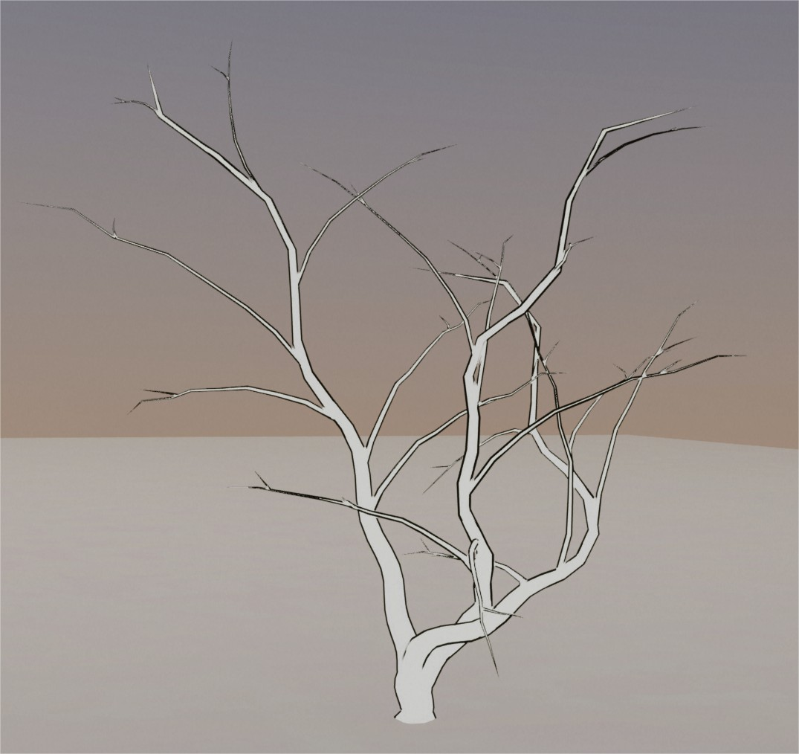

*↑测深度差等宽边缘光算法倒推为描边，个人测试效果，尚未大规模试验，不确定其它缺陷*

 

 

#### 外描边方案选择思路参考

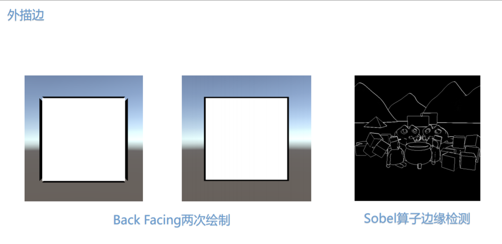

在绘制描边的时候可以拿到材质属性，就比较便于我们对这个描边进行精确的控制。我们可以控制这个描边的粗细和颜色，对角色这种描边要求比较高的东西，会更加合适一些。

然后Sobel算子的边缘检测，像是有很多物体的场景，能够一次性把他们全都给描了。处理场景描边更合适一点。当然这个事也不是绝对的，人物描边同样也可以采用Sobel算子的边缘检测，根据我们的项目需要来选择就好了。

 

 

------

### 内描边

*↑原神的手绘永久描边，直接画在基础色贴图上*

  

模型上不靠近边缘位置的复杂细节、面片结构等地方，很难通过外描边算法做描边，最后总是需要配合其它办法或手工伪勾边。

尤其是几何法，想实现内描边的话必须把细节都做成体积，这样不利于面数精简。

  

- #### 贴图手绘描边

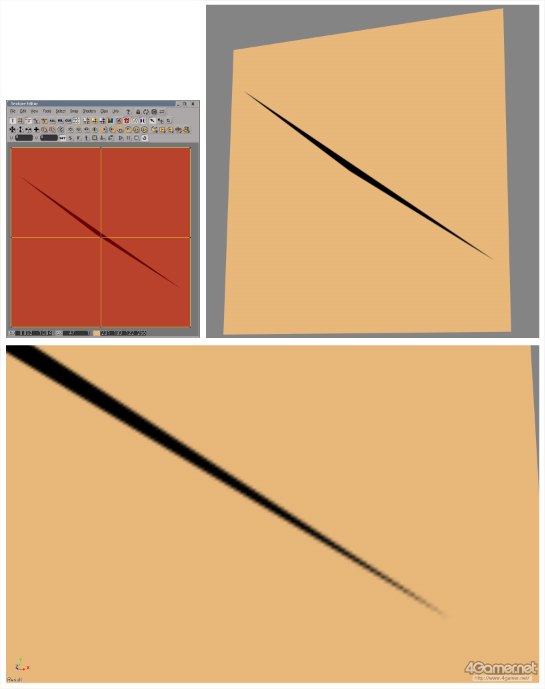

这就是直接在基础色贴图上画勾边。原神也采用了这种方法，在面片边缘和一般表面上都手绘了细节描线。

  

**优点：** 方便，直观，好画。

**缺点：** 贴图大小精度总是有限的，只要放大就容易看见锯齿。

  

**常见应用场合：** 项目允许使用足够的贴图尺寸，相机最近距离不会太夸张，不在乎视觉上一定的锯齿化，希望尽可能精简面数，不能接受单独为内描边处理UV的劳动，美术人员不想努力了（？）。

 

 

- #### 模型UV卡线

- ##### 本村线

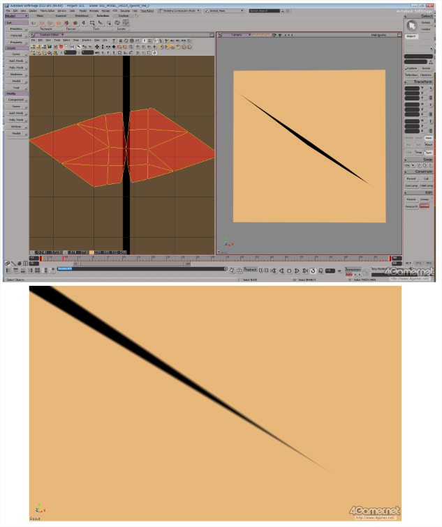

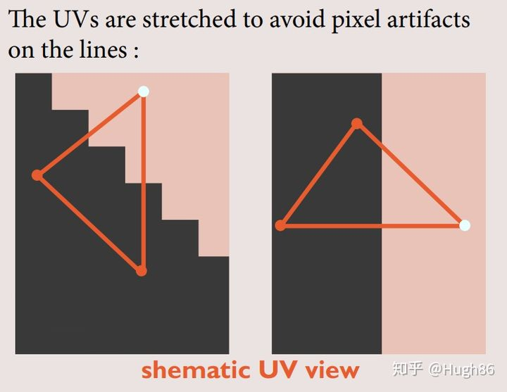

由《罪恶装备》TA本村氏提出的方案。贴图上的横线和竖线的边缘不会锯齿化，只有斜线和曲线会锯齿化。因此可以利用水平线和垂直线，通过UV卡出边缘绝对干净的线条。

  

**优点：**

- 放大后无死角抗锯齿。
- 可以大幅减少贴图体积。

**缺点：**

- 美术人员卡UV非常痛苦，需要强大的抽象能力，描线数量较多时更是灾难。
- 如果模型表面不是纯色风格，就会扭曲贴图上的文字和花纹，花纹要另外做成贴花。
- 勾边会占模型面数。
- 对三角形、曲线不友好，不方便UV合理布局。

 

**常见应用场合：** 项目要求贴图尺寸尽量小、相机凑得尽量近、内勾线尽量无锯齿但可接受一定程度折线形状，不需要手绘感、纯色无渐变的传统赛璐璐风比较适用，否则UV拉伸后很难维持局部细节。

  

- ##### 描边使用独立uv壳

把描边单独拆分出uv，集中排布到贴图的指定颜色区域。或者使用UV2专门做本村线描边，采样勾边贴图后进行叠加。

  

**优点：**

- 完美抗锯齿。
- 卡UV难度比本村线低，更直观，不用考虑对主体区域的拉伸。 

**缺点：**

- 需要的描边越多越顺滑，越增加模型面数，可能比本村线更加费面数，且可能更占用贴图位置。
- 细长三角面对硬件有更高的性能压力，比起均匀的等边三角形来说。

  

**常见应用场合：** 类似原版本村线，但希望不给美术太大压力，且对模型面数等信息量要求不严的情况。

 

战双这个鼻子下面的一段短线就是卡的UV，或者说专门做了一小片mesh叠在上面。有意思的是，同时嘴巴的线又是卡了本村线。

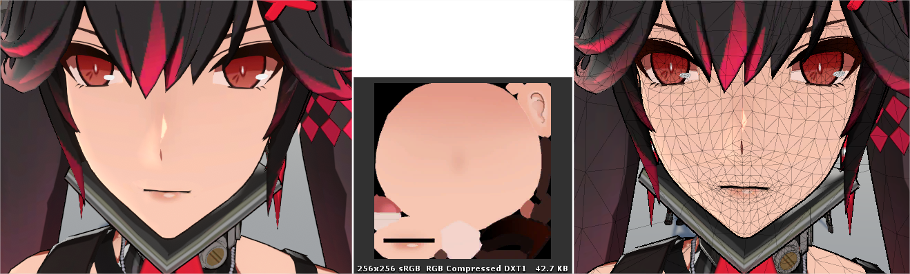

其实常见的眼眶睫毛部分也是这个原理的体现。

《火影忍者：究极风暴4》中面部表情的线条是通过直接建模的形式制作的，模型内部的描边是在贴图中通过特殊的UV拆分方法来实现的。

 

 

- #### 后处理遮罩分区法

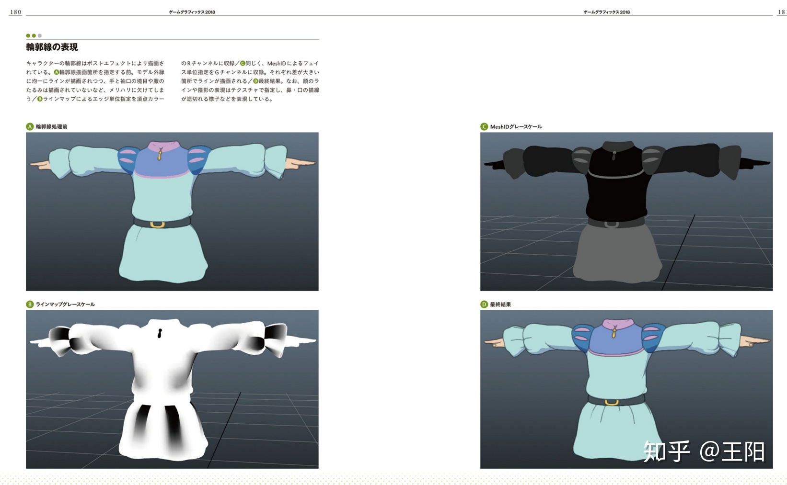

*↑左上：绘制外描边后的图；左下：存储在顶点属性R通道的边缘程度值；右上：存储在顶点属性G通道，基于MeshID指定的面部单位；右下：最终效果*

通过在角色身上不同部分刷出不同的顶点色（或mask贴图），然后在顶点色变化明显的交界处勾线。

  

**优点：**

- 勾边可动态变化，能做出传统勾边方式实现不了的地方。
- 线条干净，还能规避锯齿问题。
- 曲线更友好。

**缺点：**

- 依赖后处理，性能压力。
- 勾边宽度可能不好局部调整。
- 分区的制作略抽象，越精细的勾边就可能需要更多通道分别控制，美术人员需要适应。

  

 

- #### 几何着色器法

基于几何着色器，通过相邻三角形的法线判断线是否为边缘线并绘制。

  

**优点：**

- 精确查找边缘，连续轮廓。
- 单pass。
- 可以实现线条风格化。

**缺点：**

- Unity内支持不太好，实现复杂，性能问题，移动平台不支持geometry shader。
- 帧与帧之间会出现跳跃性。

  

> 米哈游：我们添加一个预处理过程来提取这些边缘，并将它们保存到额外的Mesh资源中，并使用Geometry shader绘制它们。对于这些折线我们使用了和Backface法类似的调整参数，从而使它们看起来完全相同。增加了折线的绘制之后，我们可以看到右侧的图片捕获到了更多的勾线细节。

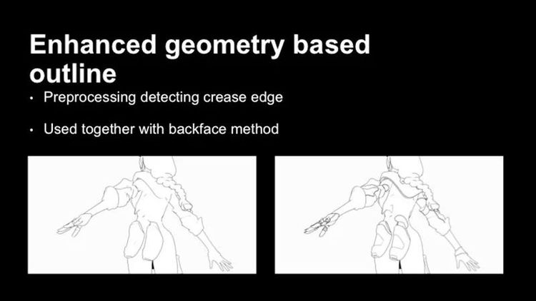

 

 

- #### Mesh提取边缘

比较粗暴的办法，提取模型尖锐边缘，挤出，保存成mesh，用勾线的颜色将提取出的mesh在引擎中再渲染一遍。这个边缘提取可以用算法一键生成，也可以手工建模。

  

**优点：**

- 勾边有立体感。

**缺点：**

- 多余面数。

 

比如有的动画公司的做法很HACK，比如通过建模的方法实现线条叠加的效果。类似下面这个：

 

 

- #### 基于笔刷/模型拓补的轮廓边缘检测

运行时提取模型边缘信息并计算轮廓线。通常分为以下几步：

1. 轮廓线提取：从Mesh上提取轮廓边，主要分为Sharp Edge和Smooth Edge二种。
2. 连接轮廓线：根据模型的拓补关系，将相邻的轮廓边连接成尽可能长的轮廓线。但有可能会出现轮廓线交叉的问题，这点也是需要处理的。
3. 轮廓线分段：在步骤2的基础上，根据轮廓线上曲率和可见性的变化，将轮廓线在曲率或可见性的突变处分开。
4. 笔触映射：将想要添加的笔触制作成纹理，根据对应的纹理坐标映射到步骤3的轮廓线上。

  

**优点：**

- 可以达到更为风格化，笔触更明显的勾线方式。

**缺点：**

- 性能消耗很大。

  

**常见应用场合：**常用于离线渲染，例如Pencil+、blender里Freestyle render渲染器便是基于这个方法实现的。可以用于CG品质渲染，但不适合直接在游戏中使用。

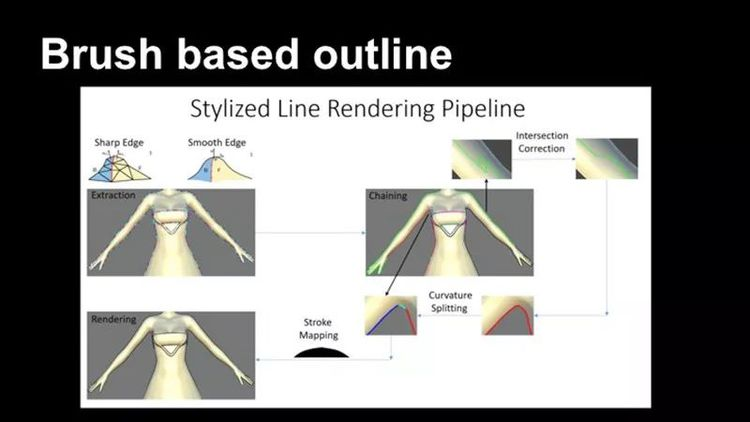

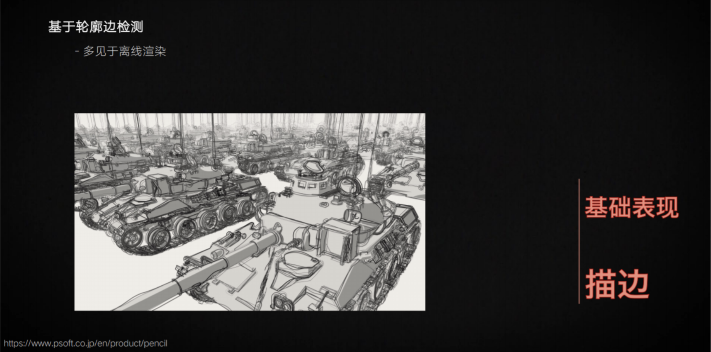

 

 

- #### 基于SDF的抗锯齿内描边

将内描边单独分层并生成SDF，然后用SDF的渲染方法显示。也就是通过一种核运算来预计算出贴图上每个像素"距离最近描边"的程度，而根据SDF的性质用这种方式甚至可以控制“较远”的像素的处理方式。

  

小众方法，具体见：[这篇文章](https://zhuanlan.zhihu.com/p/113190695)  

 

 

------

### 综合勾边方案示例

除了角色用几何法、背景用后处理法的经典方案外，还有一些不一样的组合方案。

蓝色协议用模型扩边法绘制头部，并用后处理描边处理其它部分。

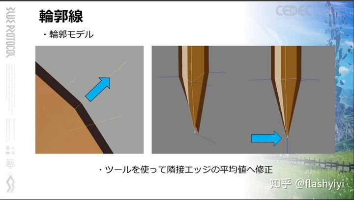

模型扩边用了单独储存共点平均法线的方式来修复分叉，是常见做法。如果扩边勾线想做得更好一点，还可以根据法线的角度方差来增强这部分的描线宽度，这样就能把发尖做出来。

后处理部分则是重点。后处理描边之前不适用主要是可控性差，而像二之国那样增加可控性会耗费比较高的成本。而它现在只用来绘制头部以外的部分，则降低了一定要求。

 

用mask分区色彩差异来生成内部描边。不过蓝色协议其实这些物件都是单独建模了的，本来就能生成大部分描边，只是因为后处理的深度差异太低了，需要利用这些数据强化描线的粗细。

另外，原文表示描线的粗细是由这张图的亮度差决定的，画面结果也确实像是这样。但是用这种方式定义宽度必然容易产生冲突，而看结果，大部分情况生成的描边都是等宽的（clamp到最大值了？）。

他们应该是放弃了精确定义不同部位的描线粗细差异，就算有参数应该也只是屏蔽描边用。毕竟真需要纠结细节的时候，也可以直接换普通扩边描边。

即使是选择不控制粗细，至少也要通过Mask来屏蔽头部的后处理阴影。

或许是选择了多个采样点中深度最高的那个像素坐标的信息。这样做虽然在多个物体交会处会不准确，但大概率是OK的，毕竟大家的参数其实差别不大。颜色的定制也可以用这种方法，如果想节省带宽可以用LUT索引来取代具体的颜色值。

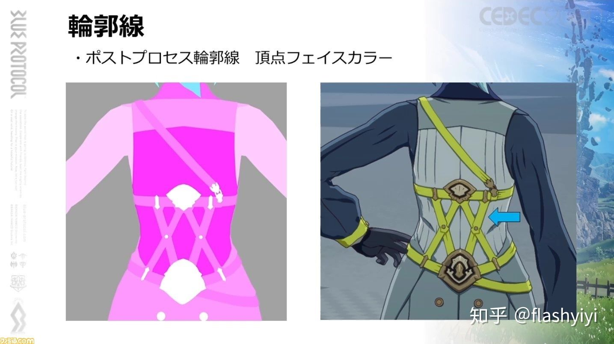

 

#### 其它可参考案例

要还原动画的线条，实际上核心是要靠3D描边渲染技术和夸张的动画技术相配合的。由APLUS制作的游戏《小魔女学园-时空魔法与七大不可思议》对于扳机社的动画还原得非常好。他们也制作了动画《斩服少女》的游戏版本，画面表现也非常自然，如果3D模型面数堆上来的话已经非常接近二维动画的效果了。

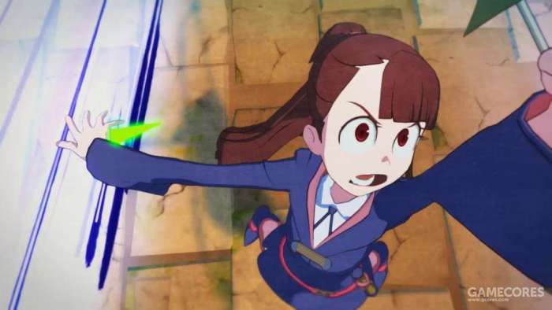

*↑《小魔女学园-时空魔法与七大不可思议》*

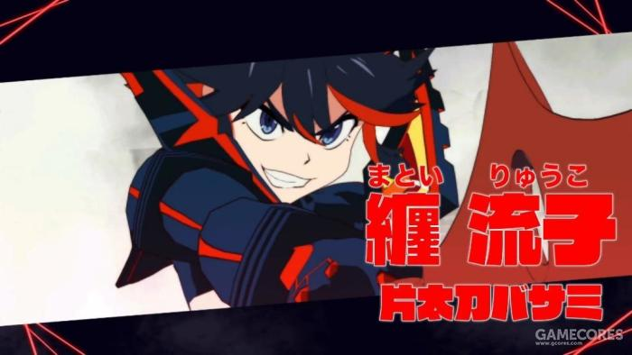

*↑《斩服少女：异布》*

 

 

------

### 描边粗细规律

#### 漫画线条

日本漫画的线条，光是使用的笔就有好多种。大多使用的笔尖从粗到细分别是：毛笔、马克笔、科学毛笔、G笔尖、D笔尖、学生笔尖、圆笔尖等等。

这些笔尖给漫画带来丰富的描边效果，可以通过线条的**近粗远细**，**近密远疏**，**近工整远凌乱**等手法来表现**远近关系**。也可以通过**轮廓加粗**和**粗细叠加**来表现物体的**叠加关系**。有的线条是**由粗变细**，有的线条是**两头尖中间粗**，有的线条是**一样粗**，也可以通过这种方法来表现线条的**笔势美感**。

 

漫画线条的粗细变化看起来随机，实际上是和绘画功力有着直接的联系，比如漫画中：

1. 物体的边缘会变粗（轮廓线）；
2. 两个线条转角比较大的地方会变粗（类似于书法中折角的顿笔）；
3. 形状与形状的交界处会变粗（体现遮挡关系）；
4. 凹陷下去比较深的地方会变粗；
5. 阴影部分的线条会变粗；
6. 线条中间比两边略粗。

 

这种线条粗细变化的美感有点类似于书法，通过人类几千年来书写出来的经验，对于线条控制的美感有多种多样的归纳，例如：刚健、柔韧、朴厚、丰润、工稳、灵动、华滋、涩劲、稚拙、精到等等。

不同漫画家的线条风格也类似于书法中的不同字体，目前大部分动画风格游戏对于线条的表现程度也就相当于是电脑字体中的黑体。这也就是现在游戏画面中该有的元素都有，就是看起来不好看的原因，这需要对技术与艺术的沉淀和融合。

 

举个例子，比如三轮士郎的线条风格会比较锐利一些，类似于书法中的瘦金体，还有很多其他漫画家也是这种锐利风格的线条。

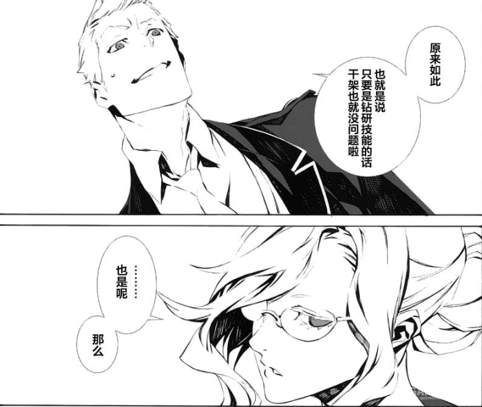

*↑《RWBY》- 三轮士郎*

*↑瘦金体 - 宋徽宗*

 

井上雄彦的《浪客行》把毛笔的粗线条运用到了极致，并且他的作品中也充满了传统素描的调子。

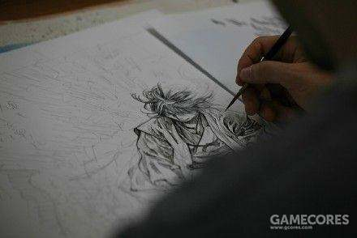

*↑《浪客行》创作中 - 井上雄彦*

 

从下面手冢的漫画看出，他的画风对线条和形状是高度概括的。

线条在保持流畅性的同时，有时会在转角处断开，这种不是完全连接上的线条其实人眼会自动进行补完，不会有生硬的断开感，有时反而观感会更好。还有从《新宝岛》图中的汽车可以看到速度线的运用，结合拉长变形的车身会使画面形成强烈的运动感。

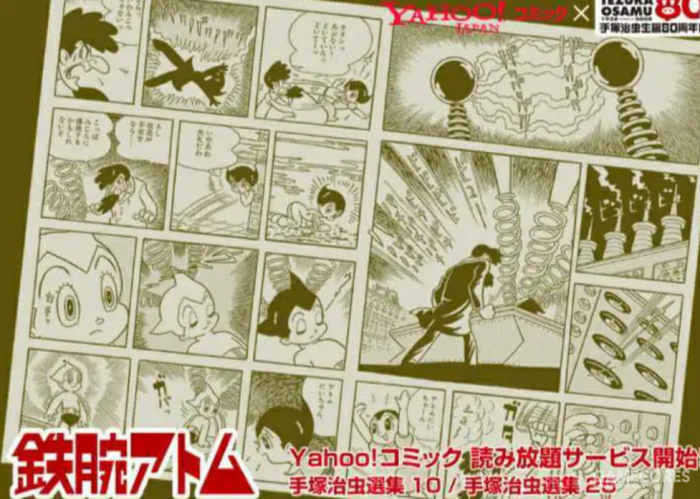

*↑手冢治虫作品*

 

下图在动作表现上，虽然都是细线条，但是线条的曲直和概括也直接影响画面的表现。请仔细看图中头发区域弧线的飘逸感与身体硬朗线条的力量感的作画风格。有曲有直的线条会丰富画面的表现效果。

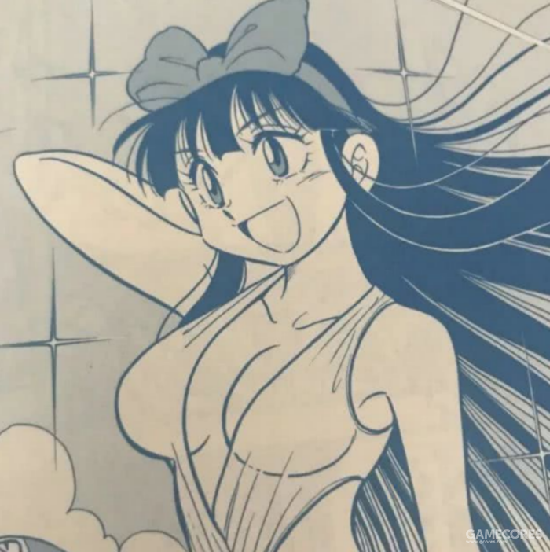

*↑四驱兄弟*

 

从下面吉成曜绘制的《小魔女学园》的原画设计可以看出一些线条的动态、粗细与转折之间的关系。

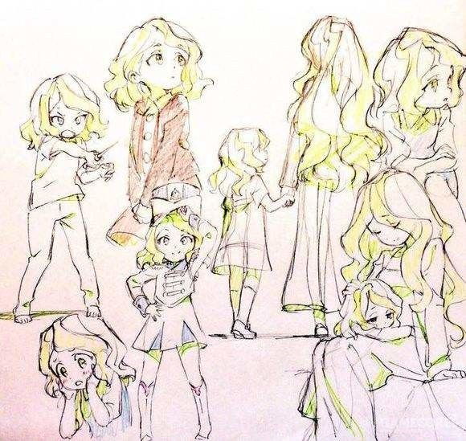

*↑《小魔女学园》设计稿*

 

 

#### 动画线条

在制作动画时，由于需要大量动画人员配合工作，原画师在绘制原画的时候已经丢失了原版漫画的一些线条细节。并且在这个原画师完成具有一定自己风格的作画后，动画师会对原画进行描原处理（在带有灯光的透台上，用一张纸叠在原画上，照着原画把线稿描出来）并加入中割，这时就会又丢失一些原本的作画细节。动画师一般在描线的时候使用的都是0.2的细线，所以我们在看动画片时候的线条基本上粗细变化就不是很明显了。

我们可以从下面这个《海贼王》的例子看出，原画的线条粗细变化就已经比较小了，动画师描原后很可能仅有的细节都没了。

*↑《海贼王》原画*

 

 

#### 3D渲染线条

3D渲染技术有一个优势就是品控可以保证，那么我们就可以根据不同风格的需求，调节出漫画线条中的粗细变化效果。线条的渲染实现上有模型变换、屏幕空间计算、贴图绘制、模型制作等多种方法，根据最适合的方法进行提炼即可。

通过分析，我们可以把线条的变化大概归纳为：**粗细**变化、**曲直**变化、**疏密**变化、**连续性**变化。通过这些变化，可以表现物体结构的**体积关系**、**穿插关系**和**远近空间感**。

 

总结上文，可以考虑的方向有：

1. 物体的内部（细节线）会比外部（轮廓线）细，甚至完全剔除一些内部描边
2. 小物体会比大物体细，体现体积关系
3. 两个线条转角比较大的地方会变粗（类似于书法中折角的顿笔），体现凸出感，也可以转角处变细或消失，体现尖锐感
4. 形状与形状的交界处会变粗，体现遮挡关系
5. 凹陷下去比较深的地方，变粗体现坠重感，变细体现拉扯张力
6. 阴影部分的线条会变粗或变色
7. 线条中间和两端的粗细变化，中间粗体现挤压感，中间细体现拉扯感，还有一端粗一端细等笔势
8. 远近对粗细、疏密的影响，远处线条变细或消失或保持粗细
9. 工整和凌乱的变化，比如近工整远凌乱

  

下面举些远近变化的例子：

由于3D渲染线条的局限性，我们要通过一些技术来规避当角色或物体缩小后的密集线条，如图中头发和手心的线条，实际上在动画中画师会对这个物体自动有一个概括。

远景人物可以隐藏内部描线，只保留最外轮廓描线。最外轮廓描线宽度一般不随缩放变化，因为动画是这样。但容易导致远景描线短粗凌乱，因此有需要可以允许过远物体缩小描边宽度。

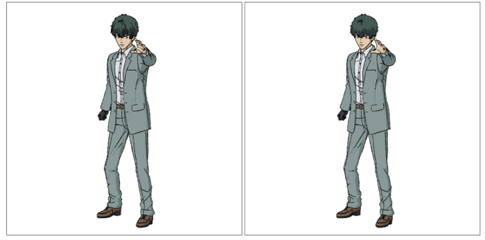

*↑请看图中头发和手心的线条变化*

一种观点是描线元素显然是不能缩放的。一旦放大了，它就不再是描线，而是某种粗色块。而缩小了，小于屏幕单个像素，则会消失不见。所以会做成尽量不随距离变化。

但是，下图中近粗远细的勾边风格看上去也不错，有意强调了远近纵深感。

*↑《Real-time Artistic Silhouettes Rendering for 3D Models》*

 

 

------

### 风格化描边

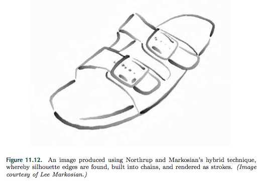

一般是首先找出精确轮廓边，把模型和轮廓渲染到纹理，再使用图像处理的方法识别出轮廓线，并在图像空间下进行风格化渲染。

 

#### 水墨风

可以通过前面介绍的过程式几何描边的方法，用多个半透明Pass来进行叠加多次描边，每次都进行顶点的随机偏移来模拟手绘的感觉。

除了进行描边的不规则化处理之外，还对像素颜色进行了平滑的过渡、量化输出以及对比度的提升。不过得到的水墨画效果其实是比较一般的，水墨画在非真实感渲染想做好其实还是比较难的，非常难模拟水墨画的这种笔触，而且相关的论文研究的也不多。

民间还有很多试验水墨风的效果，比如使用后处理等方法，请查阅文献引用列表或自行搜索。

*↑进行一次常规描边和4次不规则描边的区别*

 

#### 效果线描边

动画中经常使用凌乱密集的线条来表现画面在爆炸或强烈光线中的冲击力，如下图《天元突破》中的效果，这种画面是由类似于草稿的复线描边+速度线+阴影调子组成的。我们可以通过寻找各种技术手段来实现它，但是我觉得技术一定是要由效果来驱动的才会比较好。

根据参考类型分析好我们想要表达的线条效果后，就可以开始进行技术选型了。

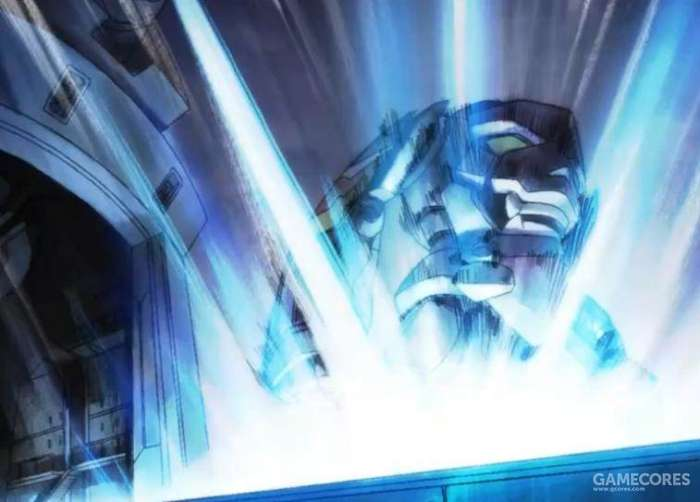

*↑《天元突破》*

*↑《Non-Photorealistic Rendering in Context: An Observational Study》*

 

#### 波浪线描边

动画《高分少女》中背景扭曲的线条也可以找到对应的论文来研究实现方法。

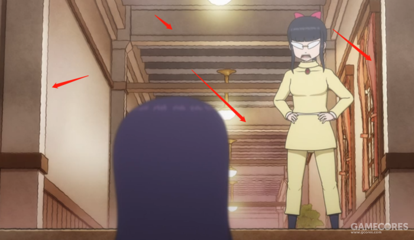

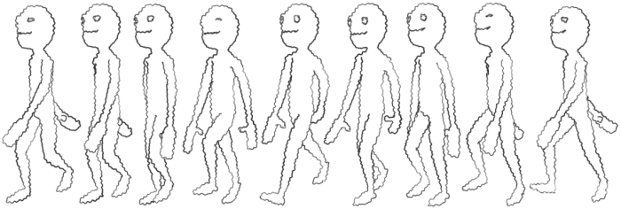

*↑《Computing Smooth Surface Contours with Accurate Topology》*

 

#### 其它风格化描边

自己尝试研究或找相关技术论文就好，然后根据自己想要表现的风格化需求进行改进，比如上文和下面提到的论文：

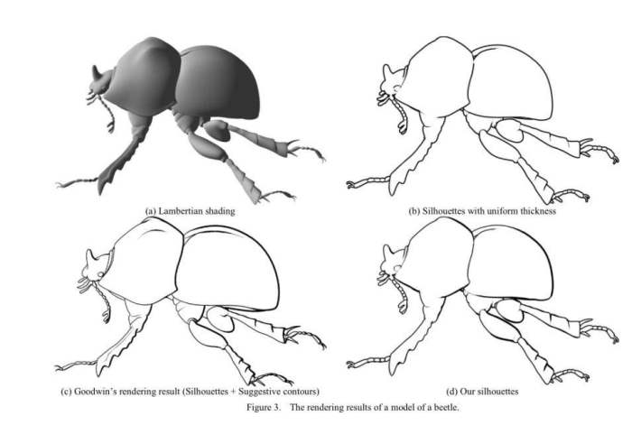

*↑《Real-time Artistic Silhouettes Rendering for 3D Models》*

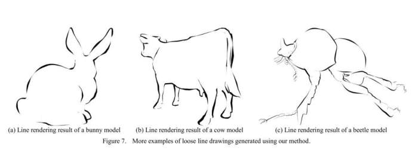

*↑《Line Rendering in Loose Style for 3D Models》*

