# Toon Shading Collection 

## CH03 - Direct Diffuse 漫反射（主光）

### 传统漫反射

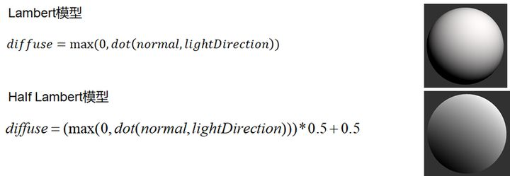

传统漫反射使用模型法线与光线方向的点乘值来获得光影的过渡，传统漫反射系数的过渡比较的柔和。

<br>

<br>

------

### 梯度漫反射

日式卡通渲染中的漫反射主要是对传统的漫反射系数做一个离散化的操作，可以看作一种抽象化（或简化）的光影表达。

传统的漫反射是用dot(N,L)来模拟的，而卡通渲染的漫反射则通过一个阈值将传统漫反射的结果分为亮和暗两个部分。


漫反射强度可以平均分割为自定义数量的区间，但从实际视觉效果上来说，只有明暗2区的情况往往比多分区看上去更舒服，因此我们通常考虑从二分入手。代码上，floor函数计算部分也可以替换为ceil或step函数。

```glsl
//Banded Lighting
float NL = saturate(dot(N, L));
float BandedStep = 6;
float BandedNL = floor(NL * BandedStep) / BandedStep;
return BandedNL;
```

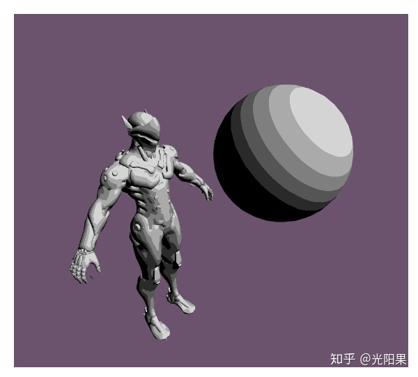

**性能优化：** 注意避免使用 if 判断分区。

**视觉优化：** 简单粗暴的明暗交界跳变会产生锯齿，可以补充抗锯齿处理，见高光章节，另外也可以通过下文的柔化边缘方法回避这个问题。


*↑左：高光边缘有锯齿；右：高光边缘抗锯齿*

<br>

<br>

------

### 梯度漫反射升级：柔化边缘

基本的梯度漫反射算法，相当于传统日本动画的赛璐璐风格，明暗交界处非常“硬”，会导致画面颜色不够丰富，也容易变形出比较难看的阴影细节。

目前流行的做法是，对明暗较接边界做一个平滑处理，还可以选择对这个柔化区域继续映射更丰富的颜色，带有手绘感。

<br>

- #### 纯函数计算柔化

首先将传统漫反射进行离散化，再使用smoothstep函数对边缘柔和度进行控制。

平滑区间应该使用一个比较相对较小的值，否则平滑过渡区域太宽，画面风格会变成美式卡通。

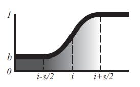


**优点：** 性能较好，可以在编辑器直接拖拽参数调整。

**缺点：** 自由度不一定能满足美术需求，色彩相对单调。

 <br>

**性能优化：** 平滑过渡的smoothstep函数也有一定性能压力，还可以删掉平滑计算部分、改为纯线性变化的InverseLerp函数。

```glsl
	float InverseLerp(float a, float b, float value)
	{
		return saturate((value - a) / (b - a));
	}
```


<br>

##### ——明暗交界线偏色

阶跃函数用两个Smoohstep，一正一反相乘，就可以求得中间明暗交界的位置，然后填充颜色。或者也可以使用高斯函数，也叫正态分布函数来选中明暗交界线区域过渡的位置。

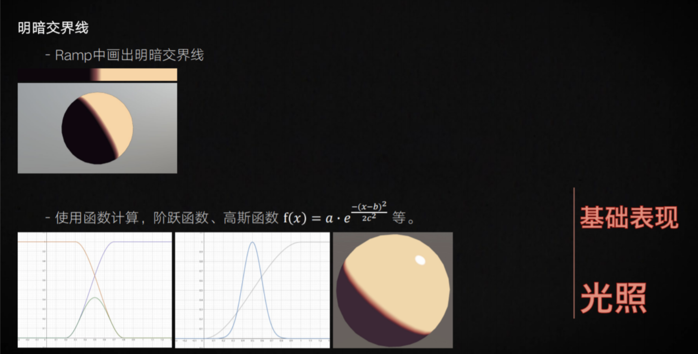

<br>

##### ——多色阶羽化

顺便看看多色阶的羽化算法。

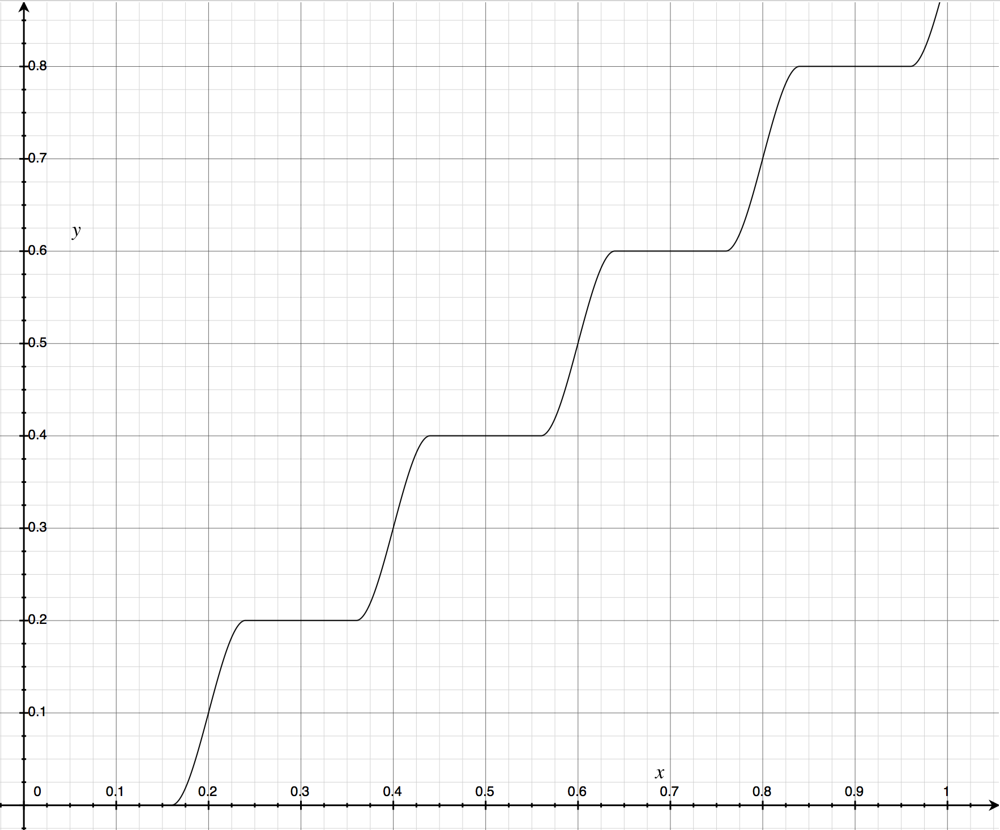

```glsl
float interval = 1 / _ToonSteps;
float level = round(diff * _ToonSteps) / _ToonSteps;
float ramp = interval * smoothstep(level - _RampSmooth * interval * 0.5, level + _RampSmooth * interval * 0.5, diff) + level - interval;
ramp = max(0, ramp);
ramp *= atten;
```

当 RampSmooth = 1 ，即完全平滑，图像应该是线性的，但是函数图像如下图。为了修正这一点，暂时的做法是加了一个判断。

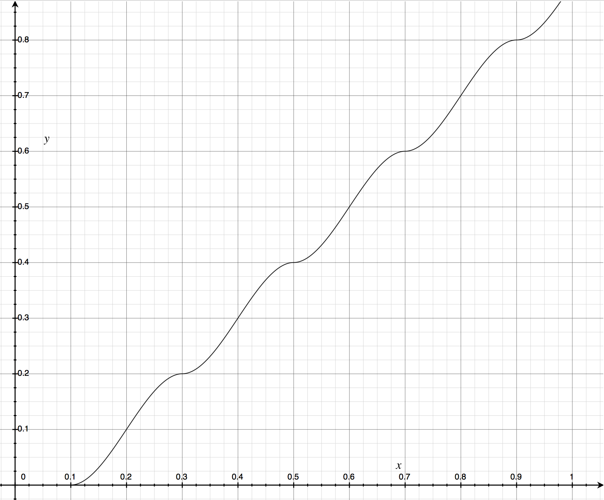

```glsl
float linearstep(float min, float max, float t)
{
	return saturate((t - min) / (max - min));
}

inline fixed4 LightingToon(SurfaceOutput s, half3 lightDir, half3 viewDir, half atten)
{
	...
	if (_RampSmooth == 1)
	{
		ramp = interval * linearstep(level - _RampSmooth * interval * 0.5, level + _RampSmooth * interval * 0.5, diff) + level - interval;
	}
	else
	{
		ramp = interval * smoothstep(level - _RampSmooth * interval * 0.5, level + _RampSmooth * interval * 0.5, diff) + level - interval;
	}
	...
}
```

<br>

- #### Ramp贴图映射柔化

除了以上的使用系数的实现方法，我们也可以使用RampTexture（又称LUT查找表）来达到这一效果。


**原理：** 通过Half Lambert值对一个纹理贴图进行采样来获得梯度变化的光影。

```glsl
fixed halfLambert = 0.5 * dot(lightDir, worldNormal) + 0.5;
fixed3 diffuseColor = tex2D(_RampTex, fixed2(halfLambert, halfLambert)).rgb;
```

**优点：** 

- 美术可以更加精细/自由的控制各个位置的光影变化。
- 更有手绘感，和PBR场景的融合感更强。

**缺点：**

- 多采样一张贴图，增加性能压力。
- 调整ramp贴图不如直接编辑器拖拽参数方便。

<br>

**性能优化：** 通常建议使用尽量小的ramp贴图，一条ramp值只需要高1或2像素就行，长度一般也不用大于256像素。为了尽量少浪费像素，Ramp贴图上可以砍掉不再有色彩变化的亮部或暗部，只需要包括明暗交界线周边需要有颜色渐变的区间内的色彩，在实际计算中通过手动调整ramp映射开始到结束的明暗位置。


*↑战双ramp贴图*

<br>

**注意：** Ramp贴图的Wrap Mode通常选Clamp。如果保留Unity默认的Repeat选项，很可能会导致边界像素采样错误。

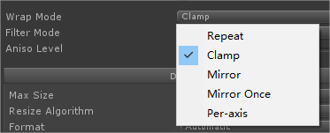

Ramp贴图制作起来并不复杂，可以使用Toony Colors Pro插件生成，也可以自行编写工具来生成。

<br>

<br>

------

### 视觉升级：更丰富的漫反射明暗色彩

对于皮肤来说，次表面散射和高光会显著的提高皮肤的质感，以下讨论到的基本都源于此效果。对于次表面散射来说，这是在生活中很常见的效果，比如说你迎着阳光去看手掌，会看到很强烈的透光效果，这就是次表面散射的体现之一。

而对于卡通渲染中也会去做相关的处理，根据风格可以主要分为两种，首先是偏写实角色上使用的次表面散射，比如说鹿鸣、暖暖这一类偏向真实感的渲染。另一类就是对于《蓝色协议》《罪恶装备》这种赛璐璐卡通风格会去做整体阴影颜色的改变。

这种对整体阴影颜色的处理会提升卡通化的观感，并且也不仅限于皮肤上，衣服头发之类的也会有所体现。

<br>

#### 分区独立指定暗部色彩

全身各部位都指定同一套暗部配色方案，会让暗部色彩过于单调。

<br>

- ##### 主贴图对应暗部色贴图

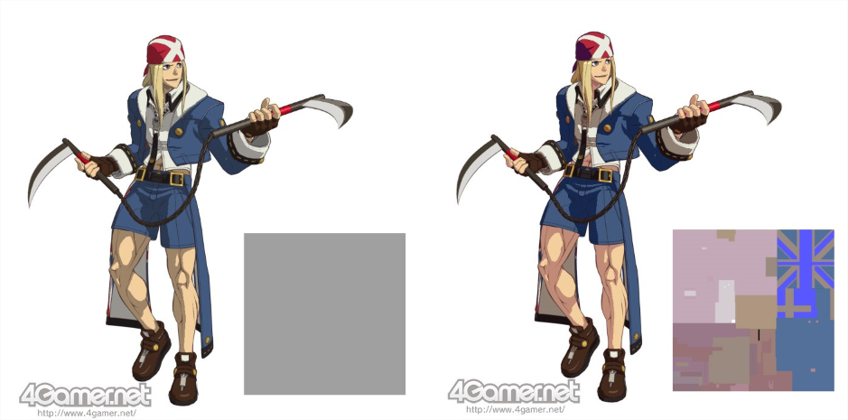

卡通风格的角色，如果上色只是纯明暗变化，阴影处就会显得比较脏，缺乏表现力，而如果提升暗处的饱和度和色相变化，整体色彩看起来就会比较鲜活。

罪恶装备通过单独的贴图来对不同部位精确定义暗面色调。从渲染结果可以看到，饱和度提高了很多，整体颜色更加生动抓眼。

<br>

- ##### 分区搭配不同Ramp组合


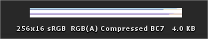

原神ramp贴图高16像素，即可以放16条ramp，按一个mask值分区进行采样。还做了疑似日夜区别，可以从白天版插值过渡到夜间版，也可能是按不同场景环境采样不同配色组合。

这其实也是下面两节思路的简化版。

另外，为了快速迭代，也可以不用ramp而是直接用颜色参数集搭配mask调整。

<br>

#### Ramp贴图二维化

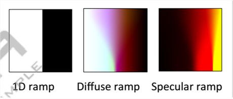


*↑米哈游：使用ramp mask纹理来选择每像素的ramp软硬以实现插画的手绘风格*

把ramp贴图二维化，利用某个自定义值在ramp贴图的Y轴上移动采样，表示此处阴影的柔化程度。

这个值可以用某张指定软硬度的mask通道，也可以是别的参数。比如以视角与法线的夹角值按Y轴采样，综合实现类似菲涅尔现象的卡通渲染。

```glsl
UV = float2(dot(N,L), pow(dot(N,V),r));
Diff = tex2D(ramp, UV).rgb * LightColor.rgb * baseTex;
```

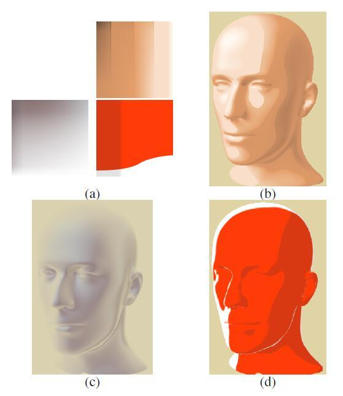

Siggraph的Pre-Integrated Skin Rendering做法是，在横向UV上使用NdotL，纵向UV上使用1/半径（曲率：用法线偏导数除以位置偏导数的值）。在眼，鼻子，嘴这些凹凸明显（即肉薄）的位置附近增强了SSS的红润气色（透光带血色）。虽然这是写实渲染的经验，但也可以借鉴。


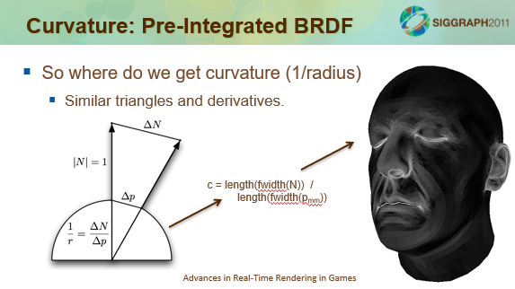

真正的次表面散射计算消耗是比较大的，虽然有基于屏幕的5S和可分离的4S的快速计算，不过基于预积分查找的皮肤SSS的计算还是最经常使用到的方式，这种方式和ramp图的计算十分类似，X轴就是NDotL，用来控制光照，可以看作是单条的ramp。而Y轴是由模型表面曲率决定的，曲率越大，它的3S效果就越强。

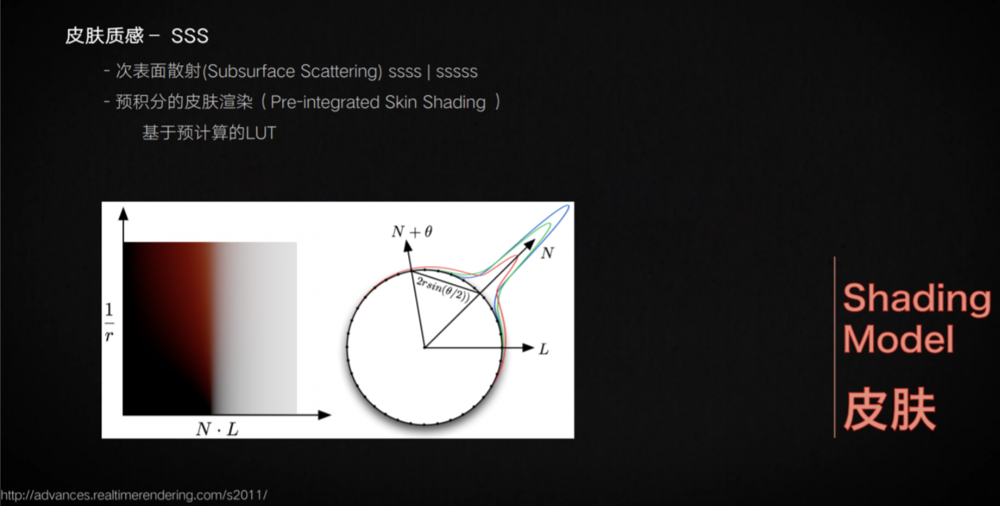

话说回来，这种方法就很难做到省像素了。

<br>

#### 多层叠加


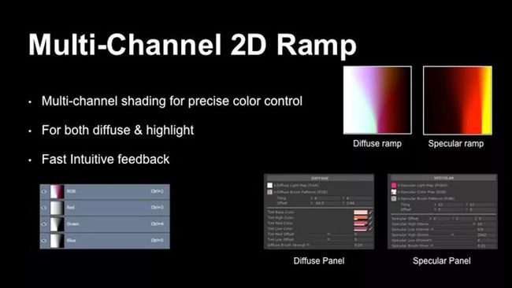

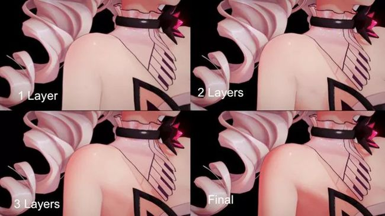

二维Ramp贴图各通道可设计为多层不同软硬度和过渡位置的阴影形态，分别映射不同的阴影颜色，再叠加到一起，丰富阴影区的色彩。

这有点像真实皮肤渲染用的预积分LUT贴图，可以借此来表现出卡通角色皮肤的次表面散射效果。

<br>

<br>

------

### 明暗部色调设计方案


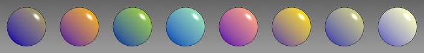

鉴于最近的业界趋势，本文倚重的日式卡通渲染早已不限于基本的Cell Shading，我们可以从中发现美式卡通渲染起家的Tone Based Shading思想的融入，如明暗交界处的柔化和ramp采样的色调变化。这里讲讲明暗色彩的简单设计思路。

明暗色调一般遵循的美术规律是：亮部偏暖色、暗部偏冷色。这样的话，角色的亮面跟暗面的色调对比更加强烈，看起来卡通感会更强。设计暗面颜色时可以由暖色调转冷色调的思路入手，当然这也不绝对。

<br>

明暗交界线是动画中经常会出现的特征，这是绘画中常见的处理。基于这些特征，不少画师会在明暗交界线上做特殊的偏色处理，动画中也都有体现，在物理的渲染中比较接近这些效果的是SSS表面散射，这一表现可以看作是对SSS的夸张。

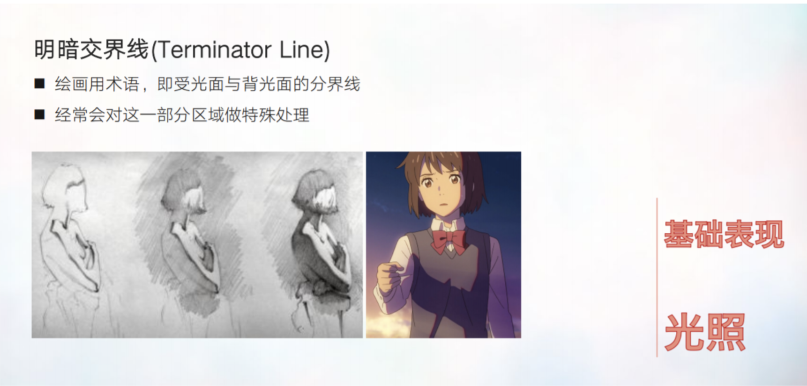

军团要塞2角色的明暗交界处有明显泛红的warpped diffuse效果（给红光更慢的衰减速率），也可视为一种体现。

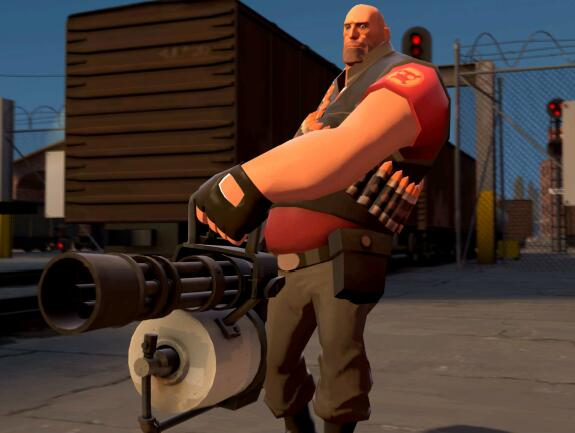

*↑军团要塞2角色的明暗交界处有明显泛红的warpped diffuse效果*

当今二次元角色渲染吸收了这种效果，经常在ramp贴图的明暗交界处插入一段根据对应表面材质特性（如皮肤、暖色布料、冷色布料等）设计的高饱和度色相，不再是简单的赛璐璐明暗跳变。

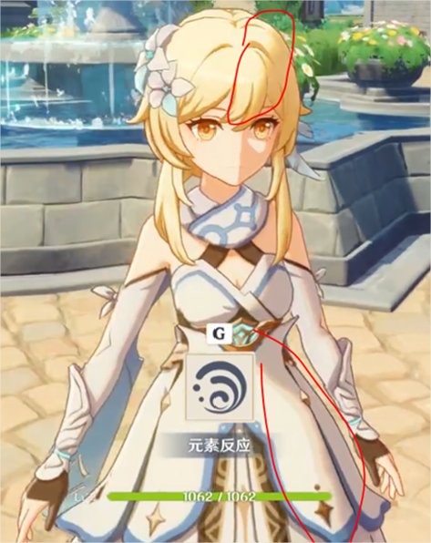

*↑原神角色明暗交界处的色相变化*

<br>

除了大体的明暗二分以外，还可以把暗色再细分为一阶暗色和二阶暗色，更加丰富暗部色彩。

一阶暗色和二阶暗色不一定都是动态变化的，现存某些渲染方案把二阶暗色永久固定在某些位置。二阶暗色也不一定会直接安排到ramp贴图的末尾部分体现，有在固有色贴图上直接画得暗一点的（原神），也有配合专门mask操作的（战双）。


*↑战双的阴影控制mask，最黑区域会算成固定二阶阴影，深灰区域是可动一阶阴影*

<br>

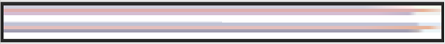

*↑注意观察原神这张ramp贴图的明暗变化，靠近左侧其实有稍微提亮*

<br>

也有为了同时实现省贴图和暗部色彩多元化的目标，使用纯参数化的明暗控制，决定不再对固有色和统一的暗部色单纯进行死板的乘法叠加（即PS中的正片叠底），而是针对固有色本身的不同明度、饱和度，设计一个标准，分别使用正片叠底或柔光等算法来叠加阴影色。具体算法的选择，可以参考PS中的图层混合模式进行试验。


*↑火影忍者究极风暴的暗部方案，A正片叠底，B柔光，C按固有色明度基准混合AB结果，皮肤头发等处的暗部就不显得死黑。*

<br>

其实这一节探讨的内容跟传统赛璐璐动画的色指定机制异曲同工。这些色卡的颜色由艺术家按经验进行设计，可能是非物理真实的，但是这种颜色在色彩构成上会非常好看。并且在各种光照条件下的颜色变化都不相同（会根据预定的场景光照设计几套不同的光影色搭配方案），所以通过shader直接叠加灯光颜色或阴影颜色很难还原出来。

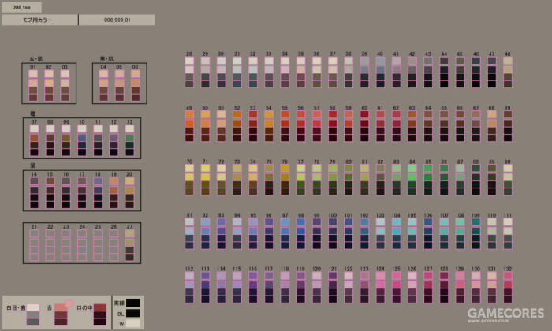


<br>

在日式的漫画里面，他们把这个物体因为处于背阴面而显示的比较暗的区称为阴。把因为物体阻挡了光线而产生的投影，称为影。

一个说法是，在卡通渲染里面这个阴和影的颜色应该要保持一致。

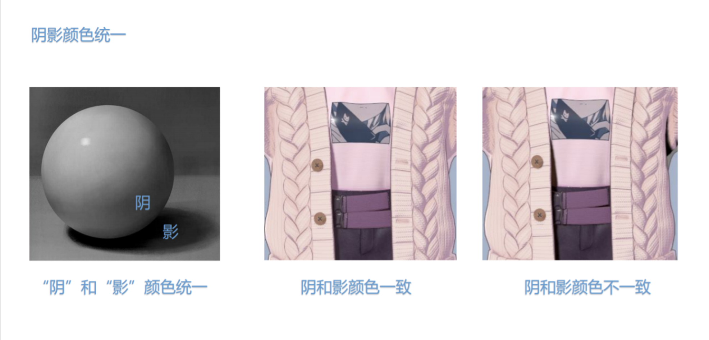

我们看中间这张图，它的阴和影的颜色是一致的，这张图的色调会更加的干净。看起来就会比右边这张阴和影的颜色不一致的的贴图，显示的光感会更好，也更加的卡通。

但个人认为可以变通，毕竟前文也有提到二阶暗色的配置，双色调的阴影色也可能有风格感，只是明度不要太低。

<br>

<br>

------

### 明暗细节调整

经典光照计算的结果是非常“正确”的，但往往好看的卡通手绘感画面的明暗分布是不完全正确的，业界为了追求卡通渲染美学已经做好了抛弃正确性的心理建设，强制干预光照计算结果。

总的来说，影响阴影的几个要素，一个是灯光的方向，一个是阈值，还有一个是法线方向。我们可以对这三个要素进行控制，来控制阴影的形状。

<br>

#### Mask添加明暗细节

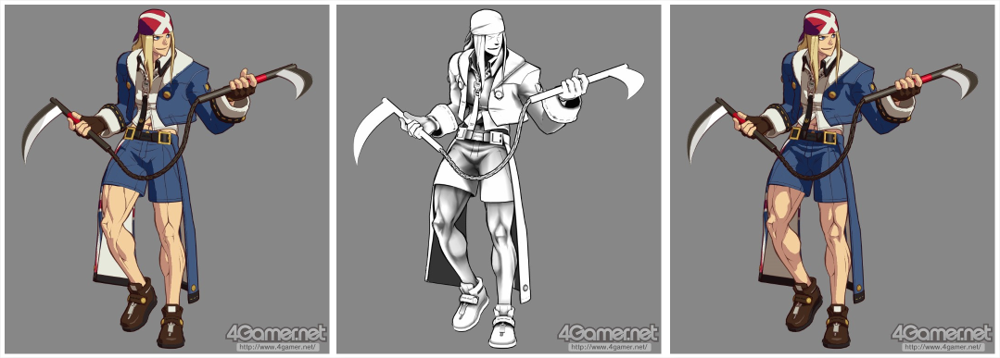

*↑罪恶装备使用顶点色存储阈值，既可以优化性能也可以排除贴图分辨率潜在的锯齿问题*

通常会借用Mask或顶点色的一个通道，作为类似AO的功能来使用，对光照计算的结果进行一些倾向性的修正，控制哪些区域更容易成为阴影，最终丰富明暗细节。

这张mask可以纯粹用来压暗，也可以同时拥有压暗和提亮的功能，具体算法可以按需修改。常见的压暗位置有脖子、下巴、裆部、后脑勺、布料内侧、裙摆起伏、其它衣褶、肌肉凹陷处等，常见的提亮位置有宝石等发光材质处。

卡通角色渲染因为细节度要求远不如写实渲染，有时会为了性能而考虑不使用法线贴图，如果你的角色渲染方案决定如此，那么这个明暗mask的存在将会完全替代法线贴图的功用，为光照结果添加细节度。

譬如业界标杆原神都舍弃了法线贴图，对角色大胆画上“死阴影”。

实际操作时，可以用引擎内置或自己写的插件在编辑器内刷顶点色或贴图色，实时看到游戏内效果。

<br>

#### 调整法线减少明暗细节

根据模型顶点位置和拓扑关系计算出的法线可能会细节过度，表现在卡通渲染的结果上就是会出现许多多余的暗部细节，对此往往还需要配合美术针对具体模型进行法线修正。

修正的方法是使用模型法线转印/传递，给精细的模型一个近似的低精度代理（比如用一个球形代表模型的头部，用一个圆柱形代表模型的胳膊或者腿），然后用代理模型上附近顶点的法线作为原模型的法线来使用。

还有一种自动化办法，吉普力工作室的《哈尔的移动城堡》的CG部分是把邻接的法线向量的平均值反复的求出，将法线向量的波动吸收，变的平坦化。

本质是把每个三角面的方向信息变得粗略，光照结果的阴影也就变得粗略了。故意粗略化的阴影体现了卡通画面的高度概括性。

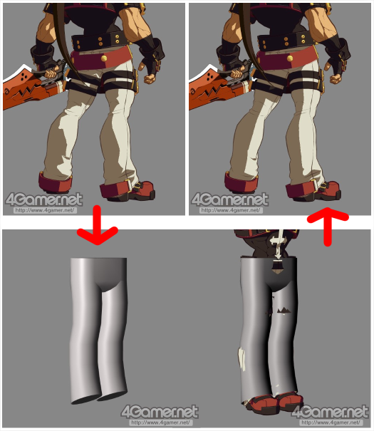

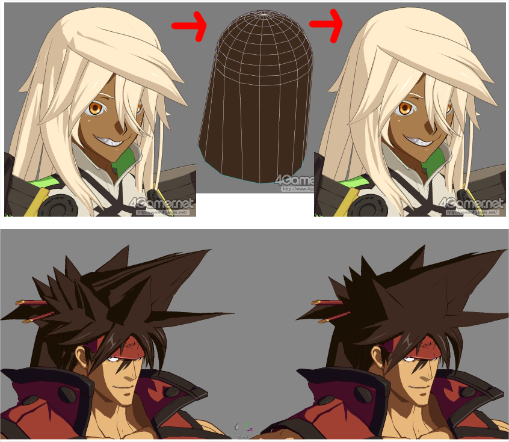

<br>

#### 固有色贴图配合

还有一个要考虑的点：固有色贴图上要不要有、有多少明暗细节？

一种意见：日系二次元的渲染风格以自发光为主，特别是皮肤要白皙干净。模型固有色贴图部分不要带强烈的阴影，衣服只要画出固有色和褶皱部分。皮肤需要根据立体结构有一点明暗变化，特别是脖子和衣服遮盖的暗部。

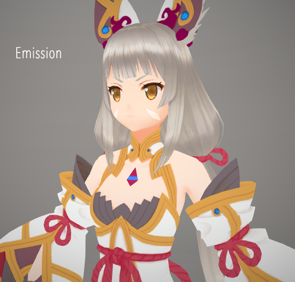

如果想尽量接近赛璐璐动画，那么固有色也不要带任何结构变化明暗，像罪恶装备一样。

<br>

<br>

------

### 特别的综合漫反射调整姿势

蓝色协议调整漫反射阴影效果的全套方案分析参考：

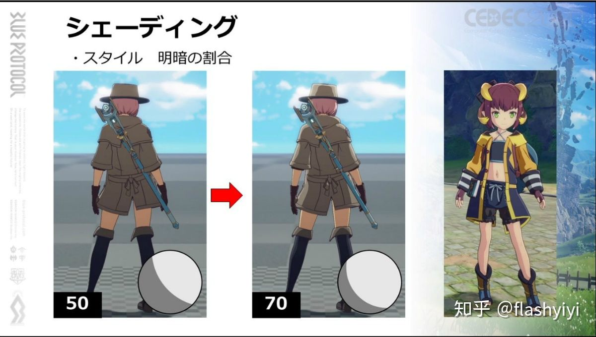

逆光时亮部区域增大为70%来解决背部缺少光照的问题。

这是个办法，缺点就是逆光的时候轮廓光的感觉有点过强了，另一个方案是逆光扭转光源，缺点是转过阈值时会发生突变。

但这样做会导致亮部区域和自投影区域重叠了，那么它们实际上没有应用自投影？还是将自投影的Normal bias也一并扩大了？目前看，很可能是前者。但投影显然也是必须要有的，而他们用了固定的控制图和后处理阴影两种方式。

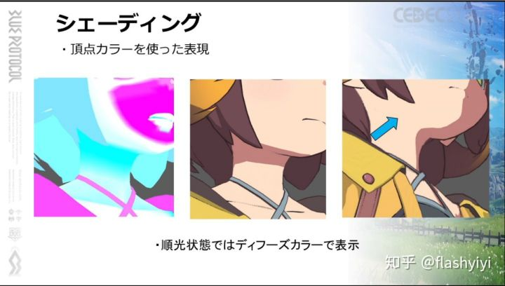

上图的蓝色区域就是降低光照阈值的依据。在正面能够看到阴影，但是光照从下方发射时阴影就会消失。这个方案其实效果并没有真实投影好，既然这样做就说明并没有真实投影。

正常的投影还是需要有的，只有正常的投影才能处理裙子投腿，头发投背这样的情景，虽然大部分情况自投影需要屏蔽，但只有一处用，也该有。而处理好屏蔽物体自投影的问题也可以做到不和70%亮部冲突，虽然确实麻烦。现在这样也是他们自己权衡后的结果吧。

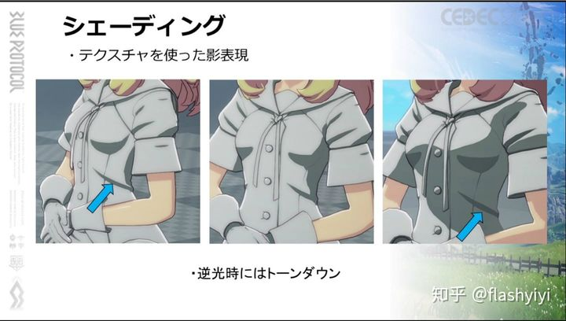

至于身体上标记的固定阴影区域，他们采用了差异不大时候融合，差异大时变得更暗的做法，让逆光时候也能看到这些阴影细节，不失为一个折中的好办法。


一般天光其实都是顶光（为了生成较少的建筑阴影），所以直接打人脸上都会完蛋。蓝色协议是直接在人物身上将天光方向拉平了50%，也就是仰角最多45度。这样倒是有挺多好处的，而且可以回避在逆光时，巨乳会被顶光单独照亮的问题（也可用自投影解决）。

但有一说一，其实身体不少部分都更适合用顶光照明，比如手臂肩膀，平光产生的垂直阴影部分太少了。所以比较好的方法其实是身体正常打光，脸部单独修（然后就会出现照亮巨乳的和暗处的脸部不协调的问题）。

毕竟没自投影，也只能这样。

他们强调了因为贴图精度问题而没有使用法线纹理，所以暗部的定制只能用上面提到的固定暗部纹理来实现。头发上肯定用了（在发瓣边缘涂深），脸上用没用也不好说。

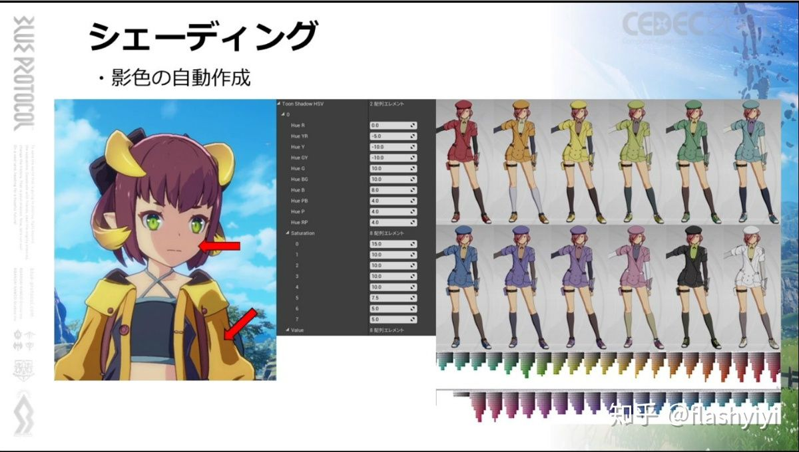

通常情况，我们都是专门给一张暗部纹理来表示暗部的色指定，虽然不算麻烦但终究是一个美术工作量。但暗部到底应该是什么样的颜色其实是有规律的，对于纯色贴图尤其如此。

所以他们做了一个变色工具，看界面，第一排的Hue R YR Y GY G……表示的其实是色环，那么数值就是某个Hue的颜色在暗部应当进行的偏色。后面的Saturation和Value则应该对应饱和度和明度，表示的也是暗部应该增减的饱和度和明度值，分为8档绘制了变化曲线。

不知道是离线生成还是实时计算，其实都行。实时可以用LUT。

它这样有个好处是可以更方便地做服装染色。

而且对非赛璐璐风格的作品帮助更大，因为那些作品的贴图绘制成本较高。

<br>

<br>

------

### 漫反射整体色彩与环境的统一

动画里对人物的原始色指定配色，也不能直接融入场景环境，还是需要进一步调整，涉及了对角色整体叠加环境色、全屏后期调色等。

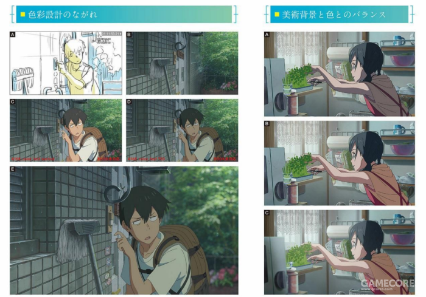

*↑新海诚《天气之子》画面色彩调整过程*

<br>

同理，按上述做法算出的多阶明暗漫反射结果，不一定能融入任意场景。

要将卡通角色整体灵活地融入各种环境中、且跟其他角色统一，卡通渲染方案常见的做法是对漫反射的亮部和暗部（或自定义的更多阶层明暗区）分别动态叠加一层全局色（相当于亮部乘直接光颜色，暗部乘环境光颜色）。

这个叠加计算不一定用简单一个乘法，亮暗颜色也可以超越梯度层，改做渐变色之类的。

注意这里的全局环境色往往会按漫反射色阶数分别指定单独的值，这就能够按美术需要，在各个场景中为角色明暗面排列组合出不同对比度、饱和度、色相。这也有利于特效的动态实现：电闪雷鸣情况下整个场景会产生刺眼的闪烁，那么人物身上也需要突变成高对比度的明暗效果；角色发动专属技能的颜色，也有必要对环境中各处的色调产生专门的影响。

另外，也应该意识到我们设计的ramp贴图或指定的暗部色参数，必须与场景环境色脱钩。

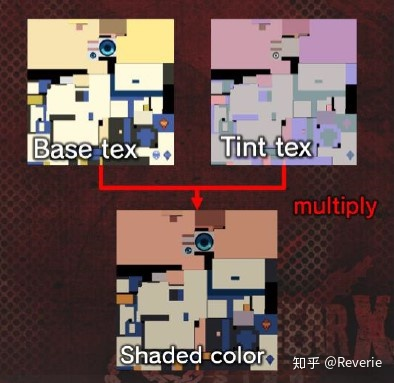

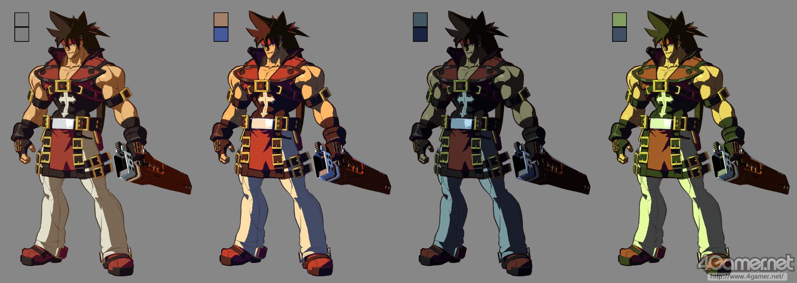

也可以参考写实渲染的算法，考虑到GI等，做更丰富的明暗部整体颜色变化……当然这已经超出漫反射范畴，留到以后讨论。

这篇只谈到对漫反射的直接调整，其它更进一步让角色融入环境的办法，会在后面的屏幕后处理等章节讨论。

<br>

<br>

------

### 综合配色设计实践案例参考

先从亮部、暗部，色彩对比关系来说。

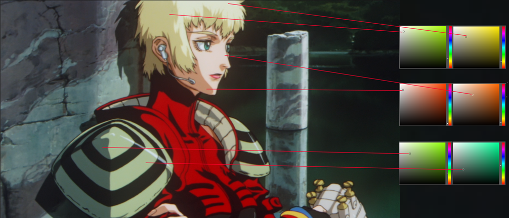

左边是剧照，右边是从上面取出来的颜色。一眼看上去，首先右边色板的左边那一条是亮部色，右边是暗部色。其实你一眼看上去能大概感觉到它的色彩有一些变化，但变化不是太大，这个就是日本传统动漫角度的一个实现方式。

但是你从皮肤的角度来看亮部、暗部的颜色，暗部会相对偏暖一点，从它盔甲的颜色上来看，又会受到环境色的影响，所以它有点偏冷。如果你是用3D角度直接做一个3D游戏，你不需要考虑这些东西，因为有很多现成的光线追踪，或者说有些反弹，就可以做这件事情。但这个是后面会讲到如何去处理的一个东西。

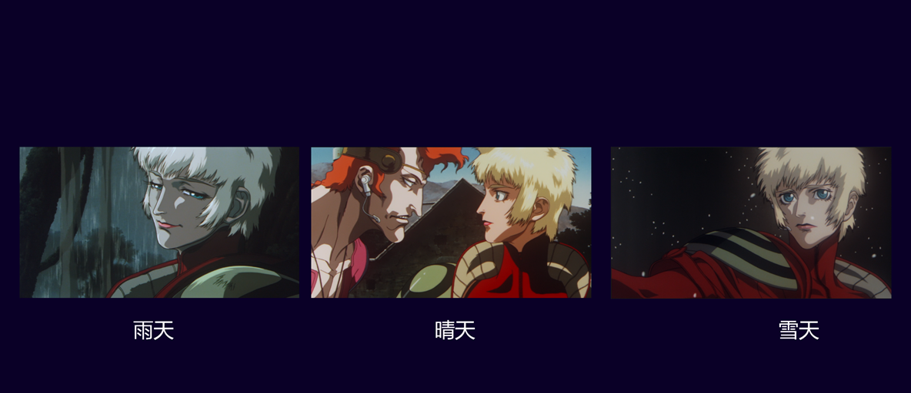

这张图是从整体和局部色彩对比关系来讲，同一个角色在雨天、晴天和雪天，也有不同的色彩变化。这个也很好理解，哪怕是一个正常的电影，一个人也会有很多色彩变化。这个里面雨天和雪天会有点接近，因为它都是属于一个漫反射的环境。晴天由于受到阳光的照射比较强烈，整体看起来颜色跟对比度会强一些。

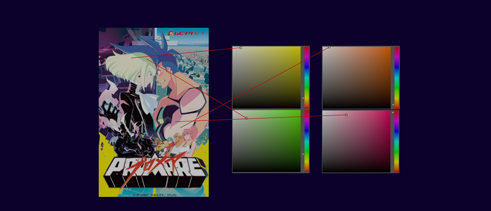

这是扳机社的《普罗米亚》电影。到了现在，日本的动画颜色已经发展得非常强烈了。这个片子如果大家有兴趣，可以找一些剧照和花絮来看，非常华丽。它的华丽度已经比刚才那个强烈很多，但是看久了也会视觉疲劳。

这边很明显能看到，现在用线连出来的也是亮部色和暗部色。从色板上明显就能看出来，一个是偏黄、偏绿，然后偏橘色和偏粉红色。它把这个颜色的饱和度层级拉开得非常过，你可以看到有一些颜色顶得非常高，是RGB色，用打印机的颜色有可能会打印不出来，所以这个如果是印刷有可能会偏色。这就是他们要追求的非常强烈的视觉效果。

理解了这种受众和审美以后，是如何把它用到游戏里的？这个就是游戏里面的角色：卡洛琳。左边是她的原生状态，右边是她的一个皮肤。

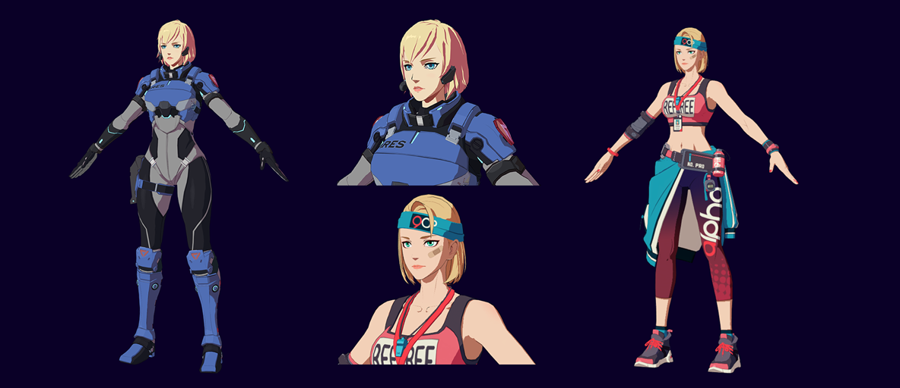

你看到左边这个角色，她全身都是非常冷的颜色，包括暗部我们也故意调成了一个偏冷的紫色，就是为了让她的色彩能统一。但是这样一来，她的色彩就会容易变得比较生硬。所以虽然她是黄色的头发，但给她加了一个非常重的粉红色，其实是用了一个紫色暗部做衬托。然后她的皮肤、身上衣服的暗部，用了冷色来衬托，达到一种统一效果。

另外一个是校园教练，通过对比他的头发就能看出，其实头发、皮肤和身体着装的暗部都是统一的颜色，让他看起来像是沐浴在阳光中的一个状态。这对应刚才讲的，亮部和暗部要有色彩对比，是人为处理的。同时，它整体也要有一个色彩饱和度对比，这是一个简单的技术说明，就不说非常细节的内容了。

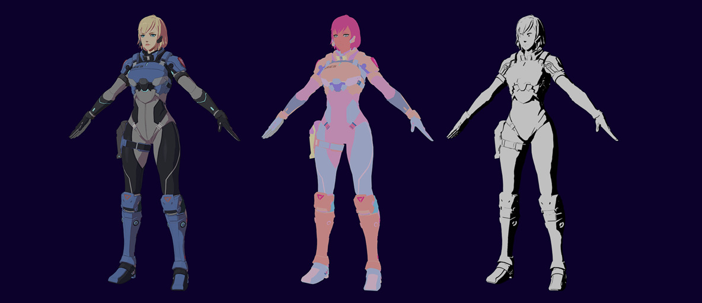

左边第一张图是实现出来的效果，第二张图是在暗部色做的处理。你可以看到，头发的颜色、饱和度和色彩倾向是非常重的。最右边的那张图，可以认为是个shader，其中一个过程是把黑色和白色作为阴影分离开。在黑色区域，把中间这张图跟我们的亮部色做一个叠加混合，就得到了最终效果。 

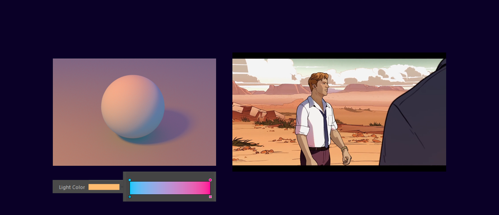

右边这张图是《爱，死亡和机器人》里的一张静帧截图，这是一个偏美式的画面效果，但是可以看到，角色白色的衬衣往上有一个反射光，看起来是一个暖色的。在一部正常的电影，或者说一个稍微写实一点的画面里，你不会看到这么强烈的一个反光，这里是在故意强调他的裤子，或者说整个环境对他白衬衣暗部的反射影响。

左边是做的一个模拟，可以把它称为卡通渲染的光线追踪。因为它的光线追踪并不是基于一个特别物理，或者特别写实度的范围，而是给它直接指定了一个渐变。

还是看左边那张球下面的图，灯光颜色给了一个暖黄色，模拟大概太阳的颜色。暗部做了一个从蓝到粉红的渐变，也就是在它的暗部罩一层蓝色、冷色。这个冷色用来跟亮部的暖黄色做对比。

粉红色会产生什么效果呢？光线追踪它会不停地反弹这个球的深色区域，让这个粉红色慢慢地渗透到暗部，包括它的投影和明暗交界线后面的区域。你会看到一个比较强烈的效果，这个工作我们现在也正在用于角色实验当中。

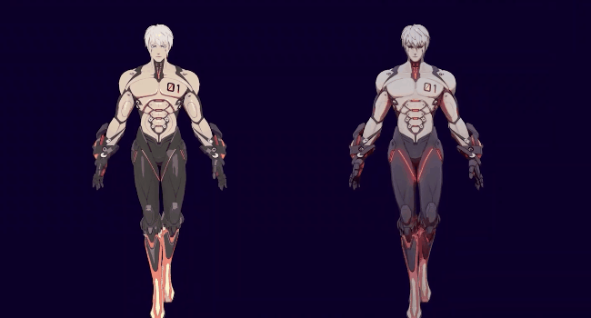

左边是现在的《王牌战士》角色效果，右边是正在尝试中的画面效果。通过对比可以看出，之前的赛璐璐效果很有特点和风格，但如果要继续往下走、想要更多细节，或者说想要更多的表现力，就需要做出更多尝试，去找到一个平衡点。

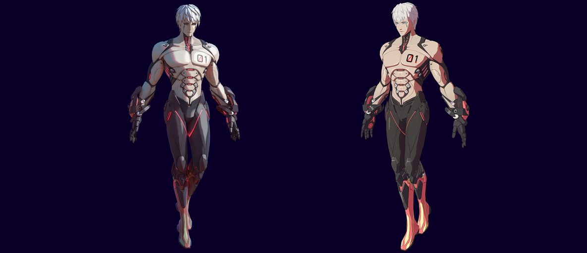

可以看到，现在正在进化中的，就是一些明暗交界线的色彩关系，包括高光区域的处理。现在这个角色的色彩里就已经包含了刚才说的光线追踪效果，但是因为要在游戏里面实时奔跑，我们会用到一些其他的技术。

这是一个隐含的黑科技，首先要用一个非实时渲染效果做预演，然后再在引擎中实现，这两步也是相辅相成的。因为我们做宣传片、海报，都要在这个基础上处理。这就代表了两种方向，一种是赛璐璐，非常传统的做法；另一种是未来想要进化的思路和效果。

<br>

<br>

------

### 风格化的暗部处理

在日本动画中的物体除了正常的暗部颜色，还有大部分的涂黑操作。例如海带影和BL影。海带影主要用于表现金属质感和浓重的明暗交界线，BL影主要是对人物的暗部进行概括涂黑，来表现一种逆光效果，视觉上看具有版画的质感。

从技术上也可以考虑还原这些效果。不过个人觉得在现代游戏里可以直接还原金属效果就没必要用海带影表现金属了（真想要的话，就用反射贴图/高细节法线/更深暗部色实现？），而BL影可以通过上面的全局环境色方式设置高对比度的明暗环境色。

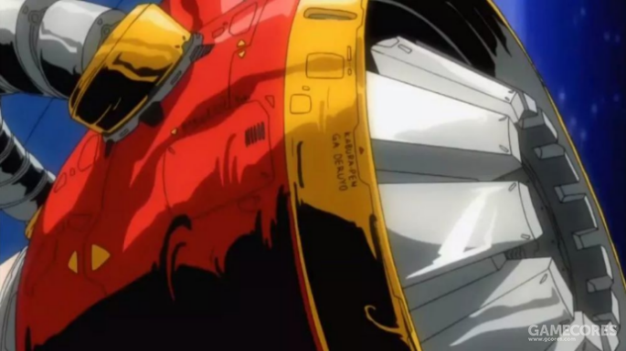

*↑海带影*

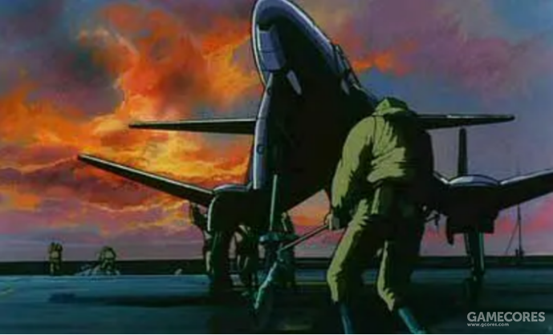

*↑BL影*

<br>

也有人试过给明暗边界线添加噪音，似乎有种晕染笔触感，不清楚如果大规模用到人物身上是否自然：

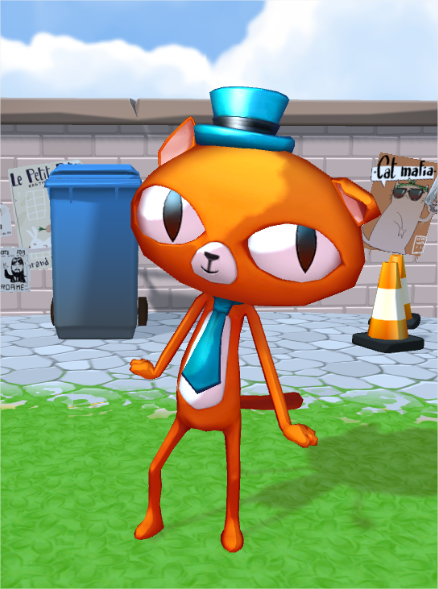

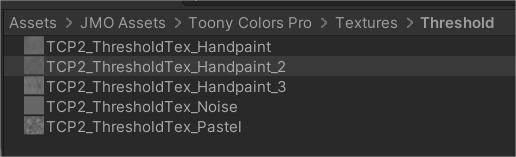

<br>

<br>

------


