# Toon Shading Collection 

## CH04 - Direct Specular 高光（主光）

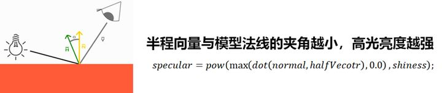

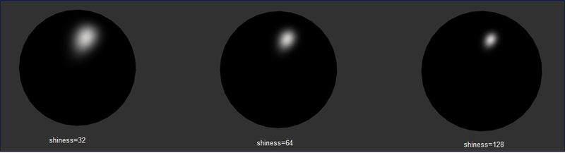

传统高光是使用H半程向量和法线来进行模拟的。与梯度漫反射阴影相同，我们依然使用smoothstep函数对原始高光值做一个离散化的处理，获得了边界明显的风格化高光。

<br>

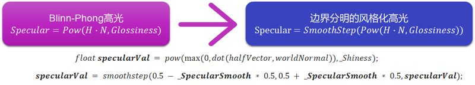

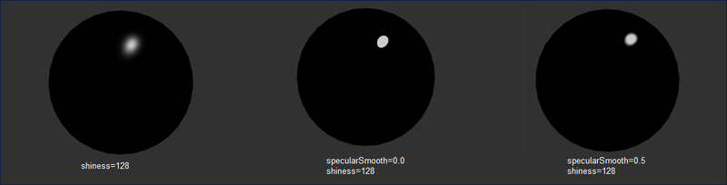

<br>

也可以以GGX高光为基础，对高光计算结果或粗糙度值进行梯度化计算。

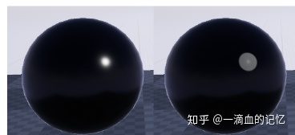

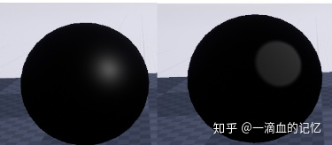

```glsl
half StylizedSpecular(half specularTerm, half specSmoothness)
{
	return smoothstep(specSmoothness * 0.5, 0.5 + specSmoothness * 0.5, specularTerm);
}

Half r = Roughness * 0.85 + (1e-4h);
specularTerm = StylizedSpecular(specularTerm, specSmooth) * (1 / r);
```

<br>

<br>

------

### 硬边高光抗锯齿


为避免硬边高光的锯齿，可以用fiwdth函数补充抗锯齿处理。

```glsl
fixed spec = dot(worldNormal, worldHalfDir);
fixed w = fwidth(spec) * 2.0;
fixed3 specular = smoothstep(-w, w, spec + _SpecularScale - 1)) * step(0.0001, _SpecularScale);
```

<br>

<br>

------

### 柔化（软边）高光

传统的卡通高光通常都处理成硬边（如罪恶装备式的传统赛璐璐动画风），然而这几年业界开始流行为二次元角色渲染融入更丰富的材质效果，卡通高光也接受羽化高光了。

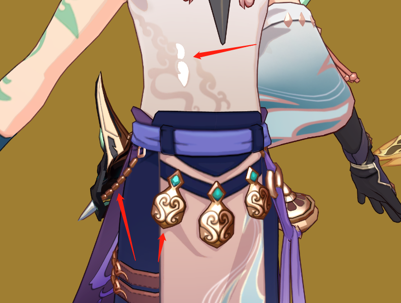

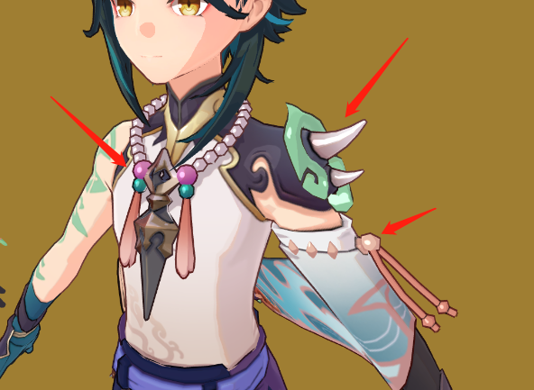

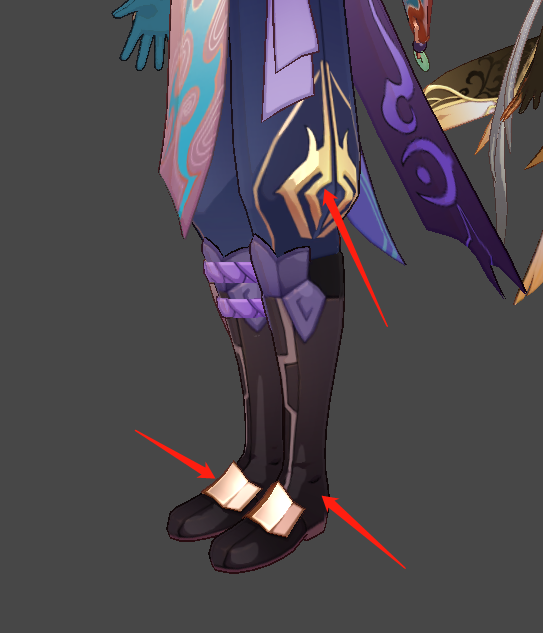

*↑个人还原的原神效果，金属材质的高光是软边，区别于玉石漆皮等材质的硬边高光*

<br>

仅米哈游一家就是这一趋势的典型例子，崩坏3中普遍采用硬边高光（不咋玩崩3，说错不负责），到原神中专门对金属部分做了软边高光处理，使金属材质有种“做旧”“粗糙”“厚重”的感觉，视觉信息更加丰富，也更加贴合中古奇幻类的世界观。

做软边高光，只需要给smoothstep函数填一个较大的柔化区间即可，或者直接保留原始高光计算的结果不附加任何离散化计算。

 <br>

**性能优化**：Gouraud 高光，在顶点中计算。

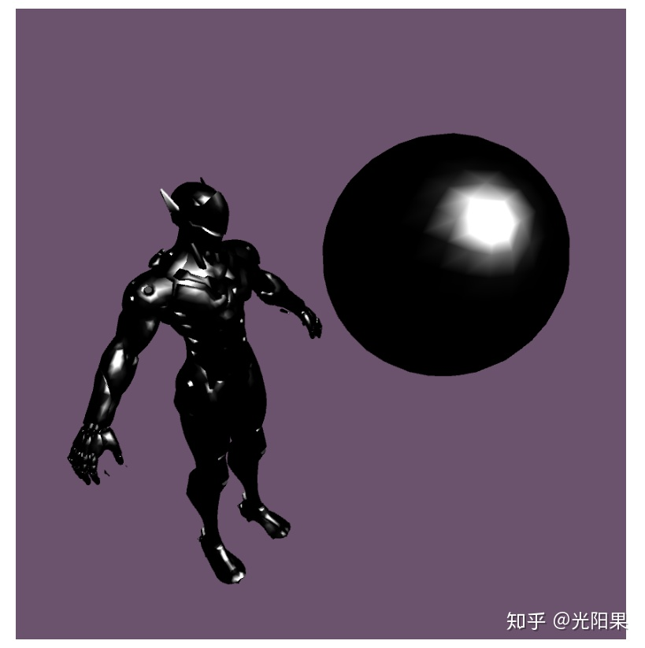


动态观察原神的金属球体，发现高光呈多边形变化，应该是使用了Gouraud 高光，即在Vertex Shader中计算高光作为优化。对于卡通渲染来说，这种牺牲精度提高性能的做法造成的多边形高光，似乎也能视为一种独特画风。

<br>

<br>

------

### 高光出现位置控制

有观点说要限制高光随视角变化范围。

直接把光源方向调整为视线方向，就能永久看到高光。光源稍微拉近视线方向也可以做到更容易看到高光。

另外还有强度mask和大小mask用来控制高光。

极端的情况是高光位置完全没有流动感觉了。

<br>

<br>

------

### 风格化高光

有时候，我们需要对高光形态进行定制。

<br>

#### Ramp映射与叠加


*↑崩坏3角色官方MMD对高光也做了多层ramp*

<br>

也可以像漫反射一样对高光进行一次ramp映射乃至多层高低频ramp叠加处理。

```glsl
float3 H = normalize(V + L);
float NoH = max(0, dot(N, H));
half specRamp = tex2D(_SpecularRamp, float2(NoH, _SpecularShininess)).r; //_SpecularShininess控制高光的锐利程度
float3 specular = _SpecularColor * specRamp * _SpecularIntensity;
```

这类似于真实感皮肤渲染中的双镜叶高光。双镜叶高光就是将不同粗糙度下GGX高光混合，然后用于模拟真实皮肤表面的高光反射效果的。

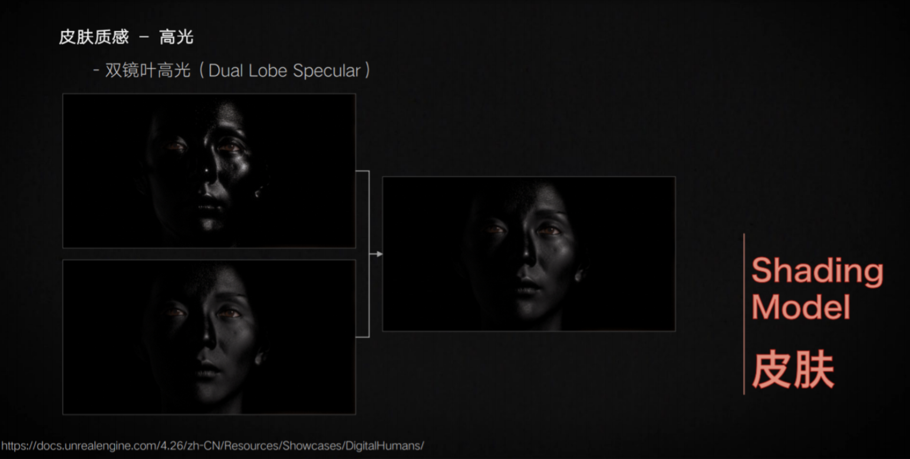

其实内一层硬高光+外一层软高光是比较常见的高光画风（其实反过来外硬叠内软也行），当然这个某种程度上可以通过bloom做类似的溢出效果。

有的画风会在胸部、肩膀关节等部位的高光下叠一片粉色，这也是软硬两层高光的做法。

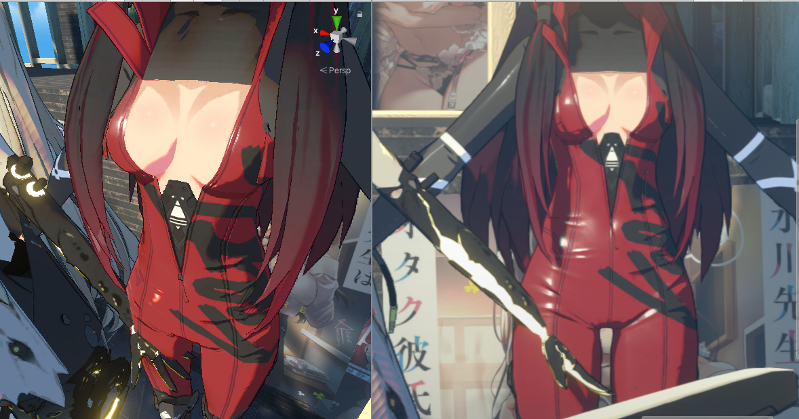

<br>

#### 纯参数化计算变形

形状自由，充分发挥算法想象力。

Stylized Highlights for Cartoon Rendering and Animation这篇论文给出了几种有趣的卡通高光渲染，包括平移(Translation)、旋转(Rotation)、分割(Split)、有向性缩放(Directional Scaling)和方形化(Squaring)几种。这些光照的实现思想都是对Blinn-Phong模型中的Half向量做一些修改，然后根据法线和Half向量的点积结果改变高光的形状。

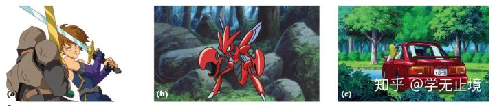

*↑这种高光变形可能的应用场景，但也可以用反射做*


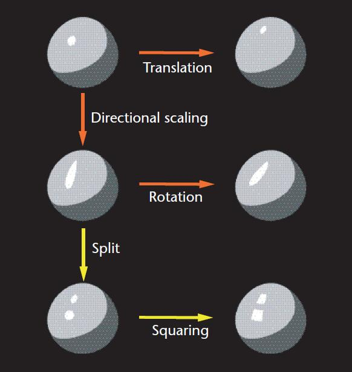

<br>

#### MatCap采样

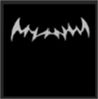

也可以使用MatCap采样高光，但这要接受假定视角不变的前提。

风格化渲染对形状和清晰化要求更高，可以放弃和光源的相关性而优先保证光斑形状。

<br>

#### 高低频高光

非金属部分的高光，高低频部分会拆分的更开，或者是平缓的大面积微弱高光，或者就是狭窄的小面积强烈高光（通常在曲率变化剧烈的倒角）。而这些在传统PBR体系下都能实现，就不说了。

<br>

#### 各向异性高光

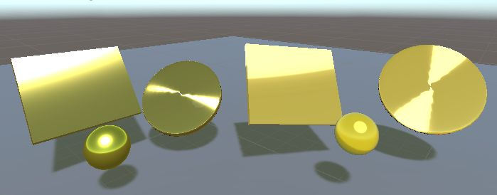

以写实渲染的各向异性高光为基础，再进行卡通化调整，通常用在头发、丝绸、皮革、CD、羽毛、特殊金属等材质上。

<br>

<br>

#### 综合案例

下面碧蓝幻想截图这个高光不同方向的软硬度显得不太一样，如果不是因为加了单方向性的bloom效果或者跟底色压暗混淆了，难道是按方向分别做了羽化？或者用了MatCap？或者将两层参数不同的高光叠加？这效果也挺有创意。另外金属高光边缘的底色饱和度有增加，让总体色彩更丰富了。

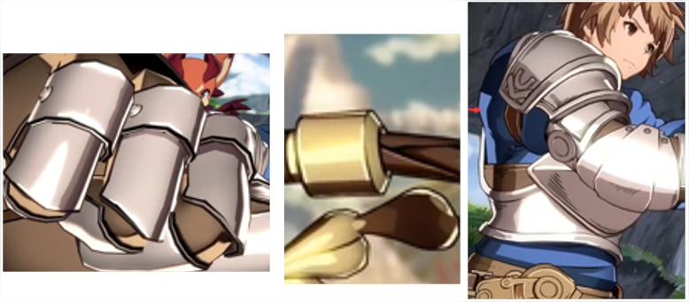

<br>

<br>

------

### 特殊高光材质

#### 清漆材质

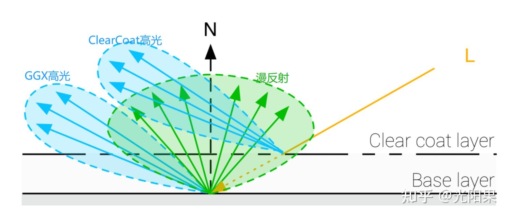

*↑清漆材质光照原理*

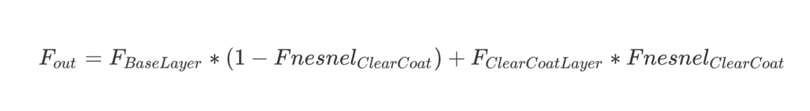

*↑清漆材质能量守恒公式*

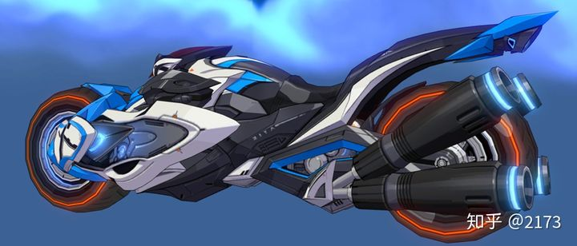

*↑摩托车金属排气管的车漆效果*

<br>

二分色还可以表现一些表面有半透明层的多层材质，比如瓷器表面的半透明釉质，漆面上的半透明涂层，可以用于表现光滑的皮革、金属等。

这个效果相当于有2层高光，直接增加一层独立的高光计算就行，然后看情况要不要补个能量守恒计算。

也有说只要将高光公式中的法线点乘半角向量换成法线点乘视线方向的（N·H改成N·V），不一定要考虑双层叠加，但这应该只是为了一直看到高光或伪反射，相当于接近卡通清漆光的形状。这比较适合用来处理一些皮革，圆柱形的金属等。

<br>

#### 丝绸材质

各向异性高光一般使用切线替代法线，但丝绸适合使用副法线（也有说法是各向异性高光在unity里都应该用副法线而不是切线方向，待查），最好能叠三个高光层，每一层分别设置不同的颜色，以便最终材质看起来色彩层次较为丰富。

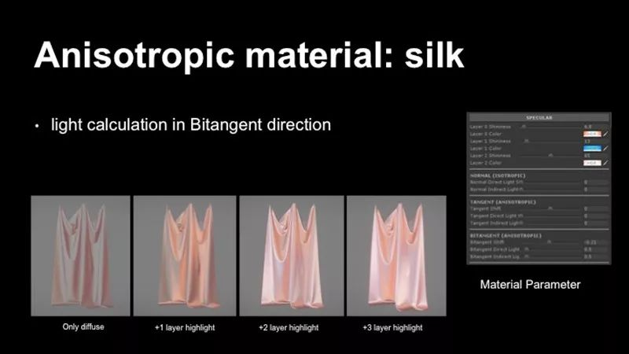

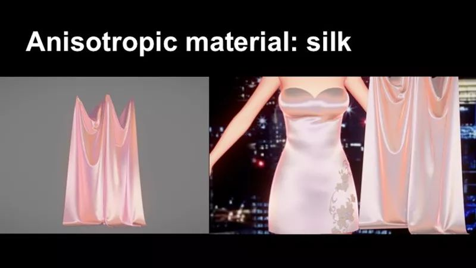

<br>

#### 头发高光

角色头发是高光变形的主要应用场景。主流做法有基于写实渲染梯度化的各向异性高光、利用遮罩贴图控制形状等。头发高光将放到下面单独章节讲解。

<br>

<br>

------

