# Toon Shading Collection 

## CH04a - Direct Specular on Hair 头发高光（主光）

 

二次元头发高光，俗称天使环。

 

------

### 各向异性高光

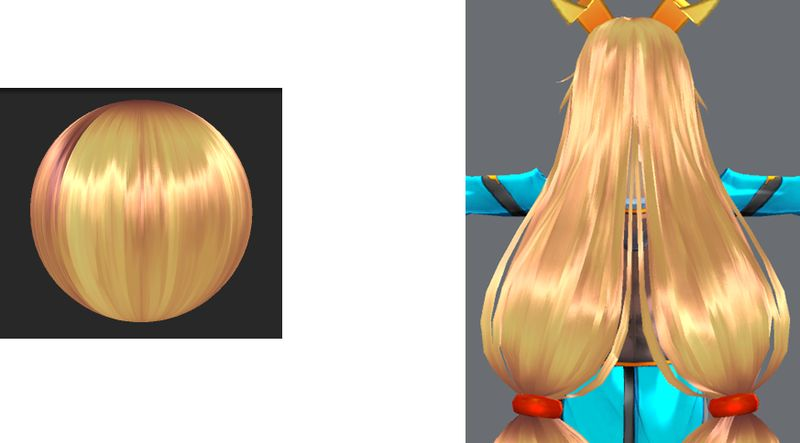

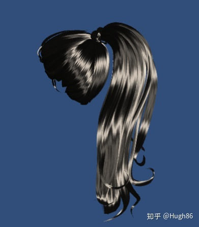

*↑Kajiya-Kay模型的卡通风格效果展示*

 对于二次元头发的渲染，第一反应是直接搬运写实渲染的各向异性头发高光模型，比如Kajiya-Kay模型：一层高频，一层低频，再加上一个切线扰动贴图达到各向异性效果， 要想使得高光沿着每根发束移动，还需要美术在头发模型的垂直方向进行uv展开。最好展成方形UV且与法线贴图方向一致，否则会出现偏移方向相反。

如果模型拓扑较为复杂，UV展开较难做到全部垂直，那就要用Flowmap来梳理高光的形状（也有意见说，卡通头发高光形状既不物理也不重复，无法使用flowmap，至少必须拉直UV避免锯齿，再小心手绘处高光偏移和粗糙度凑出高光形状，非常麻烦）。

通过使用合适的法线偏移贴图，我们可以达到日式卡通中W型头发高光的效果。

 

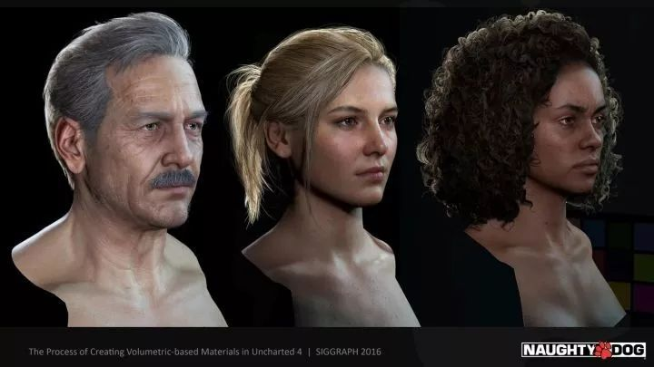

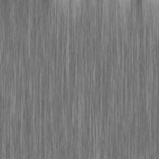

*↑偏移贴图*

  

**优点：** 最接近真实头发效果。

**缺点：** 

- 移动太过自由，容易看起来油腻。
- 对贴图精度和UV展开要求比较高。

**优化：**

- 根据性能要求，可以考虑叠加两个高光项或者只保留一层高光。
- 一旦视角改变，高光带很容易就会乱掉，可以限死x角度避免光带倾斜，并且限制y轴范围避免光带移动到不合适的范围。

 

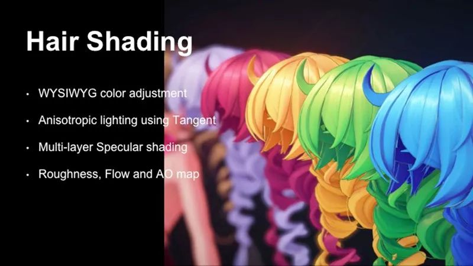

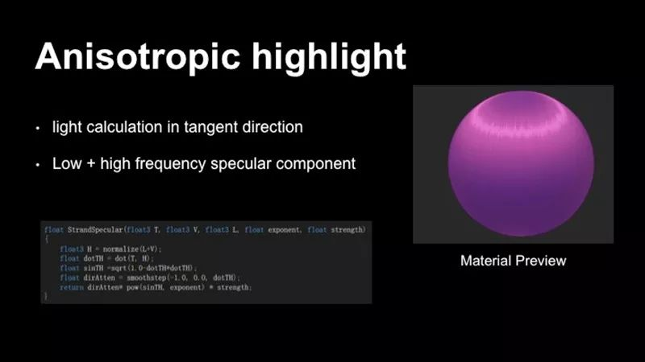

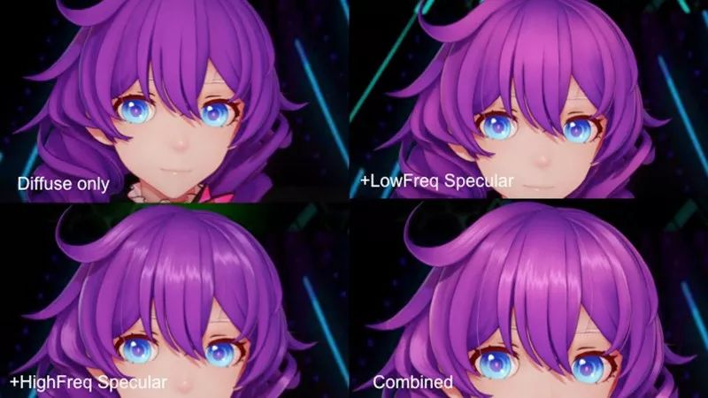

*↑崩坏3角色MMD：对两层高光设有不同亮度和色相，这样使得高光层次更为丰富*

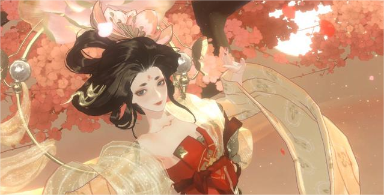

*↑忘川风华录头发高光*

 

多吐槽一下，这种高光用在卡通头发上，总觉得油腻！很少看见舒服的，只觉得米哈游官方的八重樱MMD还不错（米厂另外几个MMD我也觉得头发特油）。如有见多识广的大佬们见过更多成功范例，欢迎推荐。

 

#### 变体——梯度化

上面的各向异性高光还可以进一步加入梯度化，配合偏移和强度mask，做出卡通化的多变形态。

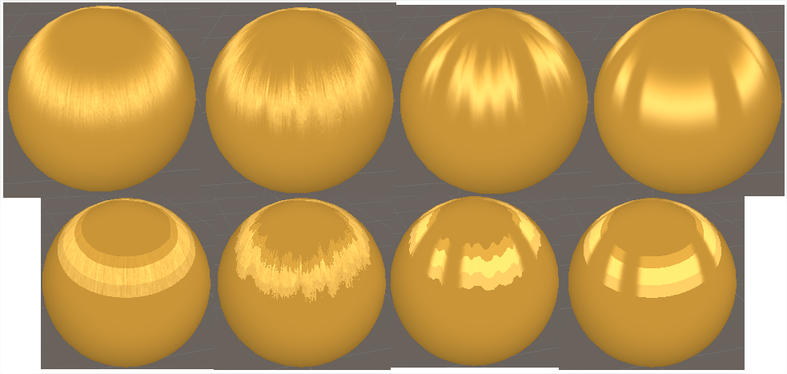

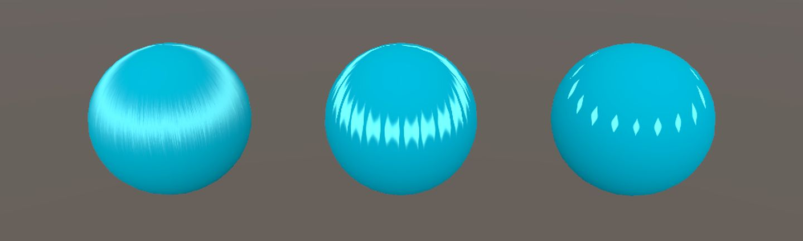

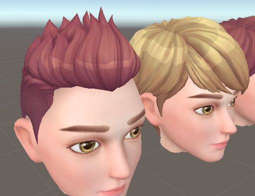

 

还有米哈游展示的一种做法，感觉有点过于复杂化了：

把每缕头发模型在垂直方向进行UW展开，以便高光可以沿着每根发束移动。然后从将每一缕从左侧向右侧填充0到1，用来标识动态生成的高光形状的起始和结束位置。使用几个曲线定义的模板来描述头发高光的基本形状，然后使用抖动噪声纹理来调制头发高光的粗细变化。材质方面有很多参数用来控制生成图案的形状，位置、偏移、宽度、抖动比例等，通过调整这些参数，可以根据需要获得各种不同的形状。

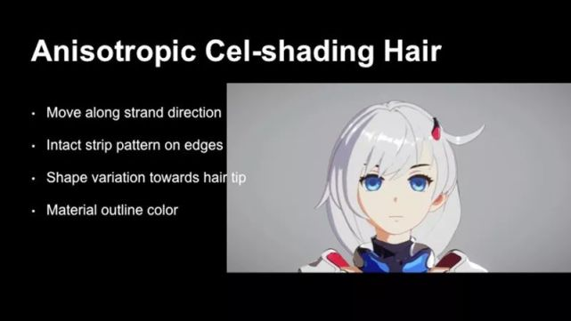

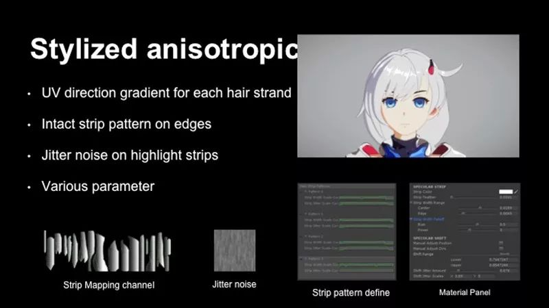

*↑米哈游分享的卡通化各向异性高光做法*

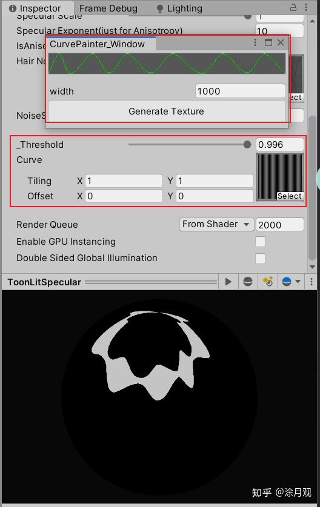

*↑民间还原的米哈游分享效果*

 

 

------

### MatCap伪高光

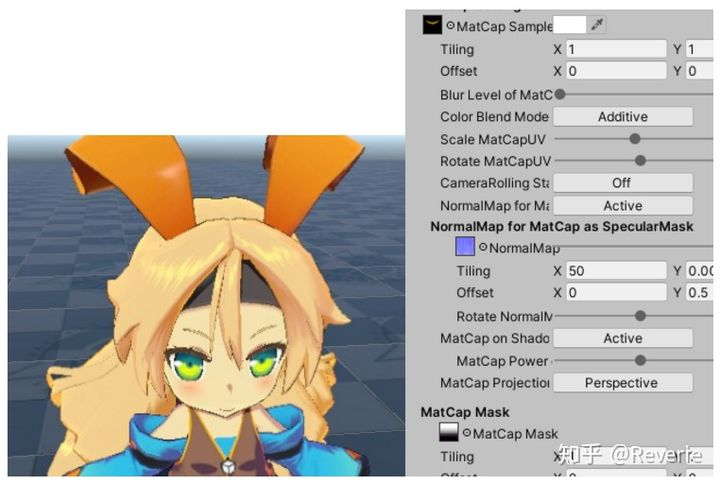

*↑UTS的头发高光*

UTS里使用视线空间法线采样matcap贴图做出假高光，法线贴图做出各向异性，加上遮罩图调整出某些位置的渐隐，也能达到不错的效果。相似的做法在新樱花大战中也有使用，不过他们有通过uv采样遮罩图精准控制到每根发丝。

**优点：** 高光形状的自由度比较高。

**缺点：** 从任何视角方向看都只能看到为指定视角设计的高光，对自然披散的头发效果最佳，但对扎起的头发、刺猬头等发型不一定看上去效果好。

 

继续吐槽，新樱花大战的头发，静态还行，动态看也觉得很油腻。是不是动态越强的头发越油腻？

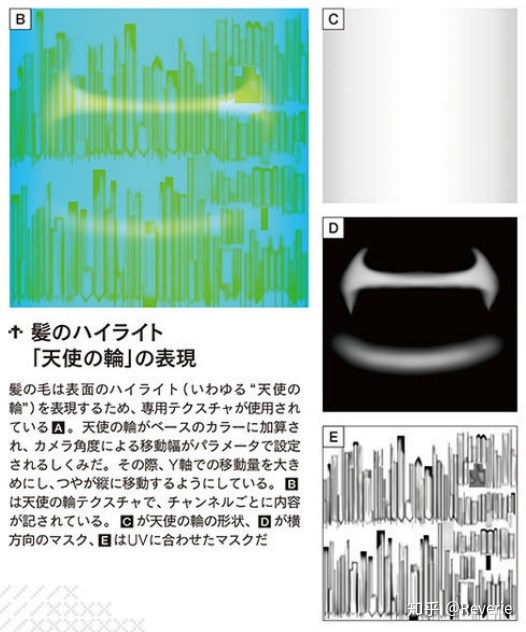

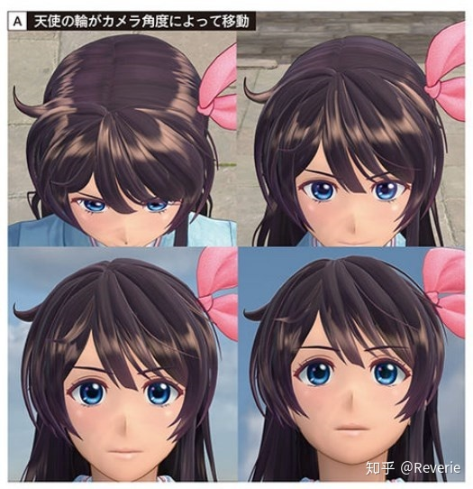

 

 

------

### UV2固定位置缩放高光

蓝色协议为了头发高光点搞得超麻烦的一种做法。

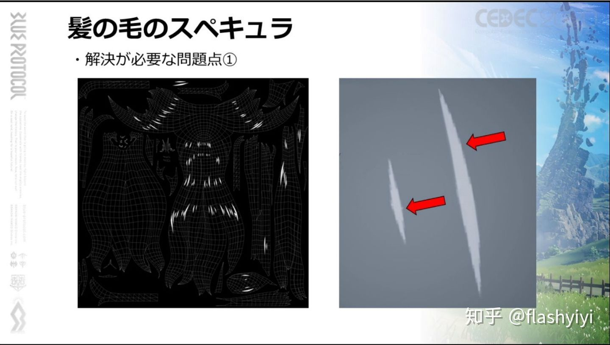

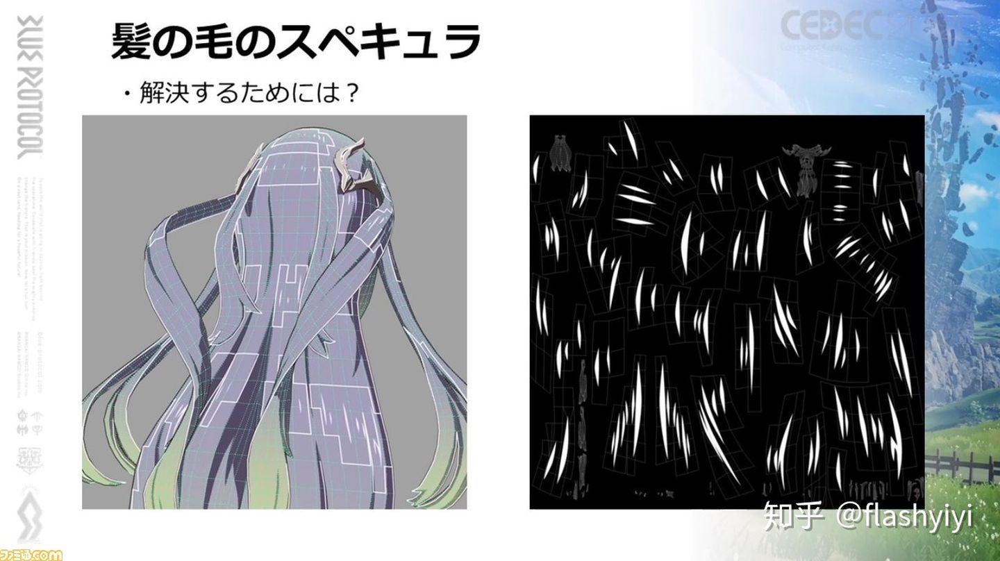

他们的目标是让光点随着镜头距离而缩小，并不会根据镜头角度移动，整个过程也和法线无关，和一般人想实现的各向异性效果完全不同。但为了实现它，使用了UV2单独为这些高光元素准备UV，这并不是为了拉直UV，而是为了精度和留出可供缩放的空白区域。

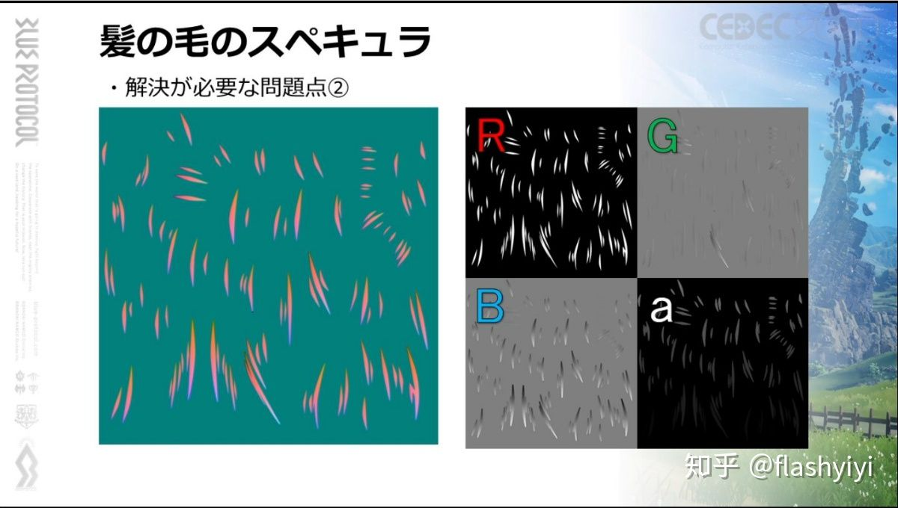

然后用一张RGBA控制图来处理。R通道是基本亮度，GB通道记录的是当前像素距离光斑中心点的距离值，A通道不明，有可能是缩放幅度。

具体做法是，当渲染一个像素时，根据读取到的BG通道数据，和当前UV相加，得到光斑中心。然后反过来减这个BG值同时进行一个根据距离的缩放。数值放大的时候，光斑在视觉上就会缩小。

这种做法可以确保光斑的边缘形状和R通道保持一致。

但是离线生成这张图就要做不少工作，必须让人手动指定每个光点的中心然后生成控制图，而且在固定距离看，人物光斑其实并没有任何变化。

但这种方式似乎是可以做和Normal挂钩的缩放的。一般做法不行，是因为光斑上每个像素点的Normal是不同的，根据Normal缩放的程度就不同，会导致光斑扭曲。但它这个方案，每个点都可以找到一个共同的中心点，只要使用这个中心点的Normal……

对，我取不到这个点的Normal，所以不行。

所以只能如此。

**优点：** 

- 虽然不能移动，但如果需求就要这样的话还算是一种独特的画风和处理方式，视觉上不易油腻。
- 高光形状设计比较自由。

**缺点：**

- 高光整体位置不能移动。
- 资源准备比较麻烦。
- 算法比较奇葩。

 

 

------

### 经典高光计算配合mask限制形状

算是一种偷懒方式，放弃了光照角度的正确性。如果能接受高光位置固定的话，就可以大胆采用。虽然不能自然滑动，但油腻度大大减少。也可以改出各种形状，比如有些画风的头发高光是画成小圆点形的。

战双在头发高光区的边缘都做了羽化，会让每片高光本身在随视角移动时还带有像气泡一样的膨胀收缩效果，很有意思。这样人物运动的时候起码这个高光带有点变化，不是完全的死高光。（这个方法也可以用在肌肉、嘴唇光点等希望产生较为固定但又能稍微带点变化的区域。）

这个头发高光处于暗部时，一种建议是，不应该隐藏，只能处理成稍微变暗，这是头发材质特性的一部分。

 

**优点：** 

- 不容易油腻。
- 形状设计的自由度还算高。
- 高光算法和其它区域保持统一，不用附加专门处理。

**缺点：** 位置过于固定。

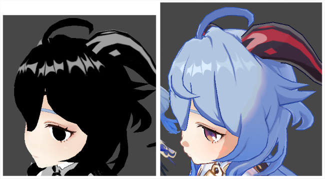

*↑原神：NNN形高光*

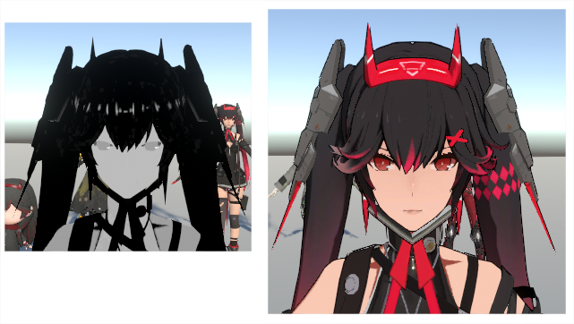

*↑战双：气泡点形高光*

 

光带在正视的时候看起来最美观，但是在自由视角就存在玩家把镜头转到头顶上的问题。在那个视角上头顶光带会在头的周围变成一个圈，非常违和。偷懒办法是禁止视角拉到头顶。

《子弹少女》给出一种办法是，在y轴角度到达一个阈值后，会把这个光带渐渐裁掉，但裁掉光带后必须在头顶位置显示一个新的光带（图中的中心散射光带），否则从玩家视觉角度，他们会觉得高光突然消失了，好像头发的光照特性突然改变了。

这个处理方法虽然不错，但并不是所有高光画风都能兼容。

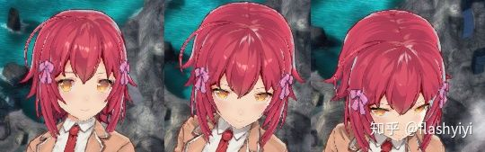

 

#### 变体——反向高光

上面经典高光的做法，算出来的高光一定是中心强外围弱的，但我们经常看见一些画风的头发高光是外围强中心弱的。

于是可以直接把经典高光算法做个反向，一步到位实现效果。

潜在的问题是，假设正面打光，我们只能大致从正面观察才能看到最佳效果，而绕到背光面看头发时，整个高光区都亮了。取巧办法是，直接压暗这种背光视角中的高光，或者单独对头发高光动态调整光照方向。

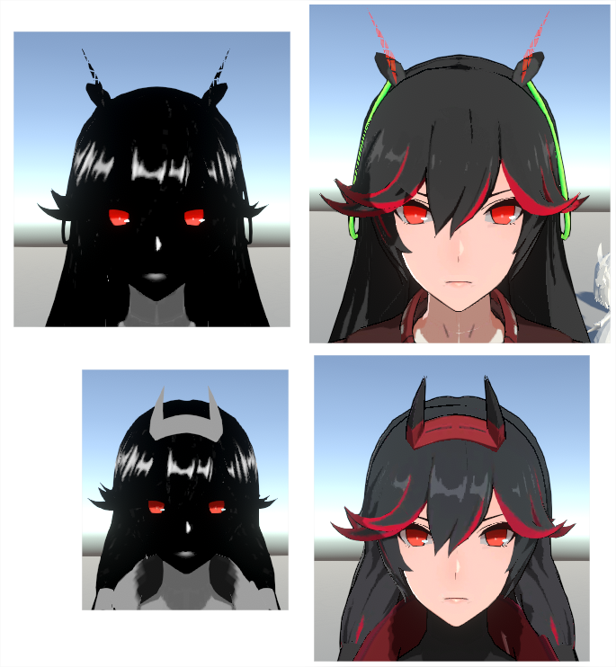

*↑上排：反向高光；下排：默认高光*

 

 

------

### 永久加亮（偷懒办法）

直接画在贴图上或者mask上，永久加亮高光区域，做成死高光，管它呢！

甚至有的日本动画公司在为了表现头发固定的高光位置，依然使用了取巧的3D建模手段来实现，效果也还可以。

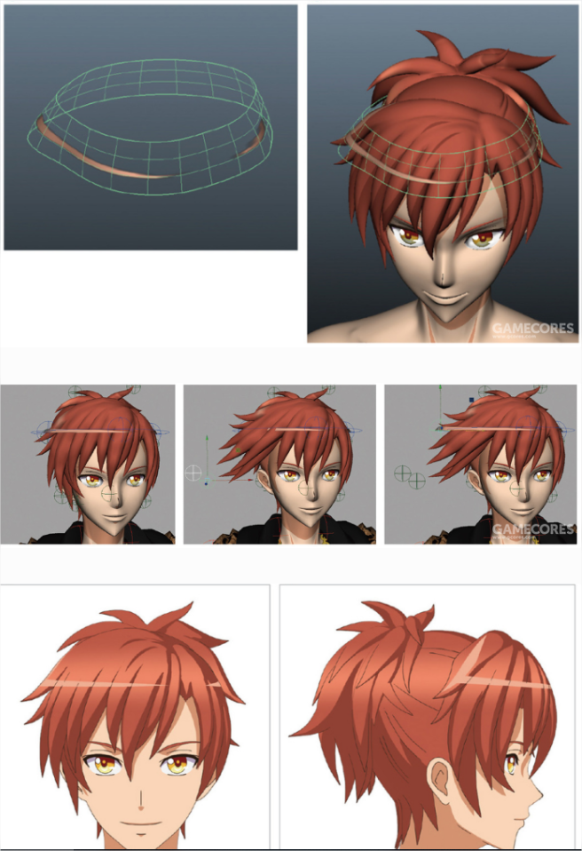

 

------

 

------

 

------

 

------

