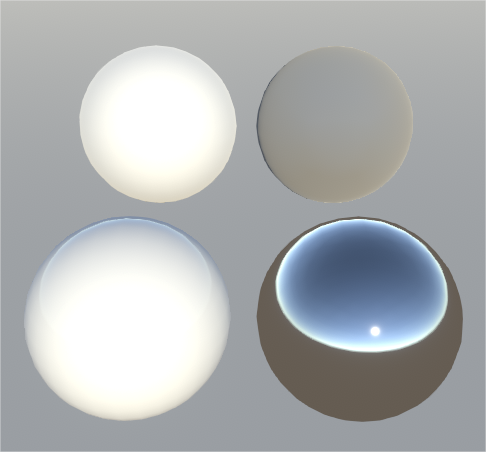
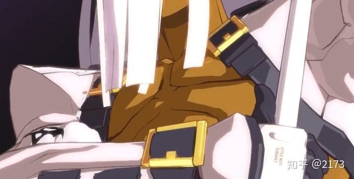
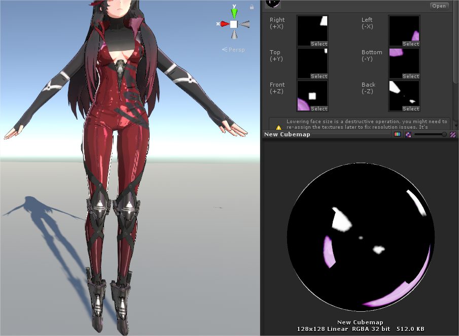
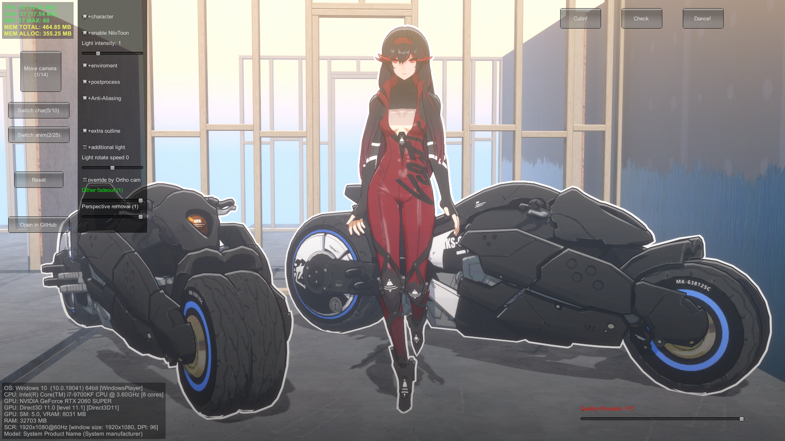
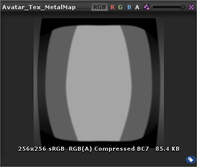
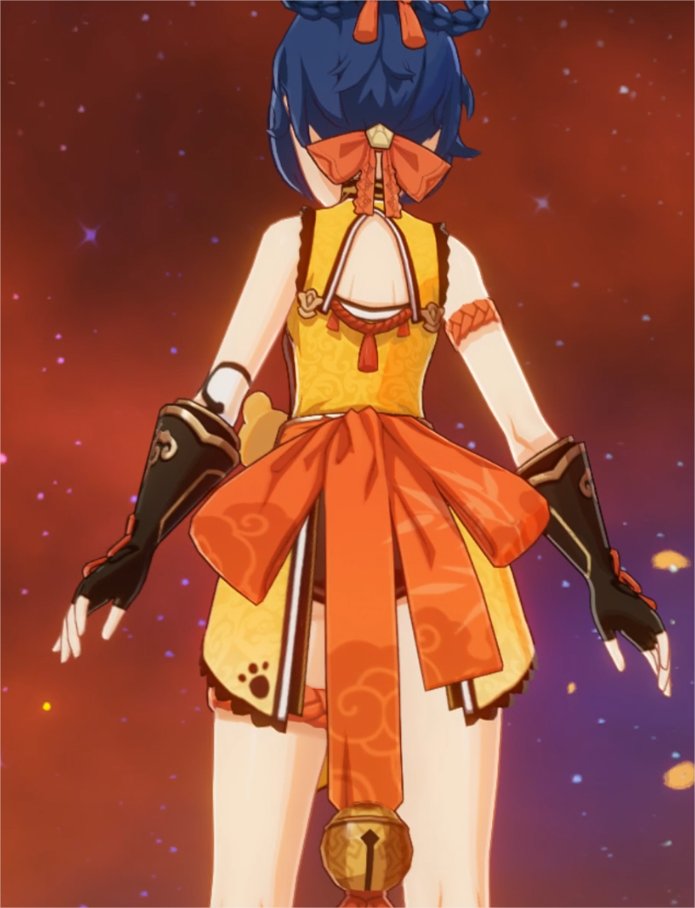
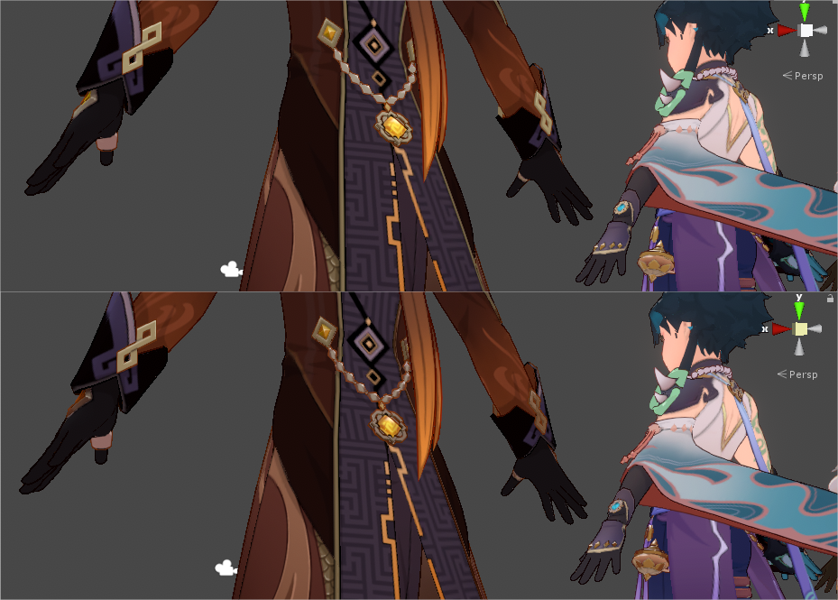

# Toon Shading Collection 

## CH05 - Indirect Reflection 反射（环境光）

反射的本质，是ambient环境光源在物体表面产生的高光。（反过来说，高光就是平行光主光源的反射，所以高光反射经常混在一块儿讲。）

*↑左上：金属度0光滑度0；左下：金属度0光滑度1；右上：金属度1光滑度0；右下：金属度1光滑度1。*

 

大致上说，越光滑、越金属的物体，反射越明显。

早期的卡通角色渲染几乎跟动画一致，如果不考虑结合PBR的话，基本上不咋加入反射效果。比如罪恶装备的金属部分，跟别的材质相比只是多了一层高光。

然而，如果视线转到角色的背光面，我们就很难看到主光产生的高光了，也就是说，光滑材质和粗糙材质、金属材质和非金属材质，在暗面几乎看不出区别，都会特别平。

对于强制玩家视线不能靠近背光面的游戏，我们对此可以无所谓；但对于开放视角且统一全场光照方向的游戏，就需要多想想了：为了增加暗面细节度，要不要补上反射呢？

现有的卡通渲染分析文也很少见到讨论反射效果的，所以本章几乎纯个人独立理解了。

 

 

------

### Cubemap反射

一种方式是直接按传统方法用cubemap采样反射。对于卡通渲染，cubemap上的图案其实没必要太精细。

下面看战双，虽然这个反射是在它PBR部分算的但姑且拿来举例吧，它的反射贴图超级简化，简简单单打几道区域光就很有卡通感。如果想定制化反射，就用偏简化的贴图吧。

而假如随便找一张写实背景的反射贴图反而会显得太过写实、有种割裂感。但也不是不能多尝试，想直接跟环境走实时采样反射探针也行。

*↑战双的反射贴图，非常简化，虽然是在PBR部分算的*

*↑大佬做的战双同一套皮肤，感觉没用反射贴图或只用了一张比较糊的？就感觉材质不一样了*

 

 

------

### MatCap伪反射

既然上面的全方向反射贴图都可以那么简化了，已经跟周遭环境色完全脱节，那不如干脆再省点，直接采样固定方向的MatCap，反正卡通渲染本来就不用那么正确。

原神就在金属材质上统一用了张极简的MatCap反射贴图，立体感层次感强很多。

另外，也可以考虑高光和反射都合并在MatCap上算了。

 

*↑原神的反射贴图，乍一看都没想到是MatCap，过于简化了*

*↑原神这张截图上的金属材质能看出很多层次的色彩，都是高光配合反射贴图的结果*

*↑原神角色香菱的金属铃铛，终于完全看出MatCap的本来面目了*

*↑本人还原的原神角色材质金属部分对比——上：无MatCap反射；下：有MatCap反射——总之立体感层次感强很多，动态更明显但懒得录了*

 

这个做法的本质是，风格化渲染，金属部分和写实渲染在高光GI方面的需求基本一致，只是对IBL的形状和清晰化要求更高，所以有一种选择是直接使用MatCap，放弃和光源的相关性而优先保证光斑形状。水面反射也更多要求使用如同镜子一般的清晰镜面反射（不管是否合理）。

 

 

------

### 极简伪反射

碧蓝幻想的金属和皮革材质会有一圈边缘压暗效果，亮部压暗是软边的，暗部的压暗有硬边，搭配边缘光，实际上实现了反射效果的替代效用，给人造成材质错觉。

再次注意一下原神的反射MatCap贴图，也是高度概括成了中心亮、四周暗、最外围又一圈亮色的样子，也就是说这是一种反射简化的共识。

 

 

------

### 反射采样粗糙化？

上面采样贴图的两种办法，还可以考虑要不要模拟粗糙/光滑表面的情况，利用mipmap逐级进行模糊化采样（甚至极简办法也可以把压暗计算搞个软硬可变）——当然都到了这一步的话，不如直接上PBR了。

原神的金属反射就看不出有模糊处理，而它的金属高光经常是很宽的软边，这就有种粗糙度逻辑上的矛盾。其实它也不一定要降采样，直接替换成一张模糊化的反射贴图就好，但它就是没有。

总之就算不上PBR，也可以考虑整个可模糊可清晰的反射，增加材质多样性嘛。

