# Toon Shading Collection 

## CH06 - Rim 边缘光/勾边光

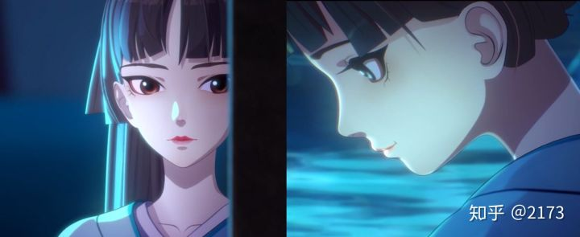

卡通渲染通常饱和度比较高，描边和边缘光能够让角色从高饱和度的画面中凸显出来。在动画中也经常用边缘光经常用来表现逆光效果。

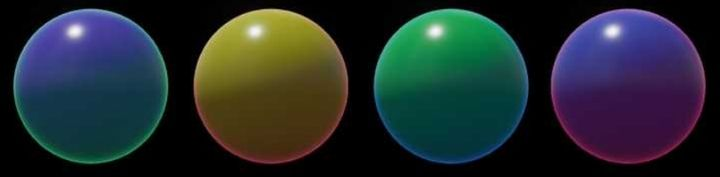

边缘光，顾名思义，指的是模型边缘内部的发光效果。

这与现实物理的菲涅尔反射相关，视线垂直于表面时反射较弱，视线与表面的夹角越小、反射越强。

在素描上也有明暗五调子的概念，在物体边缘的部分会有一圈反光，所以物体的边缘不会是最暗的部分。在图形学上对应的概念就是菲涅耳（fresnel）现象。

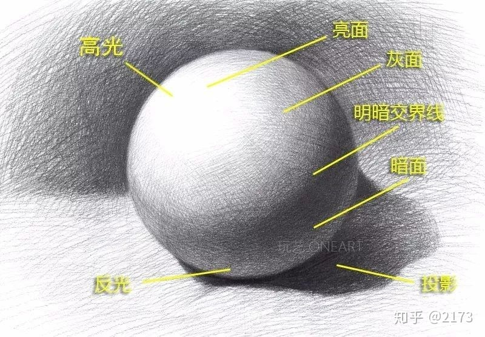

<br>

<br>

------

### 传统边缘光算法

**原理：** 基于视线与物体表面法线的点乘，视线与物体表面垂直时边缘光强度为0，视线与物体表面平行时边缘光强度为1。

**基础公式：** 1- saturate(dot(i.viewDir, i.worldNormal));

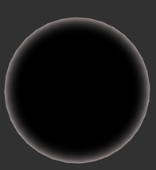

类似高光和漫反射，卡通边缘光的过度通常会比较硬，所以通常我们还会用smoothstep或step做离散化加工，进一步简化边缘光。

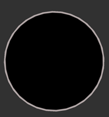

<br>

<br>

------

### 边缘光出现条件

现在通常认为，在卡通渲染中，边缘光的出现也是有条件的。

<br>

#### 亮部才有边缘光？

一种观点认为，在光照射不到的地方，就不该显示边缘光。

为此，可以用NL点乘结果与rim值相乘，这样在暗处就不会有边缘光。

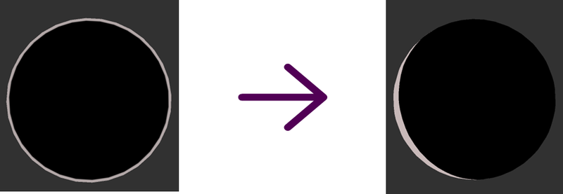

边缘光在面光时出现，也有利于勾勒人物边缘。

<br>

#### 逆光透射？

另一种观点认为，逆光观察时才应该看到最强的边缘光，用来代表背光透射，顺光观察受光面时反而不该出现边缘光。

原神就运用了此观点来动态处理角色边缘光强度。

为此，可以用VL点乘结果（或光照方向L点乘物体中心到相机的方向/或光照方向L点乘相机中心视线角度，括号内二者计算结果对全身比较统一）的反向值与rim值相乘，还可以再补个offset调整从光线和视角的夹角多大时应该开始出现边缘光。

<br>

#### 侧逆光？

应该用来表现侧逆光，一直保持单向的硬边缘光而不是全方向的菲涅尔边缘光，算是源自人像摄影打光技术。这并不是什么菲尼尔效应，而是一个自动的背部补光。

主要算法是对主灯光方向做处理以后再和法线做点积。有的算法直接再自定义一两个边缘光方向，可以动态调整。

边缘光需要相对固定的覆盖面积。100%固定角度的边缘光实际使用时违和感很强，还是覆盖面随视角有一定变化的边缘光看上去更加自然，虽然在某些角度下覆盖面积变小了。

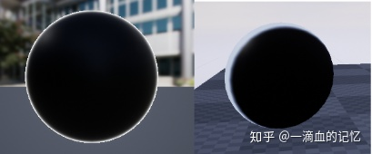

```glsl
// 采样Ramp侧逆光
half3 rim(half nov, float3 lightdir, float3 normaldir, RimRampTex, half4 rimColor, half3 col)
{
    half falloffU = clamp(1.0 - abs(nov), 0.02, 0.98);
    half rimLightDot = saturate(0.5 * (dot(normaldir, lightdir + half3(-1, 0, 0)) + 1.5));
    falloffU = saturate(falloffU * rimLightDot);
    falloffU = Texture2DSample(RimRampTex, RimRampTexSampler, half2(falloffU, 0.25)).r;
    return col * rimColor.rgb * rimColor.a * falloffU;
}

// 以前常用的经典的卡通fresnel代码，来自Toony Colors Pro
inline half3 StylizedFresnel(half nv, half roughness, UnityLight light, half3 normal, fixed3 rimParams)
{
    half rim = 1-nv;
    rim = smoothstep(rimParams.x, rimParams.y, rim) * rimParams.z * saturate(1.33-roughness);
    return rim * saturate(dot(normal, lightdir)) * lightcolor;
}

// 基于UnityChan2里的方法改抄
float3 GetRimLight(float3 viewDirection, float3 normalDirection, float halfLambert,
float rimLightLength, float rimLightWidth, float rimLightFeather, float3 baseColor, float blend)
{
    float rimDot = saturate(1 - dot(viewDirection, normalDirection));
    float rimDot_X_lightDot = rimDot * pow(abs(halfLambert), 10 - rimLightLength);
    float light = smoothstep((1 - rimLightWidth) - rimLightFeather, (1 - rimLightWidth) + rimLightFeather, rimDot_X_lightDot);
    return light * lerp(1, baseColor, blend);
}
```

<br>

#### 综合叠加？

还有一种观点认为，rim可以分为多层互相叠加。

通常来讲，跟随光照变化的单侧边缘光的会更好看。如果想要双侧，可以打另一个光来产生。生成方向和光照方向绑定，这样可以两侧打出不同的边缘光颜色。

还可以按需要结合使用全包边和侧边光。

动画中的边缘光更偏向软硬两层边缘光混合的情况。

<br>

#### 按画风与氛围？

还有说法是：边缘光最好在特定氛围的情况下使用，现在有些被滥用了，某些制作方分析了动画风格所具有的画面构成后，就什么效果都往里面怼。

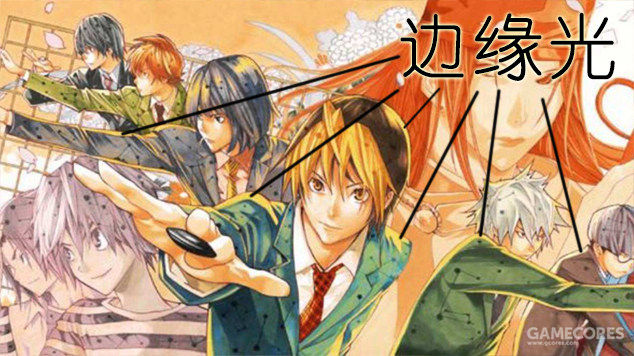

*↑《棋魂》漫画彩页：为了这个画面的整体效果而专门添加的风格化边缘光信息*

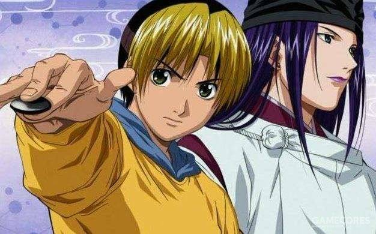

*↑《棋魂》动画：大部分时候都没有边缘光*

<br>

#### 面部常见处理

面部边缘光主要有两种，侧视时的边缘以及正视时的左右两侧边缘，可以使用SDF或深度边缘光或边缘检测的方式来制作。也可能靠调整漫反射达到边缘照亮的效果。


<br>

<br>

------

### 边缘光颜色搭配与控制

一些参考：

- 直接用主光颜色，可能叠固有色。
- 用环境光颜色作为边缘光颜色。
- 对亮部暗部分别设置边缘光颜色。
- 两侧边缘光，每侧都能自定义颜色。

<br>

如果定义的边缘光实际上是背光的话，应该投射阴影来避免漏光现象才合理。但一般不会愿意付出这个成本（其实也能跑，毕竟不是点光源投影，只是另一个低精度Pre-Object投影），而且一定程度的漏光还可能更好看，物理正确没人在意的。

要记住，边缘光本身还是一个背光的模拟，而不仅仅是一种勾勒边缘的手段。调得过亮过粗，周围却完全没有产生这个背光的光照是不行的。比如你人物处在一个黑乎乎的场景里，整个人却被一个大白边包起来这绝对不行。而如果是白天场景，加上这个就没什么不妥，毕竟你也看不出来它背后到底有光还是没光。但假如白天环境基本是白色的，你却给人包裹一个紫色的背光依然不行。

所以边缘光应该是一个光源的属性，而非材质的。材质需要做的只是处理在同一光源下不同部位的差异。

另一种说法是，边缘光既可以来自于方向光源也可以来自于环境贴图IBL，使用方向光，可以按需求定义边缘光，使用环境贴图，可以根据环境光照来获得边缘光以显得更真实，二者都比较有用，可以结合使用，并用mask控制边缘光强度。

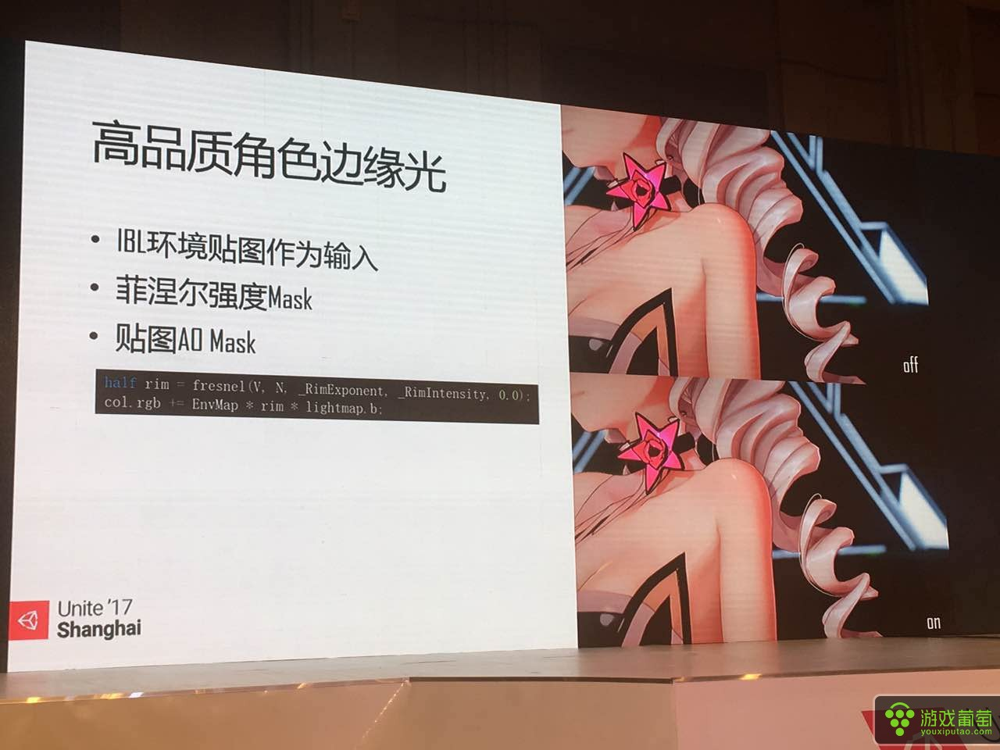


*↑为避免边边缘光出现在不需要的区域，米哈游使用AO纹理和shadowmap来屏闭掉遮挡区域，可以看到对比图中左边带有边缘光的形状显得效果更突出。*

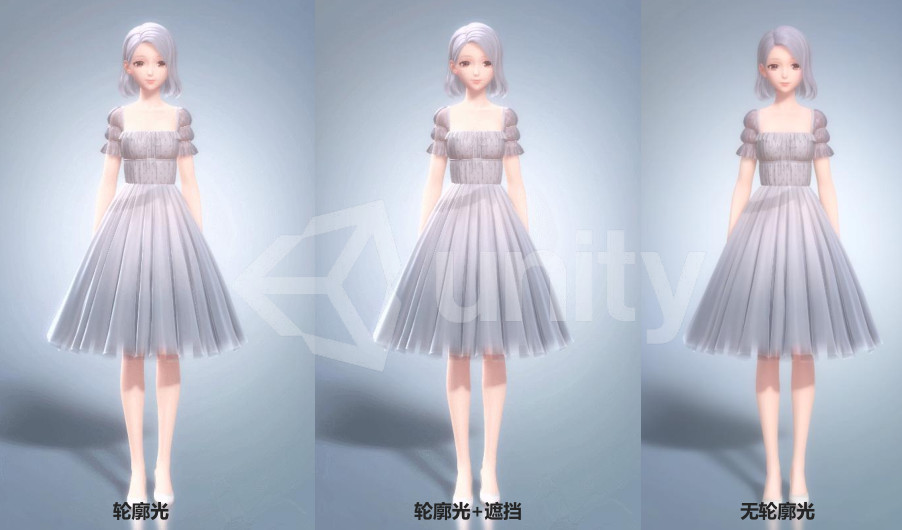

*↑闪耀暖暖通过烘焙到顶点的AO遮蔽边缘光*

<br>

<br>

------

### 双面渲染对边缘光的影响

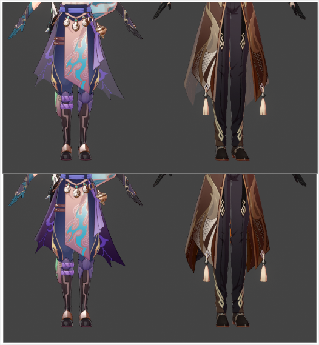

使用上面的边缘光公式，在选用双面渲染时会出现问题：背面渲染的NdotV永远小于0，clamp掉再取反的原始rim值就永远是1了，整面都会被算成边缘光区域，如上图的衣摆部分。

此时可以用abs函数代替saturate函数让NdotV曲线打个拐，或者其它类似办法，提取真正靠近边缘的部分。

**基础公式：** 1- abs(dot(i.viewDir, i.worldNormal));

还可以为背面渲染单独写个pass，直接去掉边缘光的计算。

<br>

<br>

------

### 风格化边缘光贴图采样

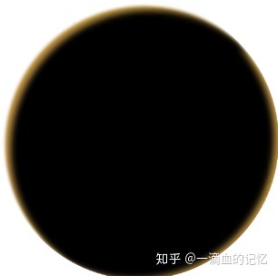

基于相机空间的法线去采样MatCap图。优点是想要什么样的边缘光就可以要什么样的，比如想要一个方向的光就擦掉一半，想要什么颜色就有什么颜色。缺点是要采一次图。

另外还可以采样Ramp图或笔刷纹理等，可参考漫反射、手绘等章节。

<br>

<br>

------

### 扁平硬表面边缘光效果优化

正如描边章节中提到的，靠NdotV提取边缘的方式更适合大曲率表面，而在扁平表面上会很难控制宽度。当平面和视线接近垂直的时候，会导致整个平面都有边缘光。

<br>

#### mask控制

罪恶装备中使用手工制作的边缘光的Mask贴图来对边缘光区域进行调整。


特别提醒，有下眼睑/颧骨上方等脸部位置最好调整下边缘光。

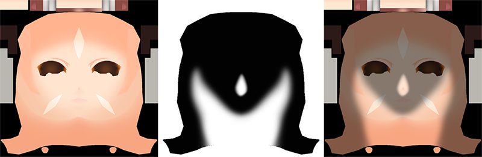

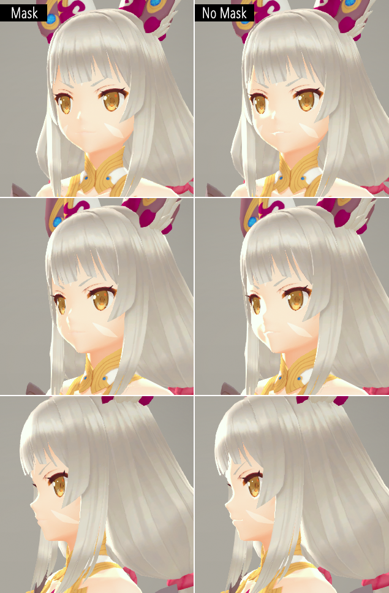

<br>

#### 屏幕空间等宽边缘光

如果一定要得到全身各处都宽度均匀的边缘光的话，就该换个思路了。

原神角色的边缘光就是全身均匀的，很可能用了屏幕空间深度查找边缘的算法：如果把每个点的位置向着屏幕空间归一化法线方向位移一段距离（原神似乎是简单粗暴向左右方向各采样一次），再根据位移后的坐标采样相机深度图，把采样深度和自己的深度做对比，如果差值大于一个阈值，那么就是边缘。

这个跟几何外扩描边法异曲同工，只是方向相反，且需要深度pass和深度缓冲的辅助，而非新增勾边pass。说到底，这也可以用于勾边。

这个方法在大块绝对平面上还会有点瑕疵，但一般游戏角色不会做出大面积平面，实在有必要也可以配合经典边缘光算法修饰一下。另外这对于一些转折比较少的模型，比如立方体的支持会更好一点。

另外也可以完全转换成后处理边缘检测勾边的思路做等宽边缘光，不过算子采样次数会增加。

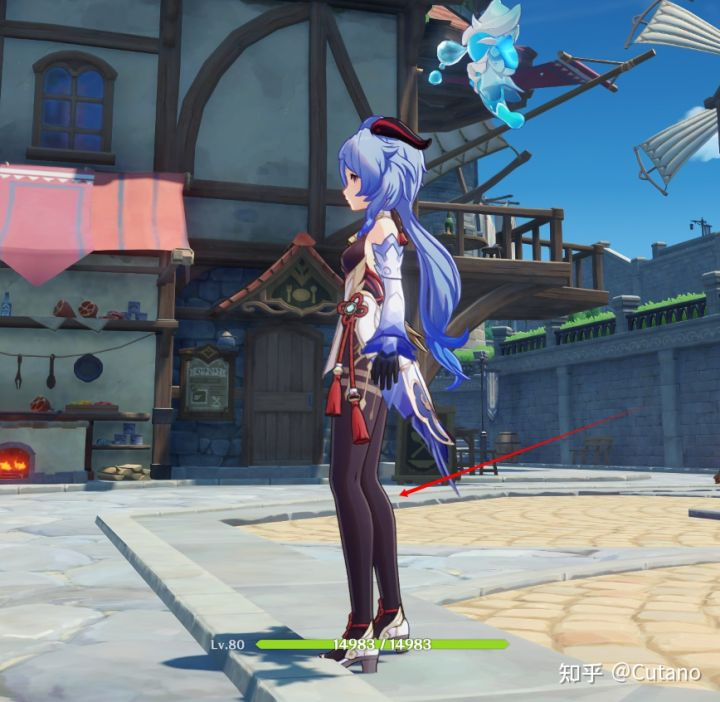


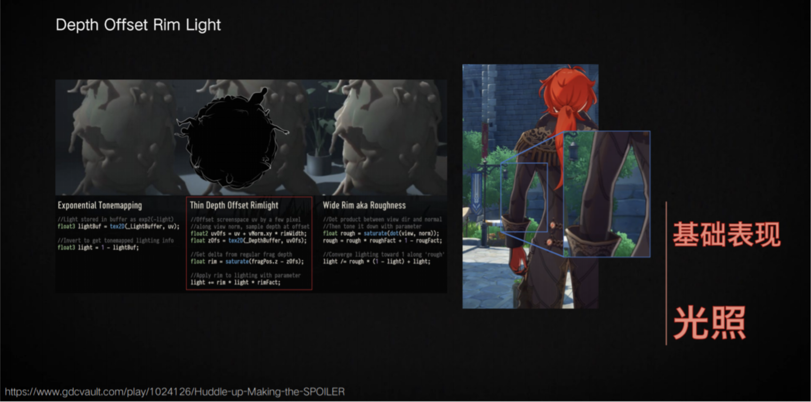

<br>

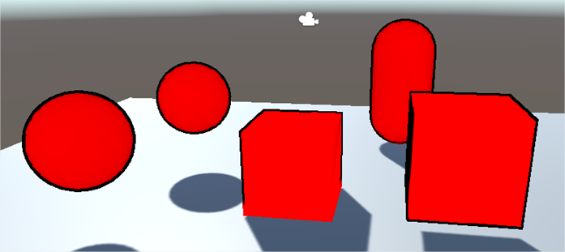

*↑查到的资料只有HDRP和URP的，于是自己试一下魔改成默认管线版，少盗点图……*

<br>

据说蓝色协议也是用了这种等宽边缘光，根据光照方向决定偏移距离。但看下图左边头顶的边缘光倒是有点不均匀，怀疑是融合了一点传统点积边缘光算法，不过也不一定，可能深度差上刚好就形成了这样的区域。

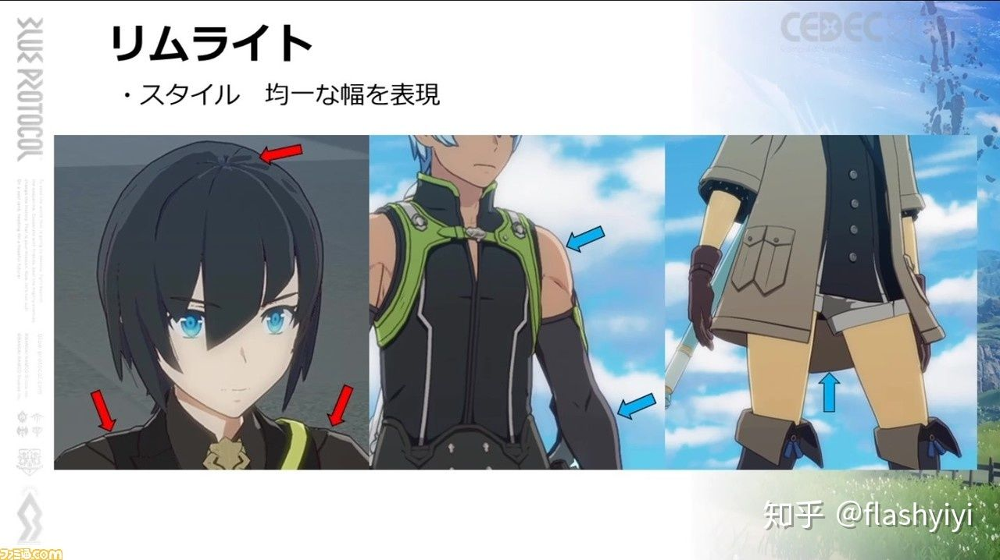

<br>

<br>

------

