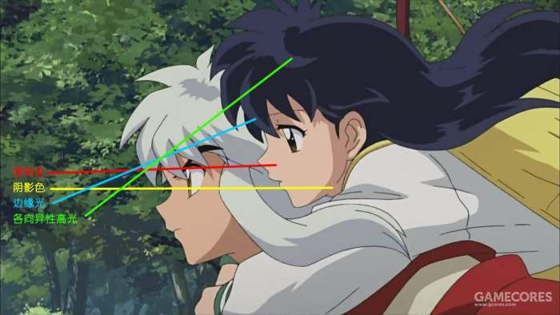
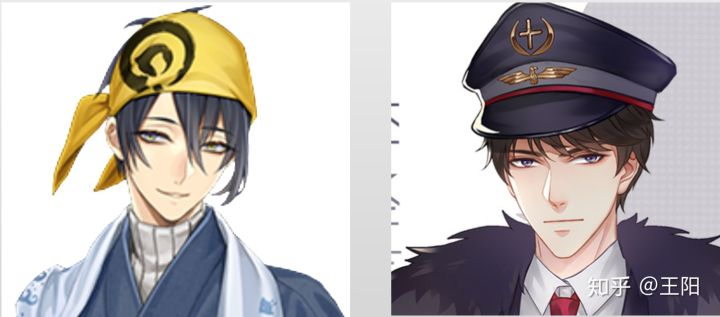
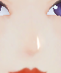
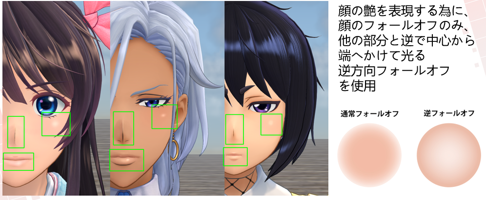
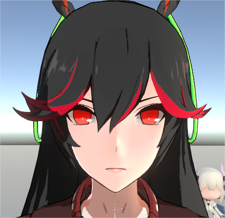
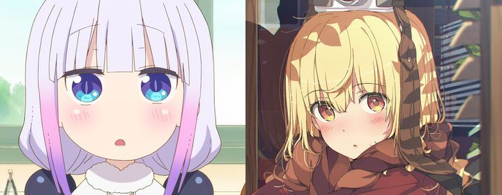
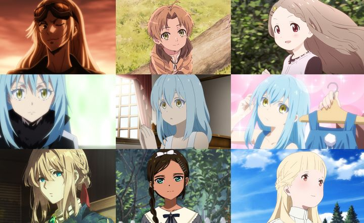

# Toon Shading Collection 

## CH09 - Stylized Body Parts 特殊风格化部位

 

这章收集一下零散的风格化角色效果。

 

------

### 效果概括融合

通过《犬夜叉》动画可以看出，除了瞳孔或光滑表面有高光之外，其他地方很少会有高光，并且头发的各向异性高光和边缘光合在了一起。这个“合在一起”的操作就很灵性了，可以考虑技术还原这种高度概括的画风，也可以提炼更独特的简化方向并实现它们。

 

 

------

### 面部特殊处理

#### 三角光

有些二次元手绘画风，有事没事都会在鼻梁边加一道一点也不科学的三角形“高光”，强调鼻子的立体感，称为“面部三角光”。

可以使用一张mask配合特别敏感的菲涅尔计算，实现脸稍稍侧过去就会出现三角光的效果。

 

#### 油光

*↑新樱花大战给角色脸上一些部位加强了反光*

 

有些手绘漫画风是会给脸上特定位置点一些高光。有时作为暗部时的补光看待，减轻扁平感。

这个高光的算法可以是传统高光，也可以魔改光源方向比如改成视线方向，也可以反向边缘光，做成正面永久可见。另外也可以用SDF贴图参考SDF面部漫反射光影算法，根据光照方向形成动态变化形状的亮区。

也有观点认为脸上别加高光，不然显得太油了。 

但嘴唇一般影响不大，鼻梁高光也还可以，可能颧骨上的高光不太好操作。

新樱花大战确实太油了，跟整体渲染方案也有关系。

 

*↑战双的鼻梁（偏三角光）和嘴唇高光，这就比较舒服（忽略右边脸的一层渐变加亮，自己加的）*

*↑原神角色脸直接在固有色贴图上叠了一层淡淡的高光，位置还是鼻梁和嘴唇*

 

#### 红晕

面部表现的常见效果，常搭配油光出现。有的会直接画在固有色上作为面部特征，有的会做成动态表情元素。

 

 

------

### 颈部阴影处理

下巴处或者说脖子上部区域的阴影一般会做影贴图，作为恒暗区域处理，不过在动画中这一部分的表现变化其实挺丰富的，在不同画风的动画中的处理方式不同。

通常会配合人物的硬朗与柔软的外观做更改，有层数与明暗的变化，对于外形硬朗的角色塑造通常会使用较深的阴影或双层阴影，而对于一些着重表现柔软的角色则会忽略部分阴影与轮廓线。

脖子阴影形态还会有自投影和暗部的矛盾，漫反射篇的综合案例有一定探讨，后文的投影方案篇也可以参考。当然，无脑一刀切整体压暗是较常见的省事办法。

 

 

------

 

------

 

------

 

------

