# Toon Shading Collection 

## CH10a - Material Analysis 综合材质分析

举例一些根据特定画风分析并还原材质质感的思路。

 

------

### 纯赛璐璐风格材质应用套路

关于赛璐璐方面的一些优势，可以看这几张图。它的Mesh已经夸张到非常奇怪了，但是它的2D表现还是非常好的。这就说明赛璐璐风格虽然抹掉了色阶，但是其实它也忽略了Mesh的物理结构。我们可以通过一些非常夸张的Mesh在一些镜头下做出好看的2D效果，它会更接近于我们2D手绘的效果。

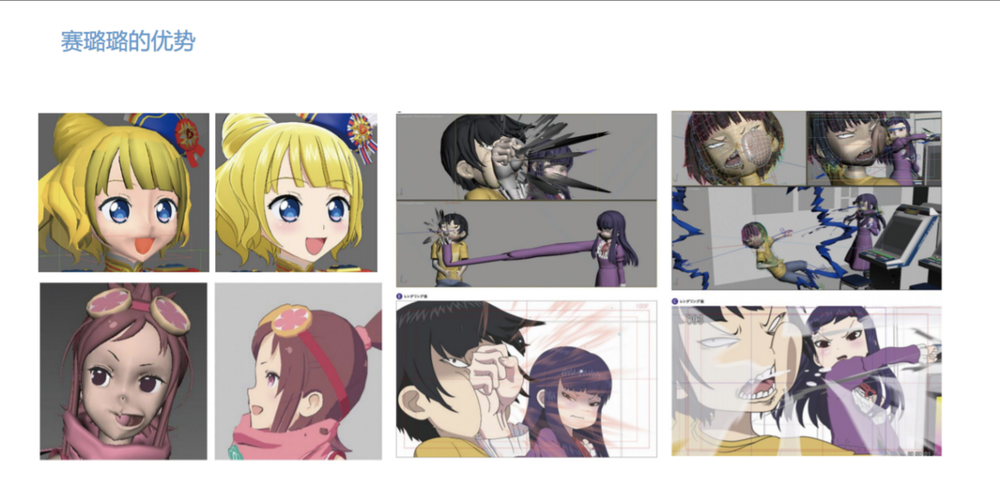

赛璐璐表达的材质，我可以用这张图来对比一下。它处理角色的面部、头发、布料、金属还有皮革，这些材质它的表现都是比较好的，基本可以满足人物材质的的需要。

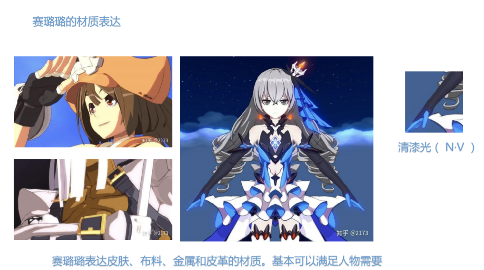

当然赛璐璐也有一些不足，赛璐璐其实不擅长表达材质质感。因为它在抹平色阶的时候，它的材质表达力也减弱了。只凭借赛璐璐的话，可能很难看出这个东西到底是个什么材质的。比方说我们的场景对材质表现要求非常高的话，它有非常多的不同的材质，那么赛璐璐就不太适合表达这样的东西了。

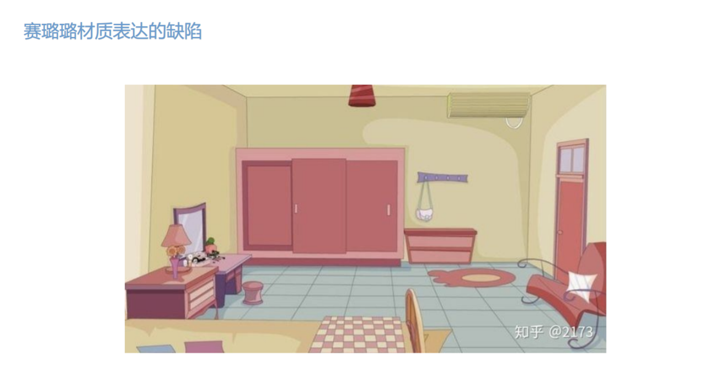

 

 

------

### 偏手绘风格材质分析思路

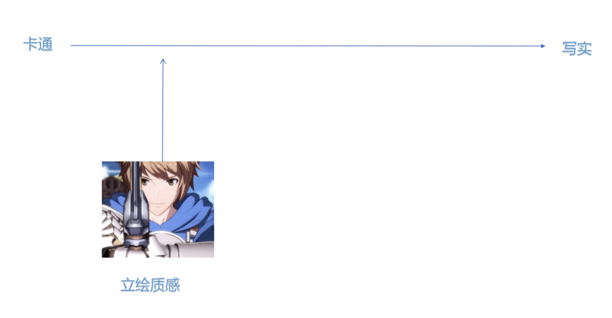

再讲一下立绘质感，这里参考的游戏是《碧蓝幻想VS》，我们可以看到它的一些角色图。通过对角色图进行一些分析，我们能看到这个角色大概是有几种不同的材质，比如有这种柱状的金属（剑柄）、肩甲、胸甲、还有角色的皮肤以及布料。

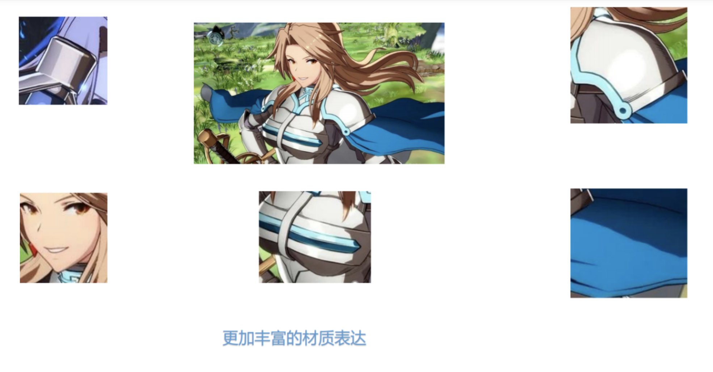

对于圆柱型金属，清漆光的光照会更加合适一些。皮肤的话，有一个单层的锐利阴影。肩甲有两层锐利的阴影，除了一层暗的，还有一层相对浅一点的阴影。胸甲有一个很明显的高光的mask，来做出这种卡通化的金属高光。布料有一层较柔和的单层阴影，可以看到它针对不同的材质去设计了不同的渲染方案。

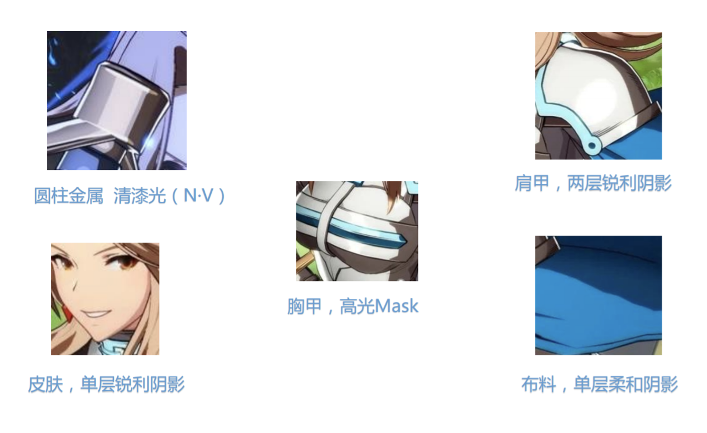

通过对于不同材质，组合不同的漫反射、高光和边缘光，它实现了比传统赛璐璐两个色阶更多的材质效果，这也使得它的角色更加接近于立绘插画的表现。

这个设计思路其实是很好的，我们在做卡通渲染的时候，实际上也是需要针对这个角色的材质进行分类，然后根据不同类型的材质去做出一些合适它的材质表达。

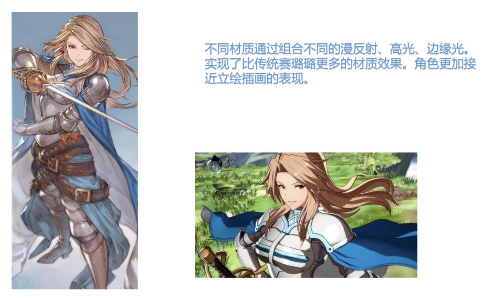

 

 

------

### 混合PBR质感材质分析思路

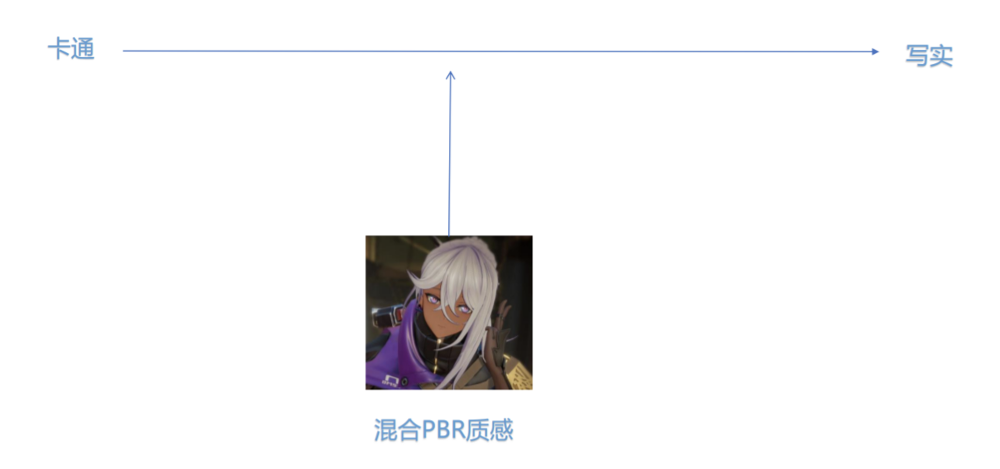

再来说一下混合了一些PBR质感的处理方式。

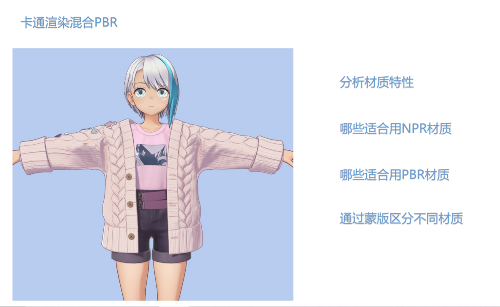

实际上我们拿到设计图之后，就开始想它的材质特性。它里面有哪些材质适合用NPR来表达，哪些材质适合用PBR来表达，我们可以通过蒙版来区分不同的材质。

这里可以看到适用于 NPR部分，比方说毛衣和角色的皮肤，我们用了黑色蒙版来表示。适用于PBR的部分，比如金属、扣子，还有角色的运动短裤和衬衣。因为这两个东西的法线信息比较丰富，高频信息特别多，所以我们这个时候认为它适用于 PBR材质。

这里我们就针对各种不同材质的去做了一些各自的实现。比方说使用ramp贴图去模拟皮肤的次表面散射效果，基于毛发的shader做了一个有点卡通的毛线效果。然后金属部分，还有扣子这种塑料，以及角色这件衬衣，我们就用了PBR材质。因为这几个东西的高频信息比较丰富，用PBR表现会更好一些。

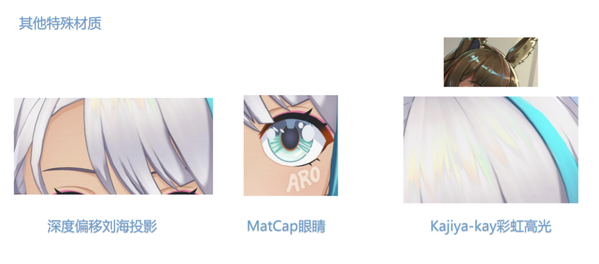

做了这样的拆分之后，我们还实现了其他一些特殊的材料效果。比方说头发通过深度偏移去做了比较锐利的头发投影。眼睛的话用了MatCap去做了一个可动的高光。然后头发是用kajiya-kay做了一个彩虹色的高光。这个彩虹色也是最近看《明日方舟》立绘有的灵感，阿米娅的头发经常是有这种彩虹高光的。

这块想说的就是2D的美术设计可以给我们的卡通渲染提供一些灵感。我们可以更多的去参考各种各样的立绘。用它的一些奇思妙想的设计来提升我们卡通渲染的表现。

这个是我们最后实现的一个效果。

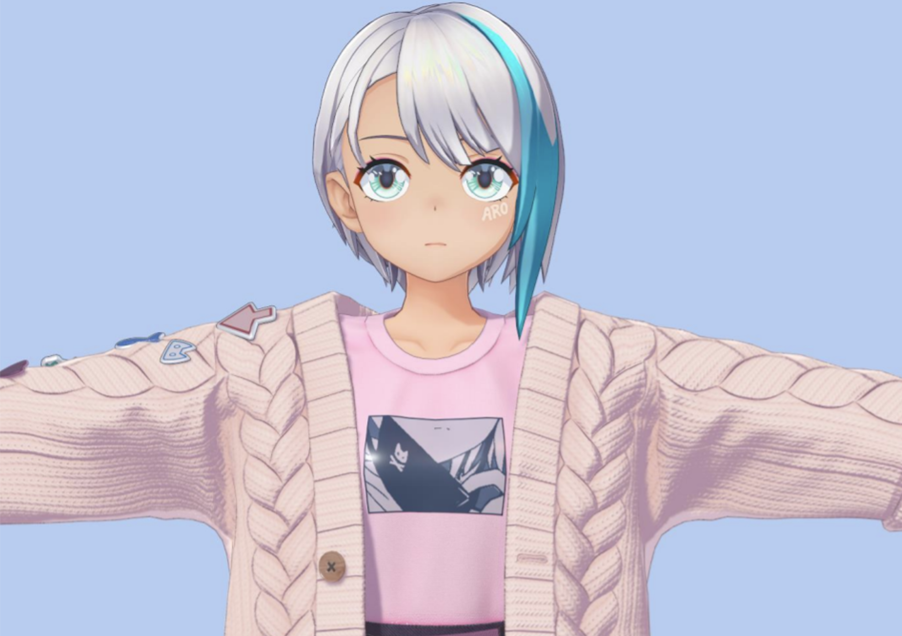

除了这种方式以外，我也在想能不能构建一个卡通的光照模型，既能表现卡通感，又能表现一些PBR质感。这个就比较困难，这里就提供一个思路吧。

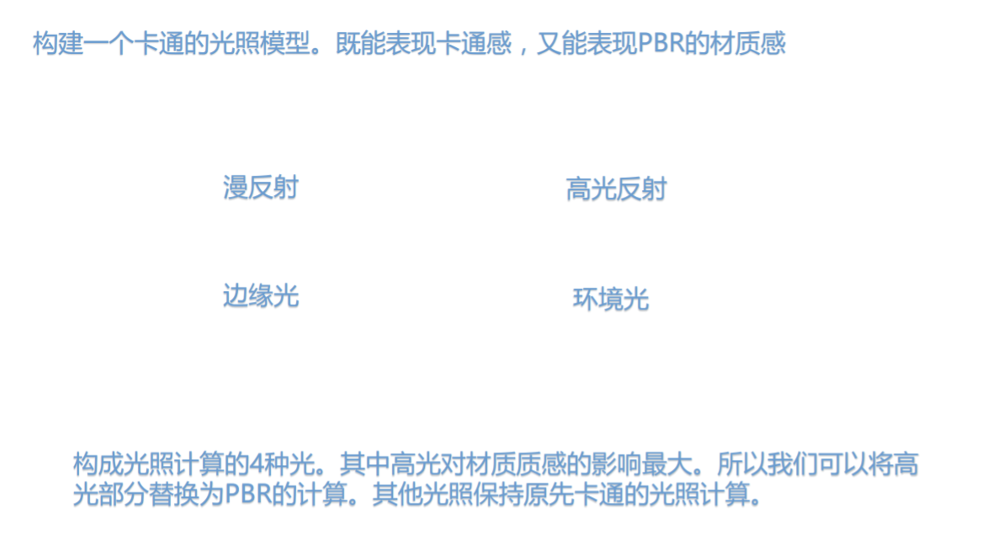

构成光照计算的四种光，比如漫反射、边缘光、环境光，还有高光反射。其中高光实际上是对质感影响最大的，我们在PBR计算里面，实际上主要也是在算高光，漫反射部分可能就是一个兰伯特光照。这里我们就将高光反射部分替换为PBR的高光计算，其他部分我们还保持之前卡通的光照计算，这里我们看一眼这个效果好也像还可以。

（注：PBR结合章节也有更多相关探讨）

 

 

------

### 材质效果设计思路总结

总结卡通渲染的一些设计规则：

首先卡通渲染的最终目的还是为了还原美术的原画效果，卡通渲染各种trick本身只是一种手段。我们在拿到美术需求之后，首先要分析原画，包括哪些材质，然后对这个材质进行分类；针对不同材质的种类去设计一个合理的实现方案；最后我们还要综合去考虑一些性能上的影响。

比方说我们实现的材质数量是不宜过多的，应该是尽量保留一些主要的材质，把一些不常见的材质去除掉。我们在设计贴图的数据通道时，可以考虑到通道数据的压缩跟合并，来减少我们贴图采样的数量。卡通渲染和PBR渲染的一个不同点，就是可能难以用统一的光照模型去表现不同的材质，各个材质都可能需要自己的mask或是是控制贴图。这个时候就需要考虑如何将这些贴图数据做合并，减少使用贴图的数量。

 

 

------

 

 

------

