# Toon Shading Collection 

## CH11 - Painting Style 画风多元化

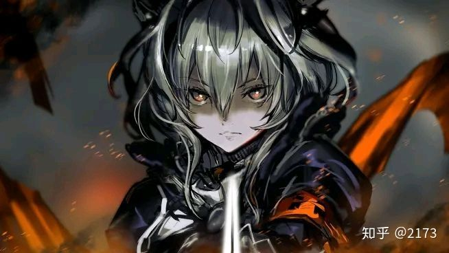

*↑《明日方舟》塔露拉立绘*

在动画风渲染作为主流的现在，试图引入插画的画风是很合理的想法。

厚涂风格相较赛璐璐风格，色阶更多，明暗交界变化会柔和很多。这个风格也有它的好处，因为3D场景比较难做成赛璐璐的。

如何让赛璐璐风格的角色和非赛璐璐的场景融合是也许需要考虑的。厚涂风格的角色会更容易和场景进行融合。

 

 

------

### 原画还原探讨

无光照的情况下还原原画还比较容易，直接将光影画死在贴图上即可。而一旦为了体现环境而加入动态光照，则必然会偏离原画的意图。但以一个足够好的原画作为基础，偏离后的结果也不会太难看。

必然可行的光照模式是在衣服上附加一定PBR特性（尤其金属），也可以用视角方向的MATCAP提供更加自定义的结果，这也是目前很常见的做法，况且目前的插画材质表现都有在向真实物理效果看齐。

在二值化光模型实在不适用时，完全去掉身体上的方向光照也不失为一个方案。毕竟固定视角的二值化光也已经失去了光照本身的特性，仅仅是一个勾勒身体立体感的方式，而且贴图的固定感也可以用外描边光解除。

但更合理的方式应当还是尽可能在两者之间寻找可以妥协的点，或者使用一个和二值化光照更加兼容的画风。固定贴图或许好看，终究还是缺乏灵动。

插画风格（尤其带光照的）的产品很少，这是一个很值得探索的点。

 

 

------

### 风格化方向

除了厚涂插画风，下面还会讨论其它风格化渲染方向。

 

#### 笔刷涂抹笔触

这个方向算是正统厚涂插画风的尝试。

米哈游：插画风格渲染的一个重要因素是使用纹理笔触。我们可以使用不同的笔触纹理图案以获得不同的着色风格。对于每个笔刷纹理，我们有4个通道可以存储代表不同方向的笔刷图案，混合使用这些笔刷可以获得更丰富的笔刷变化。右边的二张对比图中，使用笔触纹理的有着更多手绘的感觉。

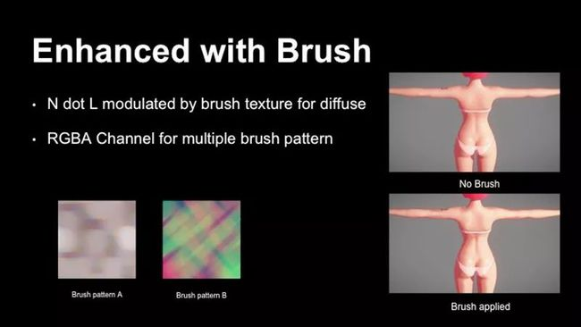

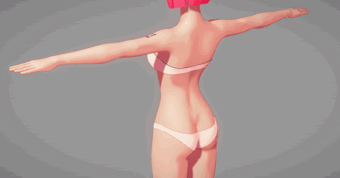

*↑应用了带有笔触风格的皮肤材质对不同光照角度的渲染结果*

在实际游戏种却基本看不到米哈游的三合一ramp叠笔触方案方案制作的产品，原因可能是性能成本，也可能是这种方式制作的材质在自由视角下的光照变化时依然无法获得令人满意的兼容性。

 

 

#### 水墨风笔触

直至目前比较成功的水墨渲染游戏有《大神》等。

水墨风的渲染，主流的做法好像都是水墨风勾边+风格化贴图，光影方面似乎都非常简化。风格化勾边在描边章节有探讨，风格化贴图依靠美术人员能力。其它方面（如光影、后处理）的渲染风格化民间有很多尝试方案，请大家自行研究。

 

 

#### 铅笔素描笔触

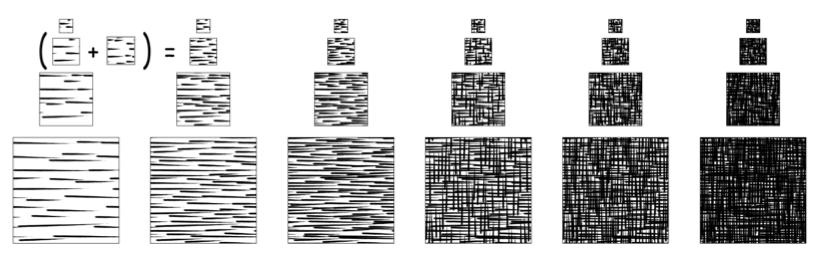

*↑素描风格的渲染效果*

采样一组深浅渐进的素描纹理（色调艺术图/Tonal Art Map/TAM）并按权重混合，来模拟漫反射效果，实现实时素描风格渲染。

注意多级渐进纹理需要特别订制成清晰的版本，而非单纯压缩分辨率。而且，这些纹理贴图右边必须包含左边的笔触，如果不遵循这一规则，得到的素描效果会很奇怪。另外，6张贴图可以合并到2张贴图的3个通道中。

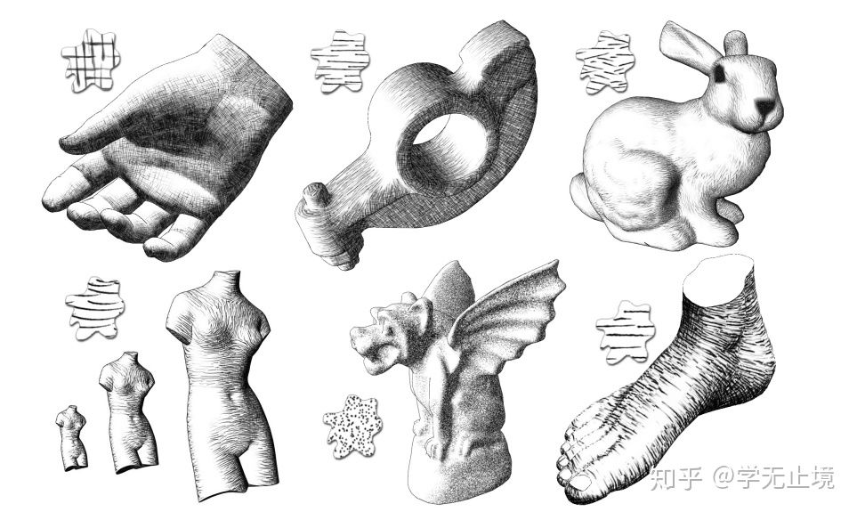

*↑论文Real-Time Hatching给出了不同TAM图模拟出来的不同素描效果*

 

 

#### 漫画笔触

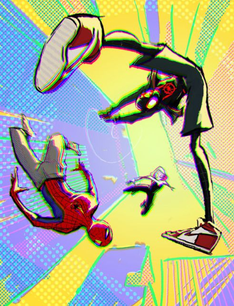

漫画网点风也是可以尝试的方向。

一种办法是在屏幕空间按灰度过滤出不同大小的网点。网点的形状不一定要圆形，可以自定义变化。

除了网点，也可以更深入研究一下漫画中会运用的其它技巧。

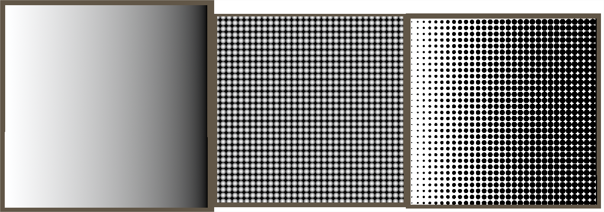

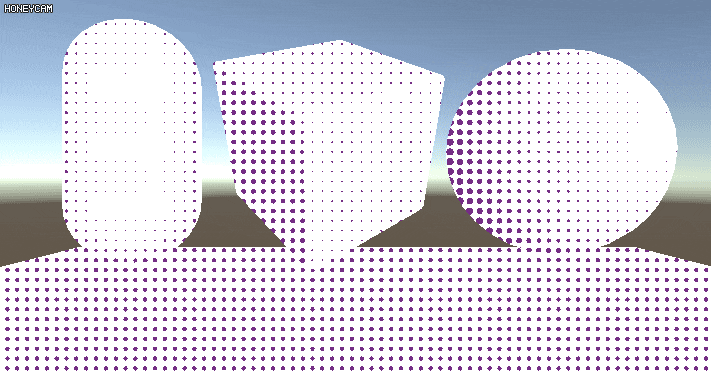

 

 

#### 油画笔触

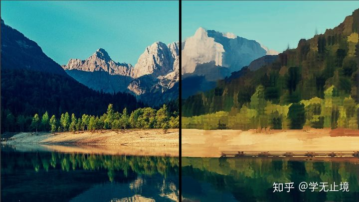

在图像处理方面，一般是通过像素周边的权重滤波来模拟油画的特点。

该滤波算法的两个重要参数分别是：滤波半径Radius和灰度区间Bucket。其中，滤波半径用来决定参与计算的像素数，一般使用(Radius * 2 + 1） * (Radius * 2 + 1)的大小区域；而灰度区间用于散列各个灰度值的像素点，找到所有Buckets中像素最多的一个，将该Bucket中像素颜色的平均值作为该像素的颜色，灰度区间一般也称为散列桶。

该算法中，滤波半径Radius用于决定滤波的总体质量，也就是说Radius越大，得到的图片块状感更强，同时更加的耗时；而灰度区间Bucket用来决定图片的光滑度，也就是块状之间的光滑程度，我们一般将像素的灰度值(0~255)散列到Bucket个区间中，找出落入像素最多的Bucket。总的来说，该算法主要是下面三个步骤：1、图片灰度化；2、像素散列；3、统计结算。下图展示了该过程的几个阶段。

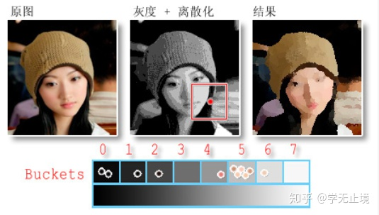

更多实现细节请自行查找相关文章。

注意这种屏幕后处理滤波的方式对性能要求略大。

 

下面是游戏11-11 Memories Retold的截图，据说是油画风格的反面例子。其实我觉得还算有那味儿，就是细节全部都糊了。

单张图感觉实现的已经差不多了，但实际玩起来又是啥感觉？静态下OK的内容，动态下可不一定好。

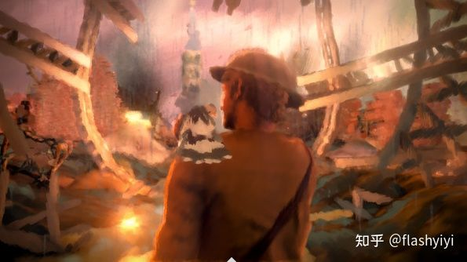

结论是，笔触化后处理不是不能用，而是不能直接照着现实中的画那样去用，应该把它当作一种创造画面的手段，而不是实现目标，因为目标效果动起来并不一定好。

下面蓝色协议的SNN过滤器用法就还可以。

这块涉足的较少，但擅加利用的话，或者能找到突破画质瓶颈/差异化的突破点。

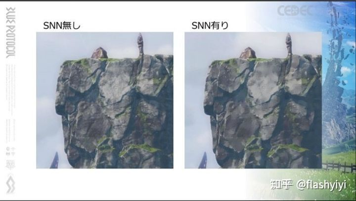

SNN滤镜也被称为“对称近邻平滑滤波器”，它本来是用于去除图像中的噪声用的，也就是图像中的高频信息。但是这个也使得画面中的色阶变少了，看起来更加卡通。目前在《蓝色协议》和《破晓传说》里面都看到他们使用SNN滤波器来处理场景。

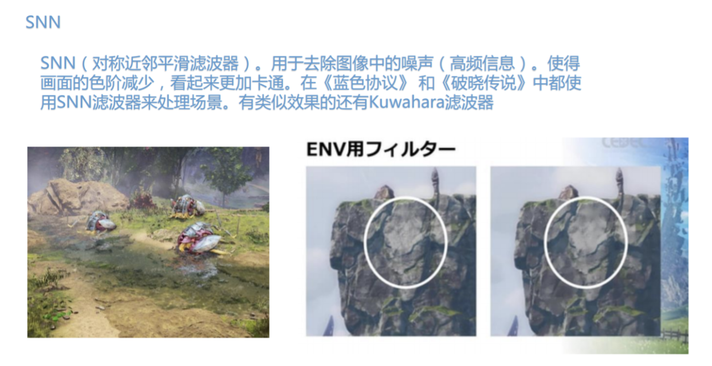

类似效果的还有Kuwahara滤波器，左边这个是SNN滤波器，右边是Kuwahara滤波器，最下面这个是没有加任何滤镜的情况。可以看到 SNN滤波器和Kuwahara滤波器的效果都差不多，但是在细节对比上，SNN滤波器能够保留更多细节。

有位大佬的修改过的[《Dither Kuwahara实时滤镜效果》](https://www.bilibili.com/video/BV1wp4y1e7pM/?spm_id_from=trigger_reload)可以看一下实时效果，观感应该比原始算法更稳定。感觉场景上非常惊艳，写实奇幻风的画面一下就变得艺术化了。人物比较糊，不过也可以继续遮罩一下角色作专门调整，个人认为如果是比较二次元的角色的话，可以将角色剔除出这个滤镜，直接搭配滤镜下的手绘感场景。

作者说是在偶然的尝试中得出，自己也不明白其中的数学理论，仅仅简单解释了一下：在XY轴方向分别用不同的步长，关键是要多次采样滤镜。（跟Dither有关？可能需要历史帧的数据？）

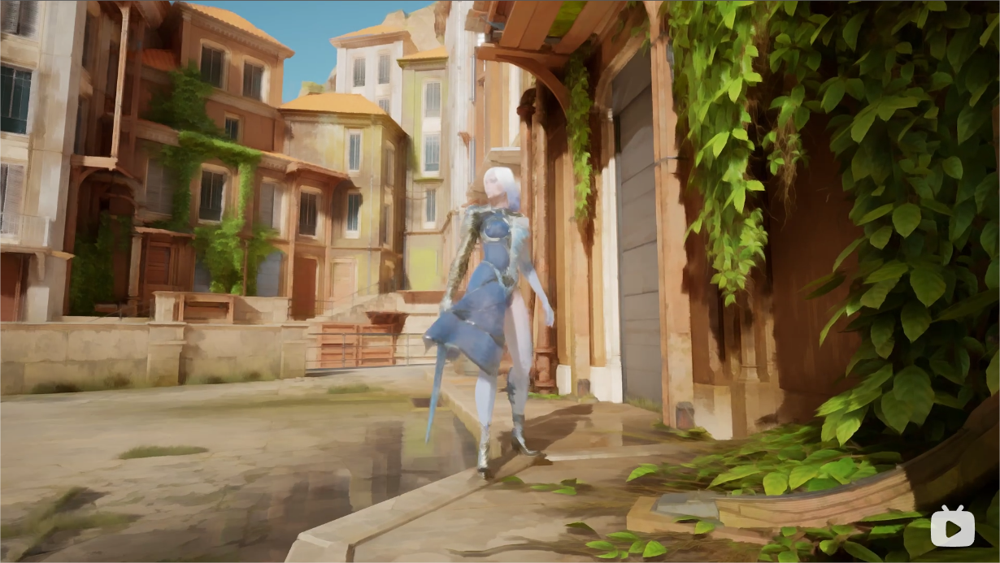

关于Kuwahara等滤波器的算法改进，还有很多论文案例，大家可以自行搜索研究。

 

 

------

（更多风格有待挖掘）
