# Toon Shading Collection 

## CH13 - Shadow 投影

 

卡通渲染的阴影不同于一般意义上的阴影，而是拆分成了两个更精细的定义：

- 阴：很难被光照射到的暗面，即背对光源的区域。本文之前一直称之为“暗面”。
- 影：由其他物体遮挡生成的暗面。本文称之为“投影”“阴影”。

卡通渲染的阴影一般不能用引擎默认的那套。

对传统的卡通角色来说，简洁且高度二分的的交界边缘是灵魂，但是在3D的光照中平滑并且锐利的阴影边界在制作当中是非常难以还原的。

 

------

### 高质量角色阴影

#### 自定义ShadowMap

如果直接使用Unity内置的CSM阴影，在镜头靠近角色的特写情况下，阴影品质并不能满足需求。

想要局部特写也能表现非常细腻的高品质角色软阴影效果，就要为角色单独渲染一张shadowmap（此处米哈游所用分辨率2K），以确保恒定的阴影品质。

ShadowMap基于视锥，根据角色的bounding box和视锥求交集部分，以此作为渲染区域，就可以最大化阴影贴图的使用率，保证相机拉很近的时候仍有较高的阴影品质。

此外还可使用Variance shadow map以及PCSS来减少阴影瑕疵以及获得自然的软阴影效果。

如果要实现正确的透明材质阴影，还需要额外的通道根据材质的透明度来存储阴影强度。

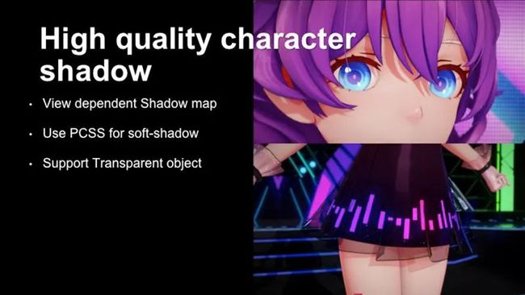

*↑从实例图片中看到半透明的裙子可以投射出自然的阴影*

 

#### Bias修正

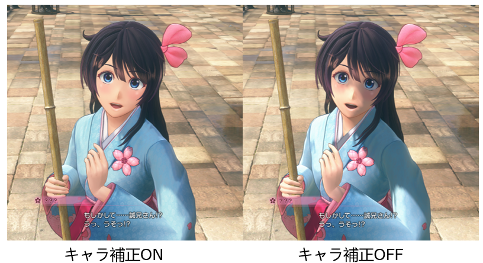

上图左右采用的是同样的光照环境，虽然右图的光照是物理正确的，但是并不是所想要达到的风格。

对Shader进行修改，在ShadowMap上添加一个Bias来对光照进行修正。由于是直接在被投影表面进行的调整，导致有的时候会将想要保留的阴影也抹除的情况，例如头发等在脸部的投影也会消失。

新樱花大战由于没有采用将头发的阴影另外绘制的方法，所以并没有完全解决这个问题，只是通过调整参数来尽可能的达到一个好的效果。

阴影Bias可调在其它游戏里也很常见，一般会对身体不同部分单独设置不同的bias，尤其是脸上的额发投影和自投影。

 

#### 内外阴影分离（UE）

每个光源都存在阴影遮蔽。如果物体处于ShadowMap的阴影下，整个光照必须被完全去掉，否则在室内却受到外部光源的影响是完全不合理的。但是人物本身的自投影（比如胳膊头发对身体的投影）又需要和人物本来的暗部融合避免产生杂乱的线条，直接去掉光照也容易显得过暗，所以必须将自阴影和外部阴影用完全不同的方式分别处理。

自阴影需要创建一个以图集作为基础的Pre-Object ShadowMap，顺便解决了精度问题，外部使用普通CSM。因为两者功能完全不同，分别计算并叠加就可以。

但CSM依然会生效到物体本身的自阴影上，产生两次阴影计算，必须屏蔽掉CSM的自阴影部分。调整bias怎么都会存在某些条件下穿帮的问题，所以我直接在Shadowmap里绘入Mask，然后让人物根据Mask过滤阴影。

Mask其实是可以直接借用ShadowMap的Stencil来标记的，这样就没有额外成本。但Resolve Stencil需要一定的API版本，最终还是要用普通的颜色通道作为fallback手段。

 

这个问题并不简单，现在大部分游戏都选择了回避这个问题。要不无法正常让外部的CSM投射到人物上，要不导致外部CSM影响人物无法达到正确的亮度，无法做到室内外无缝切换。

或者仅使用普通CSM并且正常去掉光照计算，导致人物自投影一片死黑。

里面最靠谱的其实还是完全屏蔽自阴影。

但何必呢，又不是不能解决。

 

我这也实现了单独PASS绘制物体深度/模板到RT，然后通过偏移采样做的假阴影，或者叫Mesh Shadow，因为有了标记物体的手段，利用它也可以方便地做眼部半透。

它可以更好的处理ShadowMap无法生成的不符合物理的阴影。而它的算法其实是个简化的材质版接触阴影，因此也可以作为部分位置精度的补充。

  

SSAO需要屏蔽掉，只保留外部的。UE直接判断ShadeModeId就行了。

内部能不能利用SSAO来辅助处理明暗分界线？……说起来是应该可以，但普通画在贴图上的AO也能处理大部分情况（还有Mesh Shadow可以用），加入这个动态的部分又增加了不稳定因素……

可能有用把，但我反正屏蔽了。

 

 

------

### 光源阴影配合

看下米哈游基于光源对自定义阴影的优化：

为了实现高质量的角色阴影，需要为角色指定某个光源，并在渲染时判断当前光源是否为角色主光源，是则使用高质量阴影贴图，否则使用内置的默认阴影贴图。

Unity的默认管线无法方便地遍历整个光源列表，并且无法在Shader中得知光源与场景中实际光源的对应关系，这使得无法在多光源下灵活地兼顾角色自阴影和默认阴影。

在新的HDRP高清晰渲染管线中，所有的光源列表可以在一个Pass中遍历完成，同时可以依靠光源ID判定是否为角色主光源，从根本上解决了问题。

 

 

------

### 额发投影

额发投影可能需要专门处理。

 

#### 固定正面光照法

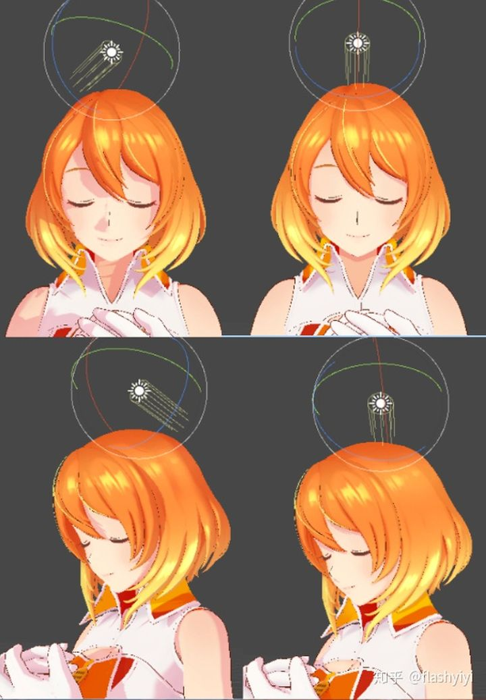

大家应该发现很多游戏明明角色各种地方都有投影，偏偏隐藏了额发投影。它们就是为了避免出现图1的结果（也可能是批量调整bias的副产物）。

当然，上图丑还跟鼻子，脸产生了多余的自投影有关，这些需要单独设置bias来消除。但即使消除了，其实还是丑。

但只要使用正面光照，即使不调bias这些问题也都不存在了。

正面光照的问题就是会让投影很难出现，所以在适当范围内做一点偏移，效果才比较好。这就是上面让光照方向也和角色朝向有关的原因。

 

#### AO法

但额发直接投影效果其实是不对的。从物理角度讲，额发投影除了投影还有ao的贡献。美观角度讲，投影是为了表达物体的空间关系，不管该不该有，需要的时候都该有。

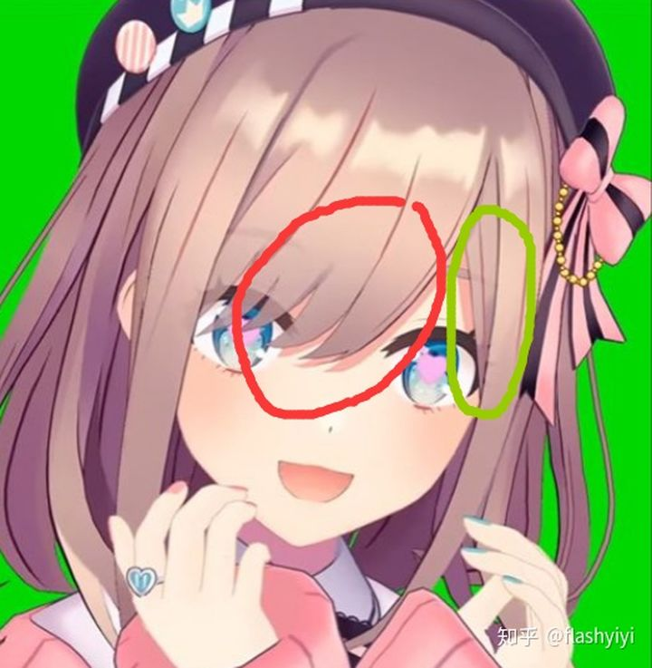

*↑如果是投影，两边的光照方向是不同的*

不动的头发，我们可以绘制ao图让侧面的额外投影出现。如果两边都是活动的就不行了。

虽然也可以用法线扩展投影物体大小的方式来扩大范围，但这样还不如再创建一个专门用于投影的模型。这样也能一并解决长头发隐藏投影以及齐刘海拉平投影的问题。

实时ao的话则在于精度，没有dxr恐怕困难，很容易出现扭曲和抖动。再说这玩意好多时候表现也一点都不ao。

 

#### 深度偏移采样法

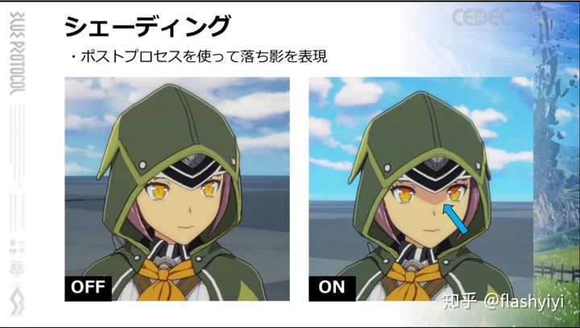

这个帽子的投影是通过偏移采样深度图来生成的，可以看到它异常地和投影物边缘保持了等宽。原理同边缘光章的等宽边缘光处理，偏移一定距离采样深度和当前深度比较，高的话就是阴影。

这其实已经是一种常用技法了，需要预先生成pre-depth，不需后处理，嘴上说成后处理只是一种让人容易理解的说辞。而这个种影子其实最适合的地方是额发的投影。

 

#### 屏幕空间自定义buffer采样法

类似深度偏移采样法，也有通过缓存一张屏幕空间头发mask再采样的。这种办法比上面那种麻烦点，毕竟多了自定义输出，但有个好处是可以控制只让头发输出颜色从而产生投影、其它物体挡在前面时不产生投影。

其实这可以作为深度采样法的辅助mask来使用。

注意阴影偏移的方向可以跟光照方向动态挂钩，另外偏移距离可以通过类似外扩勾边的NDC空间法调整。

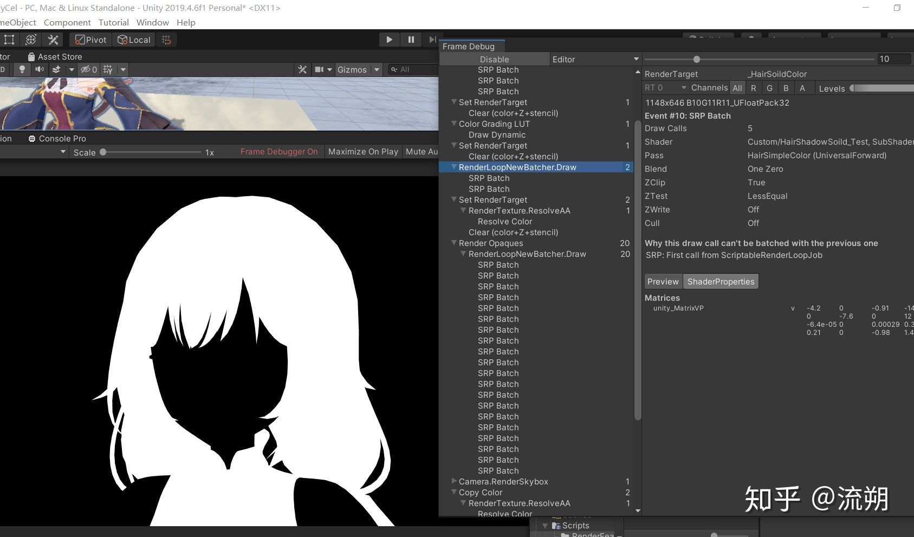

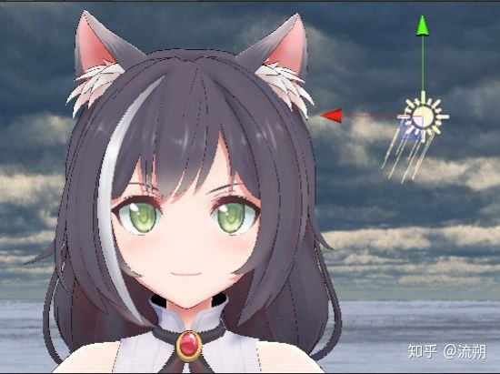

 

#### 模板测试法

以模板测试为核心，原理变得更为简单了： 在绘制面部时写入特定的模板值X，然后在不透明物体绘制完之后再绘制一次头发，此时根据屏幕空间的光照方向对它的裁剪空间坐标进行偏移，并只在模板值X时通过模板测试。

优点是规避了额外绘制Buffer，无需切换RT，精度与使用RT写入深度进行深度判断相比更加高。

缺点是“阴影”的绘制与光照着色及人物贴图完全无关，导致在许多情况下会显得突兀。说白了就是因为刘海投影只使用了一个暗色，而面部是用面部贴图乘以暗部颜色的，只要面部贴图不是赛璐璐风格的纯色，便无法避免两者在结果上的差异。 

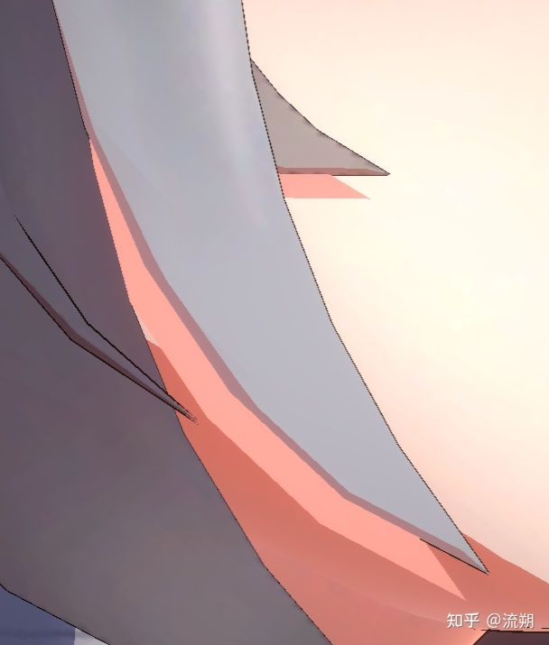

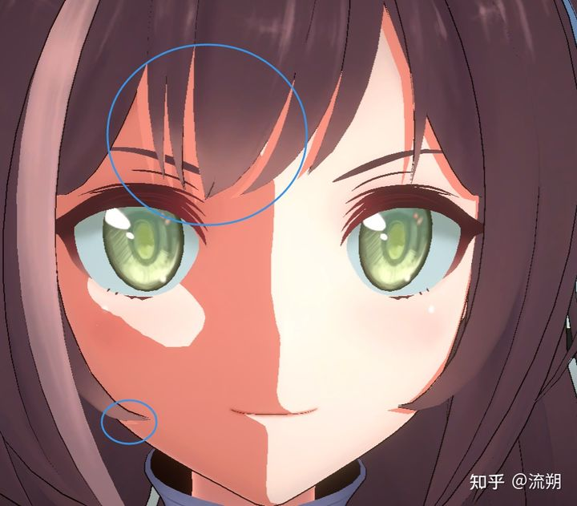

大不了再画一次脸，这次直接就是贴图色乘以暗色，总没问题了吧。 那么我们将头发的Pass修改一下，使用ColorMask 0让它不再画入颜色，且将模板值重置为0。然后给这个Shader再添加一个Pass，用于重新渲染面部，增加面部贴图的指定，以及面部的再绘制。当然，这样结果比较理想也只是因为面部的渲染算法比较简单，如果还有边缘光或者其他什么操作，大概就得真的重新用角色材质重新画一次了。

 

 

------

### 投影方案组合

#### 理想很丰满

虽然之前说人物光照要固定到视角正面，自投影也需要固定在视角正面，但人物对地面的投影自然不可能这样变来变去，只能固定在世界空间里。

因此，我们必须使用两个shadowmap，分别处理自投影和对外投影，或者每个人物（乃至每个部位）使用独立shadowmap（用图集shadowmap的方式实现）。

由于自投影的投影区域大小可以控制得很精确，后者方案效率上会更好一些。

其实说不定以后的投影方案可以靠光追，软阴影、半透明投影、多光源投影之类的都搞定了。

 

#### 现实很骨感

投影的性能问题是绕不过去的坎，实际采用的投影方案都精简很多。

原神直接给刘海画了死阴影在脸的固有色贴图上，其它身体部位用了mask压出阴影，而且角色根本就不受自投影，环境物件对角色的投影可能是脚本控制，非常生硬。让我们回忆一下原神角色树下阴影跳变之名场景。

角色对地面的投影倒是有做软阴影。

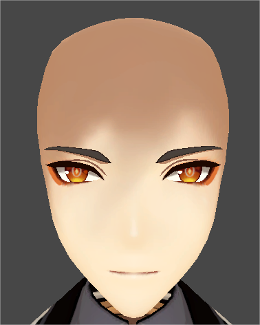

*↑是你吗，吴克？*

 

选人界面的投影处理算是战双里最高精度的了。

人物身上的影子包含两部分，一个是基于nl点积的光影（例如腿部两侧），另一个是来自方向光的投影（图中两个红色箭头）。这两边使用的光源方向是不一样的，目的主要还是为了让小裙子有投影。

投影明显分了两个方向，能看到地上投影的光是从右边打过来，裙子、刀和额发投影是从上方打下来。针对这种有一个兼顾性能与表现的做法，就是裙子、刀这种自投影使用ShadowMap，地上的投影使用平面阴影，毕竟地上大多数情况都是平坦表面，不需要考虑穿模，完美适合高性能的平面阴影。

总之最后用了一个分辨率不超过屏幕分辨率的ShadowMap，另外在各部位的bias可调整。这里没用软阴影。

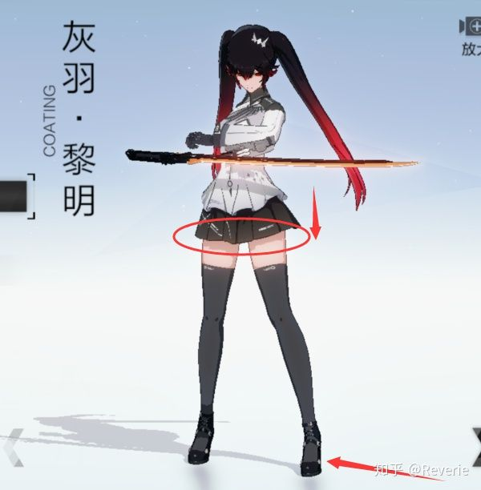

 

暂时没有看到对透明物体的投影做特殊处理的，虽然为了性能考虑是可以做dither抖动，但实际上抖动方案的闪烁比较辣眼睛。

屏幕AO在后处理章节有提到，但游戏项目比较少见，可能一因为性能二因为还是脏。

多光源的话，基本上只有主光会投影。

 

 

------

### 风格化投影

投影也可以风格化，下面摘抄一些思路。

 

#### 思路探讨

卡通投影的风格化依然遵守分频规则。

- 投影或者保持边缘清晰，或者保持一个大范围的模糊过渡，而不要在两种模式之间暧昧不清。
- 同时，需要表达一个简单清晰的形状。清晰边缘不要有尖锐的锯齿，模糊边缘的透明过渡不要有坑坑洼洼的锯齿转角。
- 同时，投影的强度依然不要暧昧不清。或者是清晰可见的，或者就直接没有，这样才能避免脏污感。

这些条件加在一起给投影制造了很多写实渲染没有的麻烦。

人物通常都需要清晰的投影边线，避免和二值化的画面元素冲突。而人物的装饰尖角又是常见元素，投影面多为弧面，这导致投影在不同方向下非常容易出现下面的凌乱边缘。

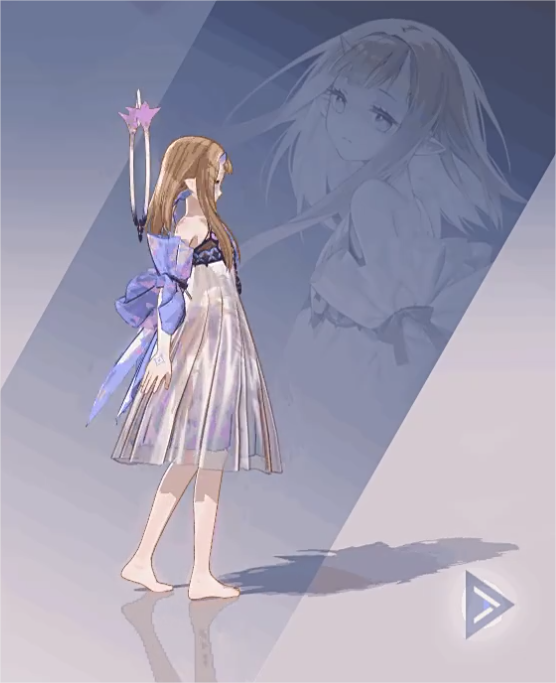

*↑注意看小腿和后脑勺上的投影*

 

利用距离场简化投影形状（下一小节会简单介绍）是比较直接的解决方案，但性能较差。

目前比较靠谱的是**手动隐藏**部分难看的投影，或者使用**代理投影物体**。

人物的问题放下不谈。场景中，因为投影面多为平面，锯齿类问题并不严重，但距离终极目标依然非常遥远。

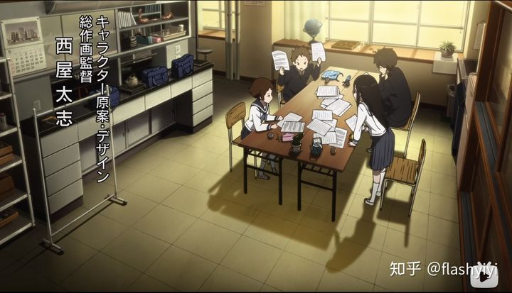

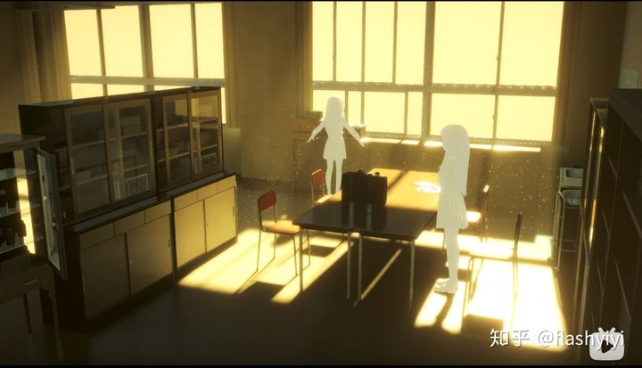

观察这两张图可以看到，仅通过ShadowMap产生的投影其实是很难做出预期的投影效果的，因为你要的效果根本不符合物理规则。

那么，人物和场景具有不同的软阴影程度？允许指定不同物体的投影方向？

对不起，那我还不如选择手绘投影。

但动态的部分怎么办？

**基本上，风格化投影是个没有被解决的问题。**

现在要不就**选择写实的风格**，这样起码不难看，但就是距离理想效果差那么一截。要不就要**限制投影的出现**，如果场景里只有直线光有投影（并且根据需要屏蔽掉一些投影物体），即使是锐利边缘也不容易出现杂乱的感觉，其他的影通过烘培/手绘尽量搞成**低精度的软边**，大概也能做出图1的效果。

也就是需要表达物体相对位置关系的地方，投出锐利的直线光投影。而剩下的影的部分则用范围很大的“AO”感觉的软投影表现，这样锐利投影的冲突就不明显。

因此我们需要一个可以规定位置的“AO”生成手段。虽然是用AO的方法实现的，但其实是影。这个下面会讲。

（不考虑动态依然可以靠手绘实现）

  

顺便谈个Local光投影的问题。一般Local光是不产生实时投影的，一方面是性能问题，一方面上面也说了，多个可投影光照很容易导致投影杂乱。

但如果直接关掉Local光的投影，Local光很容易把直线光的投影给直接盖住，形成无影灯的效果，这样人物就变得没有投影了，容易形成悬空感。

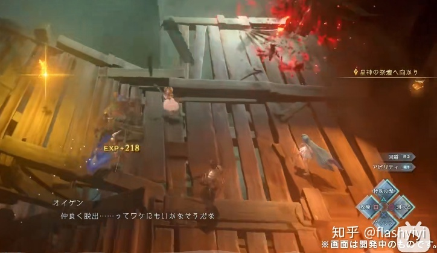

Relink让这些Local光直接应用直线光的投影范围，解决了这个问题。违和感并不严重，是一个挺有想法的解决方案。

  

上面说过了，现在我们要的不光是AO，它同时也包含了Local光投影的部分。

具体的要求则是：

- 需要明显的AO，但是只能出现在墙角，柜子后面这种地方，范围要比较大，且边缘要尽量柔软。
- 而小的结构周围则不能出现AO，人物身上尤其不能有。

使用普通的SSAO，这两个要求是相互矛盾的。

典型的例子就是草。草虽然可以加个Ｍask避免自己身上出现AO，却无法阻止自己的AO投到地面上，又不能不写深度。这样会导致地面一片脏污。

所以，我们需要修改原始SSAO，让它能够自定义不同物体产生的AO强度，但具体如何定义呢？

性能比较好的方法是：给场景创建一个专门用于AO的“框架”模型，只在墙角和柜子后面需要AO的地方单独建模，并输出到额外RT。

通常，也会将人物画到这张RT，因为人物也需要对外产生明显的AO。

然后在执行SSAO的时候，不从场景深度，而是直接从这张RT里采样周围深度，这样就能实现对AO物体的过滤处理。

原神倒很可能就是这个方案，因为解包资源里就有这种奇怪的“框架”模型。

它柜子后面看着像Local投影的固定阴影也是用AO实现的，关掉SSAO特效就没了。

 

 

#### 算法

下面风格化算法对性能要求不低，尚未见过实装，实机游戏还是先争取物理正确的软阴影再说吧。

 

类似于风格化的高光，风格化的阴影也是在标准的阴影计算流程之后，定义了一系列针对标准阴影的操作，通过这些操作，配合用户自定义的参数，便可以达到风格化阴影的效果，总的来说，共有四类操作：

1. 膨胀/腐蚀（Inflation）：扩大或者缩小阴影范围，用参数i来控制
2. 亮度（Brightness）：阴影区域的亮度，可以用于模拟半影区的效果，用参数b控制
3. 柔度（Softness）：阴影边界处的柔和程度，用参数s控制
4. 抽象度（Abstraction）：阴影形状的抽象程度，用参数alpha控制

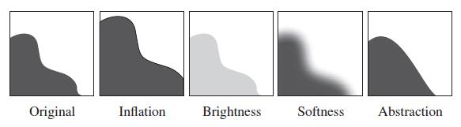

*↑几种操作和相应的效果*

整个风格化阴影的生成是基于图像空间的，从一个已经生成的精确阴影图开始。可以分成五个阶段：

1. 精确阴影的生成，由于是基于图像空间的，因此对精确阴影图的生成方法没有特别要求，可以是shadow volume，shadow map，ray tracing或者其他阴影生成技术，但必须要注意的是这里的阴影值一定是二值化的
2. 有向距离场的生成，基于图像空间的精确阴影，计算每个像素距离最近阴影边界的有向距离，这是文中算法的核心，也是后面风格化的基础，在文中给出了一种有向距离场的计算方法，当然也可以采用其他方案
3. 有向距离场的高斯模糊，这一步是抽象阴影生成的关键
4. 过滤，通过一个转移函数，将模糊后的有向距离场重新映射为阴影图
5. 使用过滤后的阴影进行光照计算

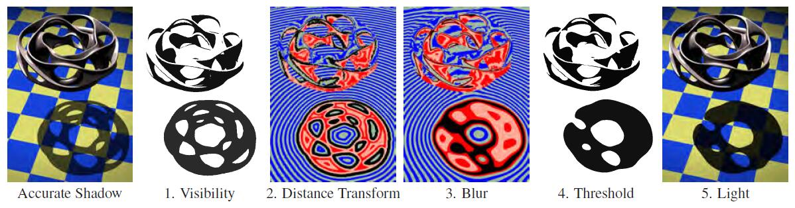

*↑整个算法的流程，图3,4中红色部分表示阴影内部，蓝色表示阴影外部*

可以清楚地看出整个算法流程的核心是（2）（3）（4），其中（2）是在整个图像空间计算有向距离场。

中略，具体请看[文章](https://zhuanlan.zhihu.com/p/26409746)。

 

上述算法中计算量最大的部分是有向距离场的生成，因为最终效果和采样数量关系密切，因此很难做到完全实时，这大概也是《军团要塞2》最终没有集成这个算法的原因。

 

 

------

### 一种面部投影问题与潜在伪光追解决方案

最近遇到了角色面部在场景中接收投影的问题，就是无论自投影或外部物体向面部投影都几乎必然会破坏原先设计好的面部光影形状，因任意物体轮廓的随机性，基本就没有好看的结果。甚至连提高投影精度也拯救不了，不是物理问题而是美术问题。身体其它部位倒是不用讲究，只是脸太关键了。

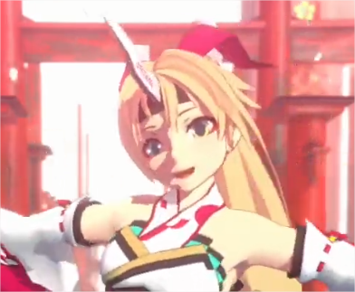

*↑虽然这里不是SDF控制的光影，但也拿来举例下，这样自由的阴影形状不光是自投影，外界任意物体都可能产生*

这个问题好像很少被提到。大神的开源JTRP项目在做完面部光影mask+额发投影之后，就没考虑面部接受外界其它物体的投影，角色整个正面被遮挡时脸还是亮的，非常突兀，做MMD倒是够了，但放大世界里肯定不能放着不管。原神的角色不接受投影+树荫下无脑光影跳变方案，也是一刀切绕过了这个问题。

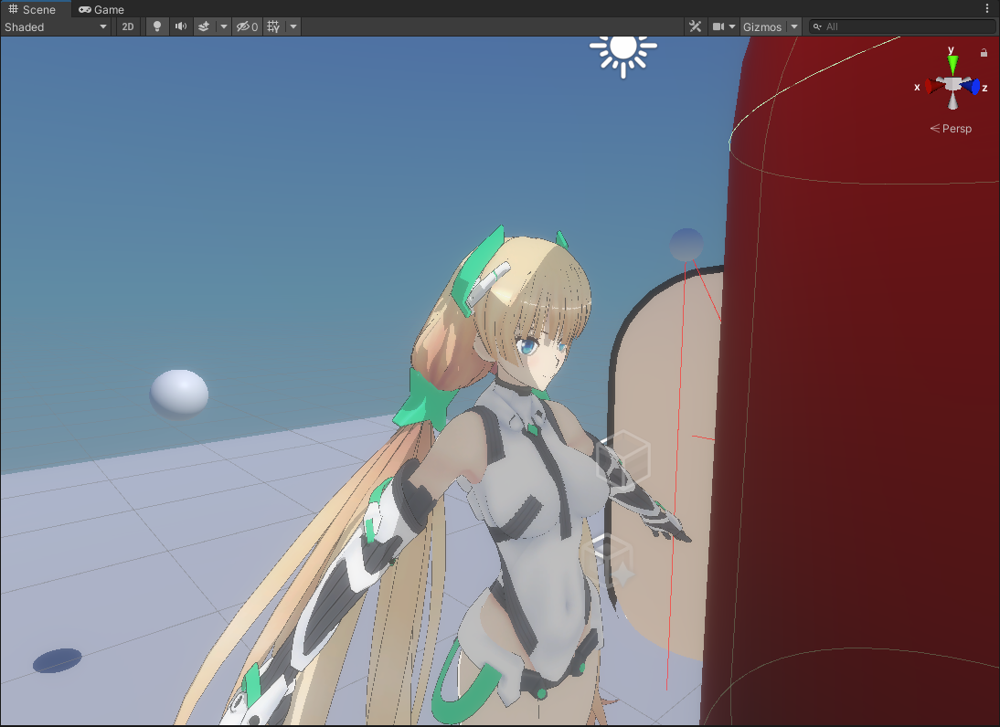

对此，发现了一个也许可行的解决方案，源于[这个工程](https://github.com/SnutiHQ/Toon-Shader)：

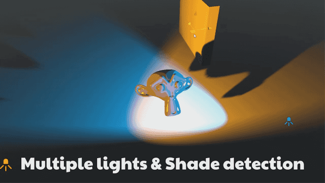

思路是从物体中心向光源位置发出射线，检测到碰撞体的话就在shader中直接整体渐变压暗相应光源的亮度，移出碰撞体时则渐变恢复光源亮度。算是一种极简版光追。碰撞体的轮廓可以用简化模型，同时也能拿来辅助前文提到的自定义AO效果，一石二鸟了。

如果用在面部，就等于整张脸一起压暗，不会给面部光影叠加不可控的无规则投影形状。

没时间测，就提一嘴可能性。

 

倒也可以对全身都用这种办法，原神的阴影跳变名场面的理想状态也是淡入淡出（不知为何砍成跳变了），原理上应该类似。Colin大神最新公开了URP角色卡渲[可运行demo](https://github.com/ColinLeung-NiloCat/UnityURPToonLitShaderExample#download-nilotoonurp-pc-exe-demo-20203lts-build)，其中一例可以观察到这一效果，细节上看，较小的物体遮挡部分肢体时没有阴影效果，大件物体如高楼遮挡大部分身躯时就触发整体明暗渐变。

 

（个人由于在把思路搬运到HDRP时遇到了难以形容的麻烦，又懒得改源码，刚刚才想到一点，其实不用这么麻烦借力物理系统……超蠢地走歪了，聪明的各位大佬一定早就想到，咱就不公开自打脸了……）

 

在米哈游的技术分享中似乎能看见脸上的斑驳树叶影子流动……看不太清楚，也可能只有身体有细节投影而脸上是整体压暗，存疑。

 

 

------

