# Toon Shading Collection 

## CH15 - Animation 角色动画

 

关于角色动画，有一些值得注意的优化点。

 

------

### 高品质角色动画

#### 关节修正

在Unity中使用Humanoid作为动画导入方式的时候，如果关节处旋转角度较大，按照动画品质的要求关节处的形状就不能令人满意。

为此可以在建模软件中，建立了每关节修正的Blendshape导入到Unity当中来防止关节变形。使用一个自动控制脚本根据关节旋转角度来差值混合形状。 为了确保更好的结果，可为每个关节分别制作两个Blendshape，一个用于90度，另一个用于140度以补正关节变形。

另外一种方法还可以使用额外的骨骼进行关节修正。这种方法更容易制作，但是对于结构细节的表现不如使用Blendshape。

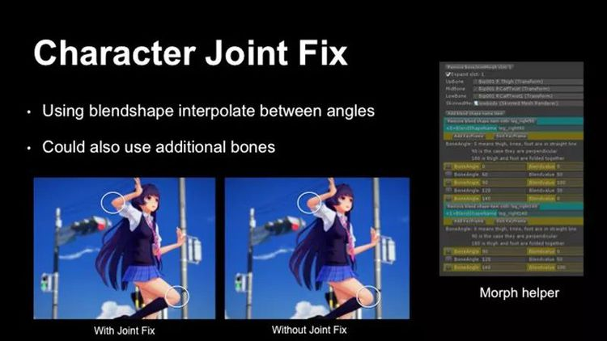

 

 

#### 反向动力学

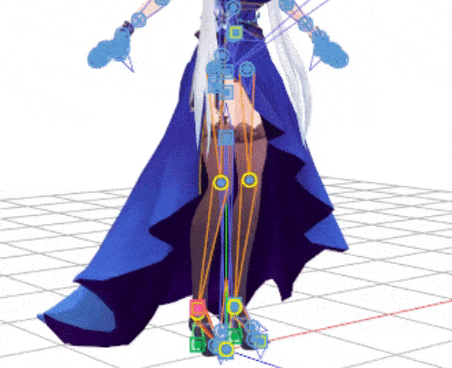

*↑mikumikudance 里面的反向动力学骨骼的效果*

当人物站在高度不一致的平面上时，左右脚会自动调整 y 的位置，并且带动大腿小腿同时调整。不仅脚部拥有这个特性，人物的手部也有。在爬山爬墙的时候，玩家的手总是能够 “自适应” 凹凸不平的表面。

这都是反向动力学骨骼解算的结果。

但是IK也不是什么时候都能出正确结果，而且性能消耗还大。原神也只在有限的情况下才应用IK。

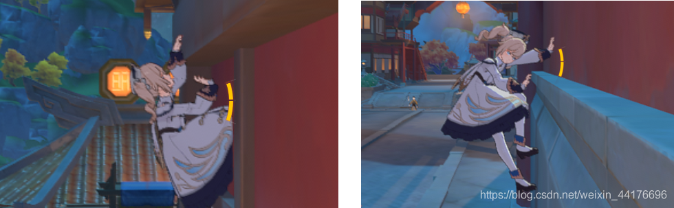

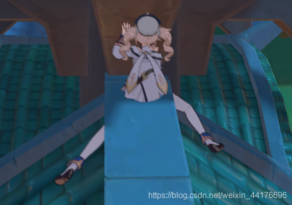

*↑这些算法并不是任何时候都能起作用*

 

 

#### 模型变形

罪恶装备的理念：漂亮的画面就是正义。

使用3D还原传统动画效果，比较重要并且比较难表现的一点就是动画变形。非真实感的动画变形会对整个运动过程中的动感和冲击力有很强的表现，并且也会对线条产生影响。

为增加表现力（主要是增强透视），会非常规地缩放模型骨骼。其中对设计好镜头的过场动画，还会进行不科学的调整。

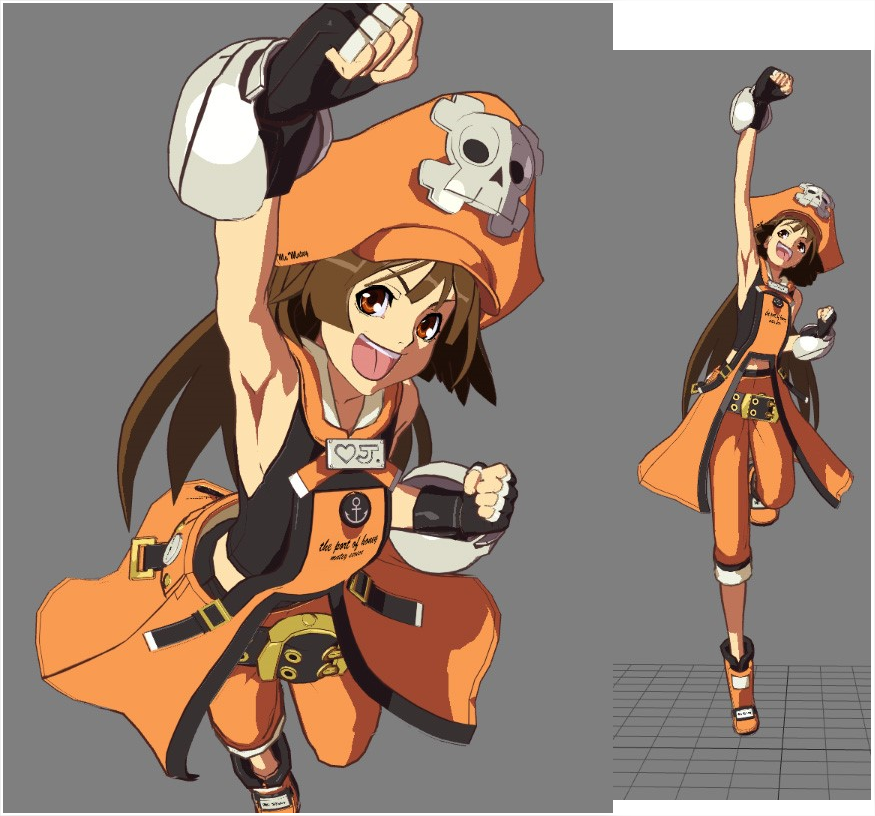

*↑为了加强纵深感，需要放大手部，因此拉伸手腕模型靠近镜头*

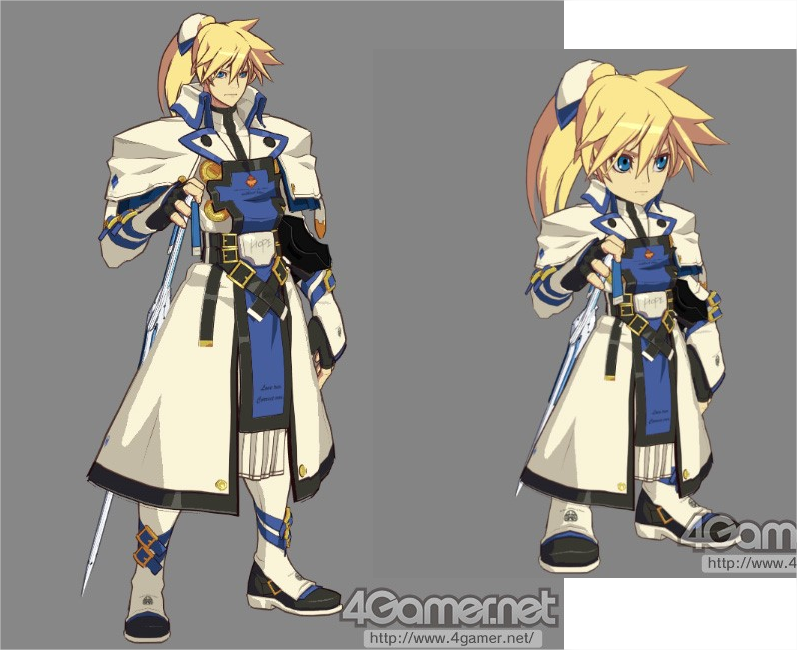

*↑通过骨骼放大缩小，可以变出Q版2头身*

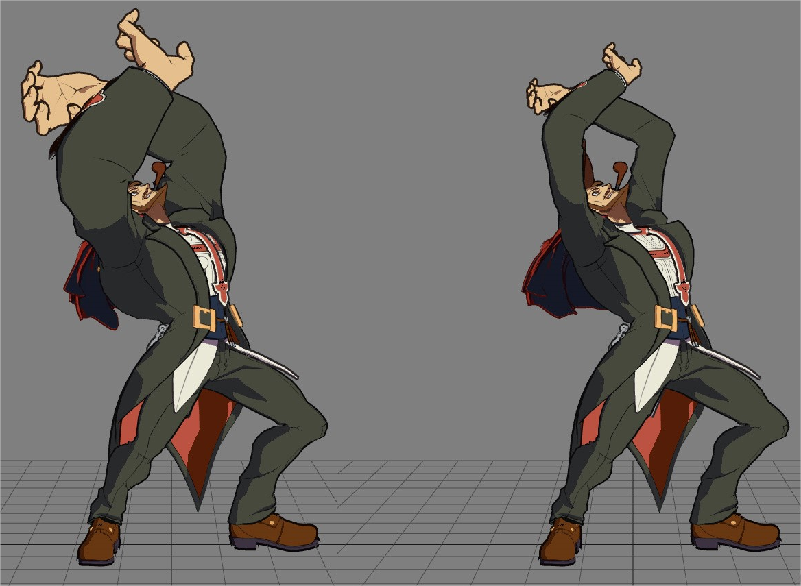

*↑单独部位分轴进行骨骼缩放*

 

为了表现动作力量感，动画《高分少女》的制作方法是在特定情况下拉长模型骨骼。这种制作方法可以在过场动画、必杀技的固定镜头下或QTE时来使用，只要摄像机视口看着没问题就可以了，不用考虑真实的物理状态。

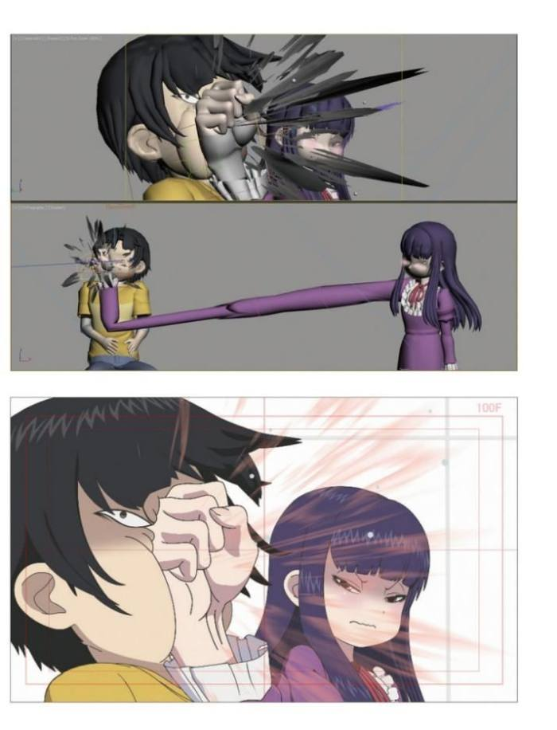

这也是非常经典的用法，其实有时没做这种项目的时候你也会纳闷：有这个必要吗？非要把手拉成这样拍，有什么意义吗？其实你如果自己拍过照片就能感受到，当大家都站在一排，远处有人拿相机拍的时候，在两边的那个人已经被拉伸得没法看了，中间的人稍稍往后靠一点点，脸就显得很小。当镜头放到这么近再去拍，镜头透视就会大到非常夸张。

其实他的人物就是站在前面的脸和手，还有后面的人脸其实都没有特别大的透视变形。我目测这个镜头FOV也就是50到60左右的正常透视状态，所以必须得做一个空间处理，你才能让它透视。如果你现在只是单纯地调相机FOV，看起来效果就非常不好了，这个也是用在视频里面的手法。或者说游戏里面也可以，但镜头一定要固定。

有的游戏是比较偏热血的，就不会有这么强烈的变形。这种动画片就属于比较夸张的动作幅度，而且变形力度都比较大，比较能说明问题。

 

 

#### 贴图替换

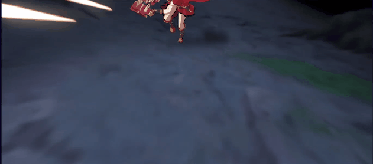

涉及到修型和增强光影，视频和真正游戏内的处理方式略有不同，视频的自由度可能更大一点，因为相对来说，只需要在这个镜头看起来对就OK了，没必要360度转着看，但在游戏内就需要更严格一些。如果现在这样看感觉还比较正常，那就给大家看一下没有处理过的状态。

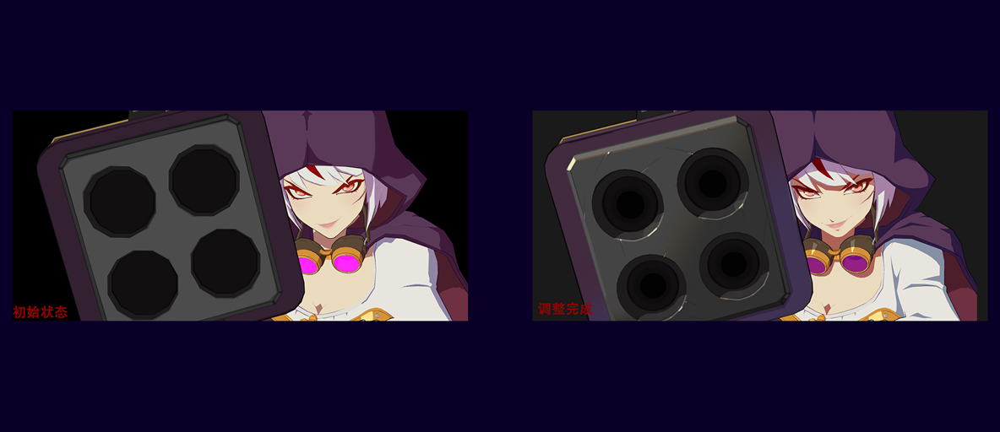

初始状态就是左边这样，调整完是右边那样。首先你看炮筒，如果单纯从这个镜头来讲，整个炮口性价比最高，同时表现效果最好的状态，一个处理方式就是直接画一张贴图，给它贴到炮口，匹配现在的光影处理就OK了。这是视频里做得最经济、最划算、效果最好的方式。

 

 

#### 模型替换

对于毛发等部位的形状变形，一般的骨骼系统实现不了，所以要准备替换部件。

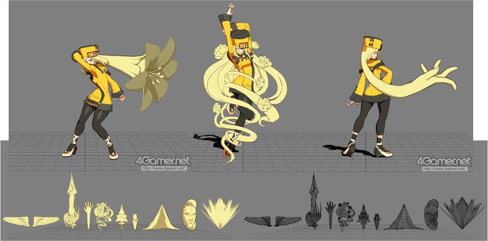

*↑头发变形的情况，准备了追加部件，来进行替换的样子*

其它目的还有用3D还原2D效果。2D的效果是完全可以去画的，但我们在3D中，如果这个角色动起来、转起来，就不可能保证它所有的3D光影都是完美的，所以也会动态增减代理模型辅助光影效果。比如有时不开模型之间的自身投影，而是用面片做了遮挡。包括胳膊、袖子，都在用一些处理方式让它变得更好看。其实默认状态下，看起来的确有一些效果不够好，所以收尾过程还有很多工作要做。

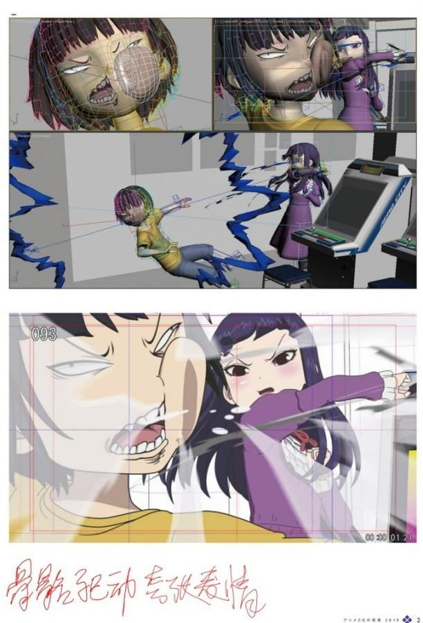

又比如这个左边打一拳，脸上肿起来了，其实直接放了一个mesh在这儿。它天生有一个好处，因为光影、造型比较简单，直接把mesh贴到脸上，看起来就像是脸上肿起来一块。在游戏中也经常会用到这种方法。

 

 

#### 动画帧数

一般都以为高质量动画必须高帧数，但其实还能有意地选择低帧数。

由于3D动画在K好关键帧后是会线性插值的，这就会让画面产生流畅和平滑的过度。但实际上这种平滑的过度会给常看动画的人非常强的违和感，因为本身赛璐璐动画在制作时的帧率就是24帧，并且有很多动画都是一拍二或者一拍多的。

为了营造表现力和打击感，罪恶装备故意采用了强硬的粗糙帧分布的动画，想要表现的是完全还原电视动画的那种感觉。他们是完全按照动画帧率去进行制作的，并且取消了线性插值。大部分动画风格游戏对这部分的还原好像不是很在意。

 

在Anime业界，把像迪士尼那样每秒24帧作画的动画称作[Full Animation]，同样是连续帧显示的，每秒8~12帧程度运动的通常称作[Limited Animation]。Limited Animation，和普通的3D图形的动画在制作风格有一些差异。

一般的3D游戏图形的角色动画，是有对角色模型内部配置的骨头的轨道进行修正的印象。轨道的制作是使用高次曲线函数（F Curve），或者是基于动作捕捉取得的数据。

与之对应的，罪恶装备是让角色一点点的运动，1帧1帧的姿势修正的做成。像粘土动画（clay animation）一样的流程。

为此，要由动画师制作故事板，设计第几帧出拳、产生碰撞判断等。动画制作方式3D和2D基本上差不多，就是制作好关键帧或者原画就好了。动作游戏中的关键POSE、蓄力和硬直感的处理也是非常重要的，这需要专业的动画知识来支持

另外一方面，角色跳跃时产生的放射性轨迹的活动和运动的飞行道具等等的运动都是60fps来更新的。

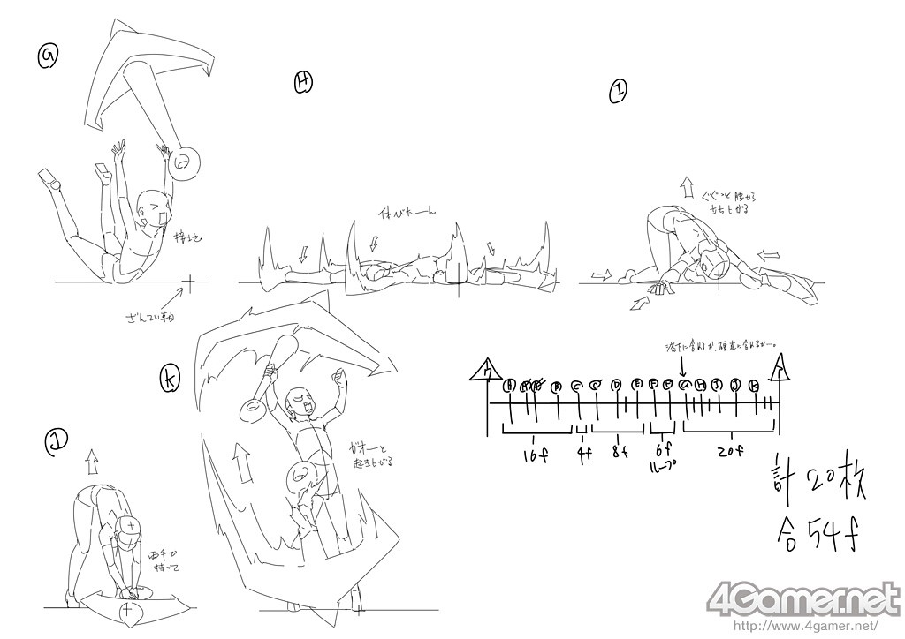

*↑必杀技相关的故事板，20帧记录了54帧的信息*

 

 

#### 镜头表现

镜头的运用无论是在动画中还是在游戏中都是非常重要的，对于画面的绚丽还有情感的表达有着不可替代的作用。甚至许多动画公司都有自己特定的经典镜头角度和动作，比如GAINAX公司就喜欢使用的一种正视镜头，角色双手抱在胸前，双脚岔开，给人一种霸气的感觉：

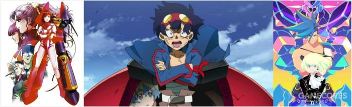

*↑GAINAX立*

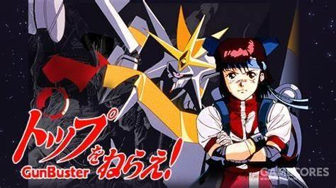

*↑《王立宇宙军》中的GAINAX立*

在动画中常用的镜头控制比较有代表性的有：板野马戏、勇者透视。

板野马戏是板野一郎发明的一种镜头跟随运动方式，镜头在大量的带有拖尾的运动物体之间来回穿梭翻转，非常酷炫。

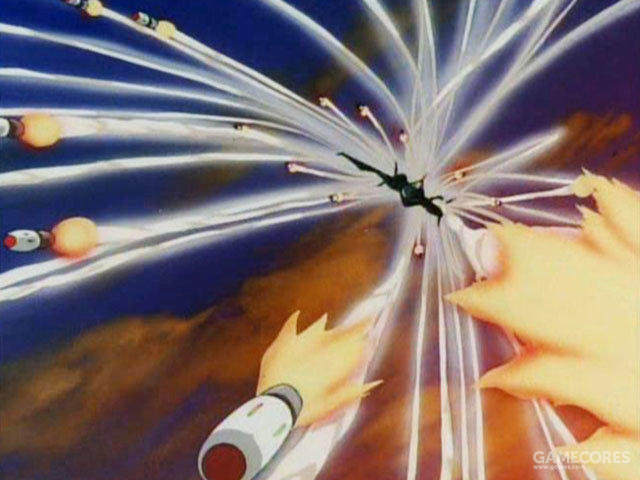

*↑板野马戏*

勇者透视是大张正己在勇者系列动画中使用的著名的夸张透视结构，往往在重要角色登场亮相的时候出现。

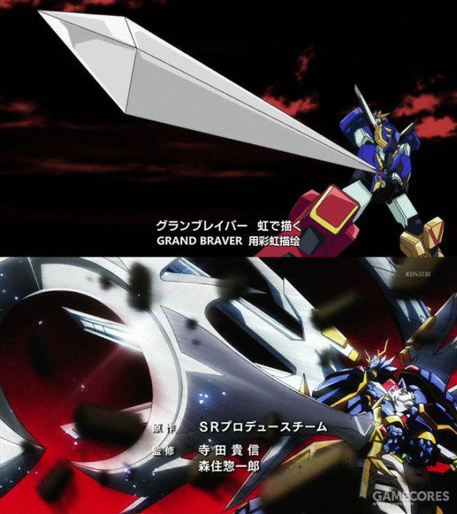

*↑勇者透视*

对于镜头控制比较好的例子就是《斩服少女：异布》和《火影忍者》。无论是第一人称还是第三人称游戏，由于需要玩家和游戏进行交互，所以在使用特殊镜头的时候也要考虑到玩家操作的适应性。这方面可研究的方向还很广，值得深入研究。

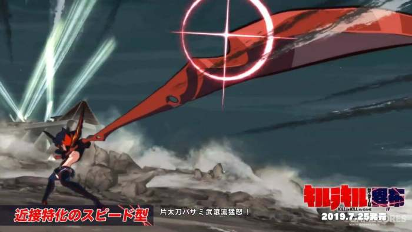

*↑《斩服少女：异布》中运用的勇者透视*

 

要实现勇者透视，除了手工的模型变形、镜头FOV调整，还可以用着色器进行动态形变：

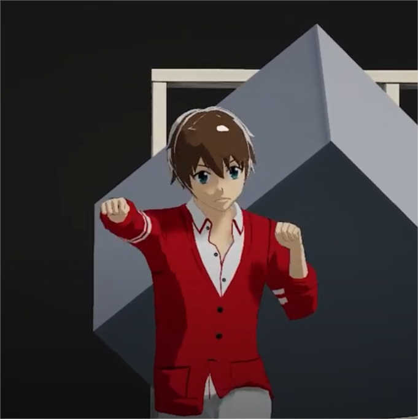

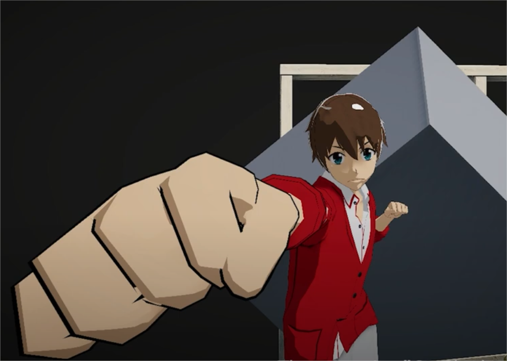

*↑Unity商店的Real Toon插件，可以按shader独立调整角色透视纵深效果。(插件开发者回复：尚未开发完成)*

 

 

#### 夸张闪现

动画中间帧，对于一些传统游戏就是正常做法，都是直接用差值来算，或者说也是动画师去做。但如果我们要做二次元，或者说有一点性格的动画，它的动画中间帧就有很多处理方式。这个是《爱，死亡和机器人》里的一段追逐戏，有种一闪而过的感觉。

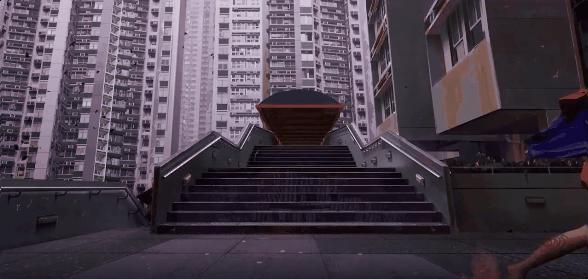

即使你看过这个片子，可能这一下过去你都没有意识到中间发生了什么，但是你能感觉到他的情感表达很强烈。

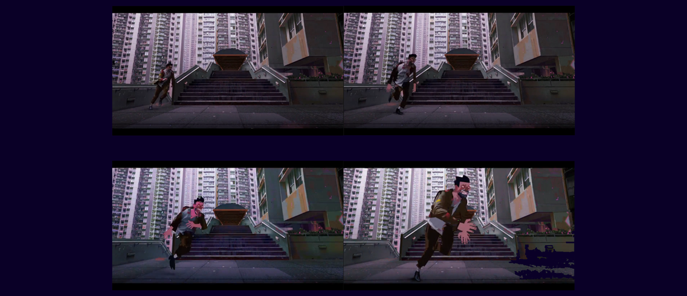

看这张图片，第一张还是正常状态，这个人在跑，但是他在追的时候非常着急，面目狰狞。这后面三张图都直接夸张化了，动画中间帧如果插入这种效果、一闪而过的话，表现力会非常强。但是用的时候，也要控制一些，因为它是一个整体调性的表达。

黑白闪跟刚才的动画中间帧蛮像的，黑白闪可以认为是整个镜头的一个中间帧，黑白闪的叫法是日本叫法，但用这个片段来跟大家讲更清楚一点。

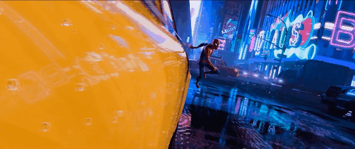

这是《蜘蛛侠：平行宇宙》中间的一段，比较明显，闪动的那一瞬间，它也是强化动作的夸张度。这个夸张度并不是说动作幅度有多大，而是说那一瞬间的情感表达要够强烈。

其实这个电影里用到了很多美漫的表达方式，美漫在处理强烈性格的时候会用一些比较潦草的线条表现，这个就被用到了电影中。

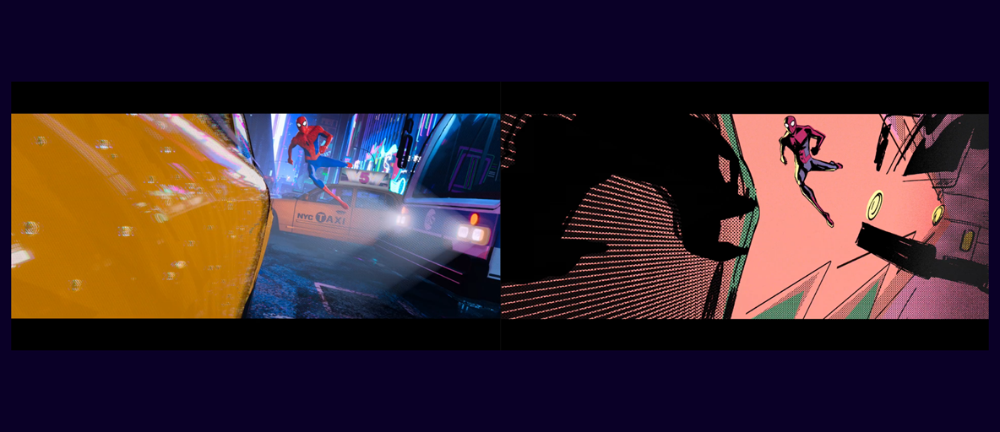

在《一人之下》中也用过，比如在龙虎山打斗时，下雨天突然有闪电出息，整个画面都变成了黑白，但这里的黑白可能就只有三四帧。那一瞬间，啪，一个黑白闪，那个味道马上就出来了。

以上效果会涉及到各种技术的综合运用。

 

 

#### 物理系统配合

看下闪暖引擎当中物理编辑的一个过程，物理制作过程当中常规的一些方法大家都很清楚，这里主要是胶囊体、碰撞体和弹簧这三个功能的改变。

胶囊体方面做了调整，可以分别改变两端的大小，这样可以更贴合人体。

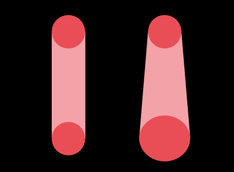

使用的碰撞体是虚拟的碰撞体，生成的方式是基于骨骼和顶点中间值，生产的一个虚拟的模型碰撞体，它的密度是根据骨骼的密度来判断的。

为什么这样做呢？考虑的是工作量的释放，通过引擎来实现的话，美术可以节省很大工作量。比如做一个碰撞体之后需要绑定，再导入引擎里面，看上去不起眼的工作量，但是如果有300套衣服的时候它就是一个非常大的工作量了，这么做增加的成本也不是很大，所以性价比非常高，也是比较科学的开发流程。

头发的骨骼，没有弹簧体的头发运动起来的话就会散乱的甩动，四处乱飞。对横向相邻的骨骼增加了弹簧体，对骨骼之间进行了约束，头发动起来效果就会自然很多。

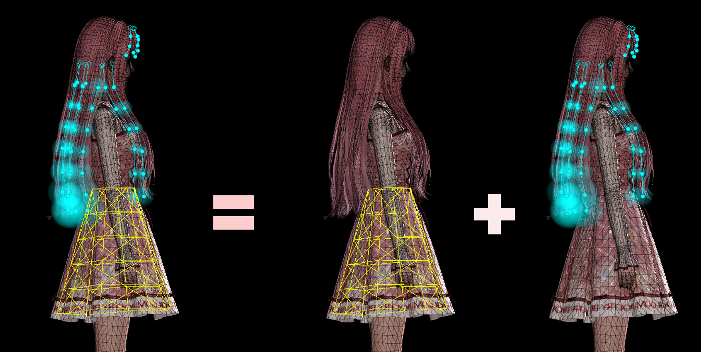

 

 

------

### 高性能人群动画

#### Imposter Animation

对大量的npc使用面片播放帧动画代替实际人物模型，而这些图片是由多个相机对3D模型预计算生成图集所得，实际游戏中根据视线角度和关键帧来显示子图。

又是一个能省下来计算量的做法，况且这些面片还可以合批。

不过用它做动画的问题在于每一帧就需要一张图，要保证精度，一张图至少得要512分辨率，一段动画少说都有5、6帧，这么多贴图放shader里难免对带宽有点吃力。

Imposter这种还是只做静物就行，大批量的房屋比较合适，比如远景LOD，在高视距大世界场景里可能很有用。

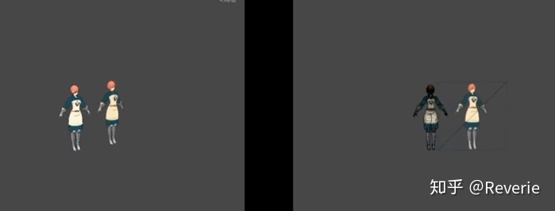

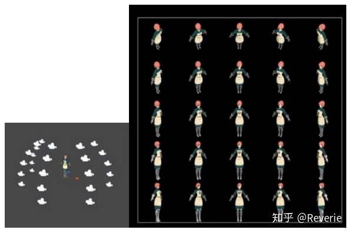

 

#### AnimMap

利用GPU视线大规模角色动画渲染，本质上是一种顶点动画，通过贴图记录下每个关键帧的顶点位置，比方说6*1024的贴图，6表示6个关键帧，1024记录1024个顶点的位置，结合GPUInstance，达到高性能且不错的表现，非常适合大批量路人、观众这种，可以弥补imposter的不足。

 

#### 过程化生成

为了表现大量随机群体动作，过程化生成是最高效的方式。

米哈游的实现方式是写一个crowdmanager过程化生成每个实例，观众席每个独立个体表现，由振幅、频率、颜色、位置偏移等随机参数来控制。

实际测试，数量从100到400到800，对于帧率并没有明显的变化。

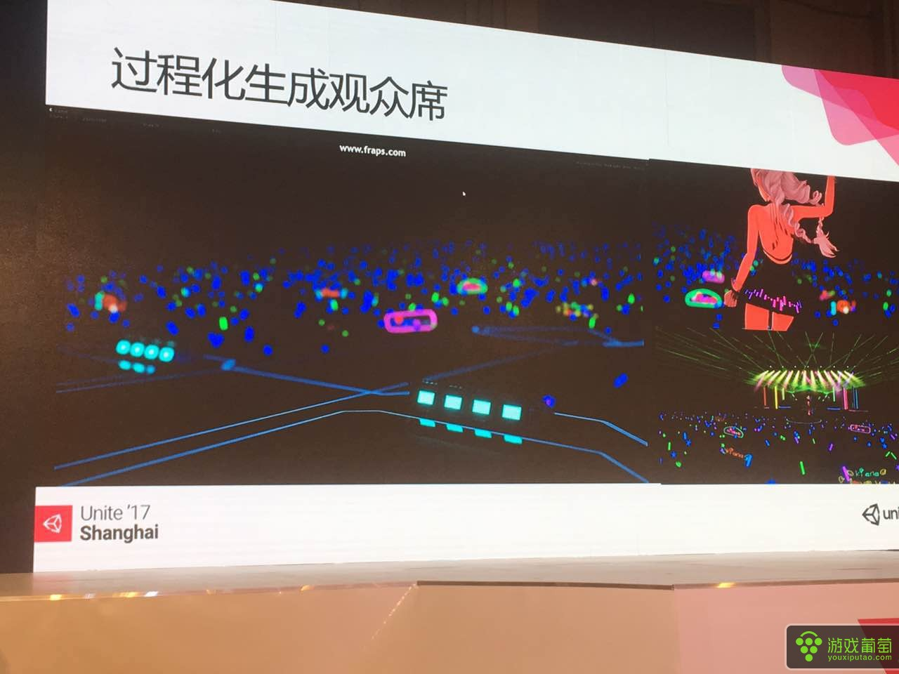

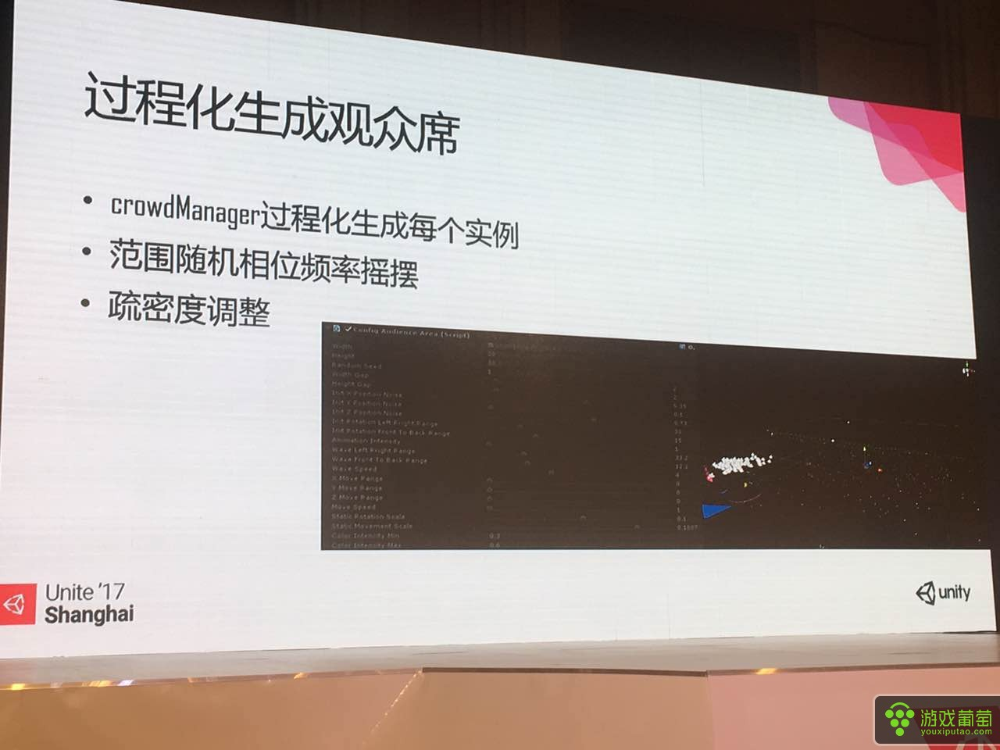

*↑米哈游这段MMD视频展示了有500个观众挥舞荧光棒的场面，效率有比较大的提升。*

 

 

------

