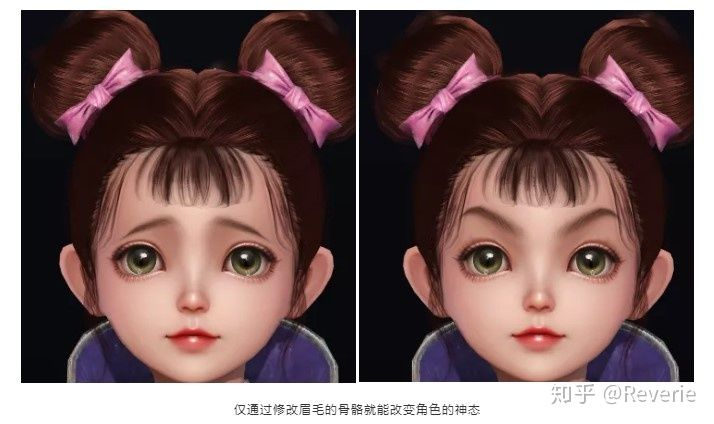
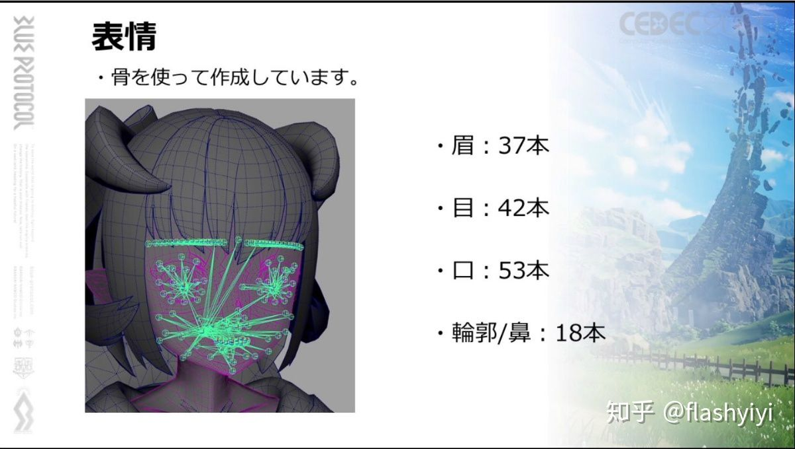
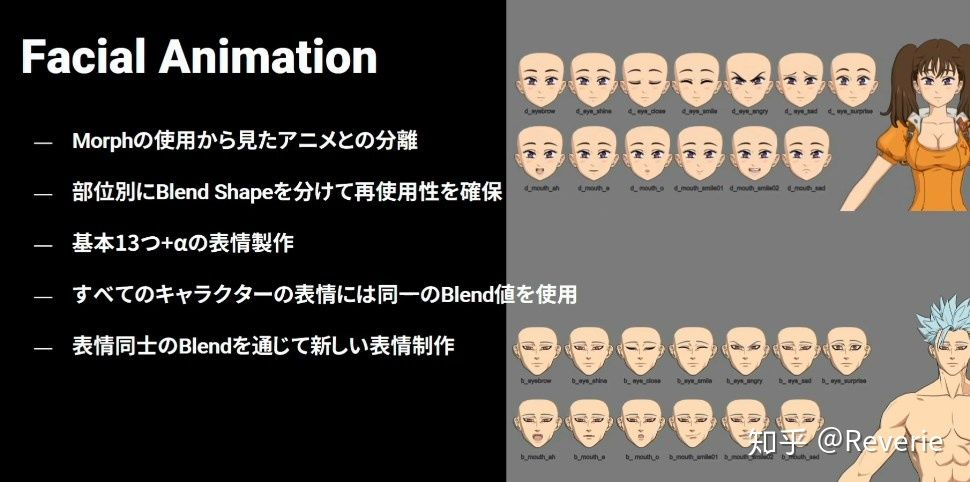
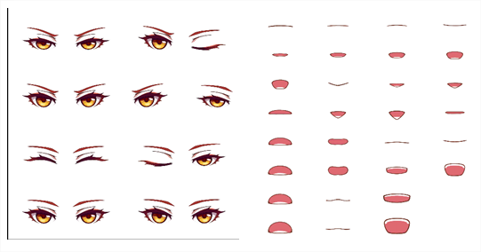
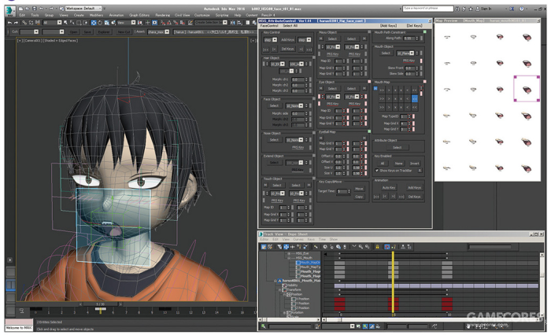
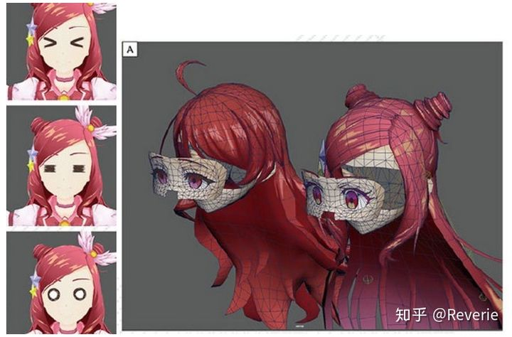
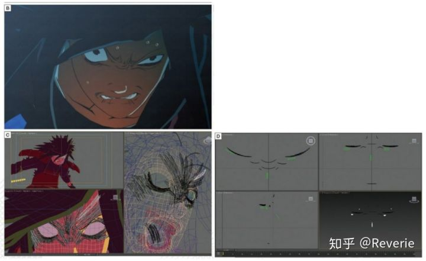
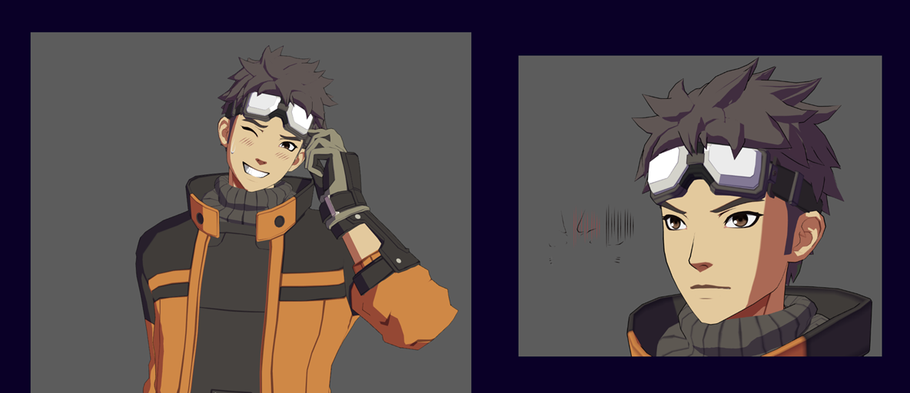
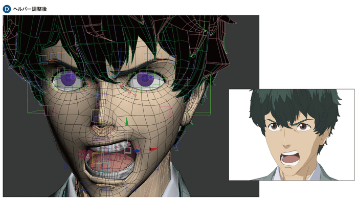

# Toon Shading Collection 

## CH15a - Facial Expression 表情动画

 

表情的制作要么就是改模型，要么就是改贴图。改模型的做法又可以分为blend shape（morph）和改骨骼。

 

------

### 表情方案分类

#### 骨骼表情

骨骼动画表情在非二次元游戏中常用，而二次元比较少见。可能是因为写实人物的五官差异比较小吧。

修改骨骼的变换信息，通过蒙皮来修改脸部模型，就性能上来说这种会好一点。

- 通用性较高，还适应捏脸
- 脸部主体顶点序列不变
- 方便做连续的表情动画
- 重要角色可能要单独处理表情
- 资源量比较少
- 可能需要过多的骨骼才能实现漫画式的夸张表情

蓝色协议的骨骼表情，骨骼特别多，应该是没有BlendShape做的快的，性能也很抱歉。估计只有在特写时才会开启，那样还行。

还有罪恶装备也采用了骨骼动画方案做表情。

 

#### Morph表情

Blend shape在CG制作动漫中非常常见，本质是修改网格顶点进行形变预先制作好一套表情组合，像是眨眼之间的表情切换可以通过顶点动画插值来实现。

目前可见的二次元游戏人物表情和口型都是用的blend shape而非骨骼，原因不明，毕竟blendshape几乎无复用的可能，而脸部还是存在不少需要建模的部分。可能是为了即使同一表情也要每个人订制不同细节？

又有大佬言，BlendShape其实也可以复用的，用SkinWarp一类可以让眉毛睫毛模型跟随脸部一起运动，而脸大家都一样的，组合也可以通过Mask。

有个叫vroid的软件，可以比较方便地生成和绘制二次元人物模型，生成后自带表情blendshape。如果能做个工具把表情这个过程参数化，最后输出blendshape作为结果，将能大大提升铺量的效率。

- 效果可控，夸张细腻的表情比较容易做
- 数量较少
- 模型前期要求高，后续修改较难
- 只能做成多个关键帧，做连续表情动画比较麻烦

 

#### 贴图表情

*↑崩坏3贴图表情*

如果对精度没有较高要求、数量也很有限的话，其实直接用贴图就是一种非常实惠的做法，例如>.<这些表情换张图就能很好搞定。贴图的局限性在于动态得通过帧动画的形式来做，数量较多的话还不如改模型。

贴图表情可以放在脸上附加的面片上，也可以直接在面部材质上采样第二层贴图混合。

*↑使用贴片的方法制作嘴巴和眼睛*

贴图表情算是业界老黄历了，现存的可能就是Q版角色或特殊简化表情会用这种方案。这年头为了质量还是要老老实实和写实渲染一样去搞，不要想着用切换图片精灵的方法来做表情。

 

 

------

### 特殊表情处理

#### 特定建模方案

如果需要表现出一些特殊的漫画中表情，就得考虑为眼睛和眉毛单独建模。

崩坏将眼睛部分的脸部做了单独建模，估计是为了方便在特殊表情（比如 X.X）的时候更换眼睛模型。但也可以试试，与其这样将blendshape撕裂开两部分，倒不如在特殊表情的时候直接把一个单独模型盖在原来的眼睛上面（原模型这部分下陷避免穿帮），这样不影响默认表情，想换哪就换哪也更加自由。

还特殊一点的：颜艺。丰富表情导致的形状扭曲，如果用3D模型来表现这种效果，这需要非常细致的骨骼绑定才会还原得比较好。而且光影计算已经救不了了，需要另外用贴图或模型块面来制作。像是褶皱和嘴巴三角阴影，将一些常用小物件（汗、#）放在贴图中，在动画每帧中间插进去。国内基本不会做到这么细致。

比较含蓄也适用，脸上滴一滴汗、一头黑线、有点小红晕，都是可以做表情线的。

这张图左边就是表现出来的效果，看右边那个不起眼的几条线，有红线、有黑线，其实还有一些面部皮肤颜色的线，这个还挺重要的。这个线可以放大，把它放在屏幕周围，它就变成了速度线。 

仔细看他的左边咧开的嘴角，嘴角的线其实也是用线摆上去的。用3D模拟的时候，它不可能在所有视角看起来都是那么的自然，我们就需要有一些工具修补瑕疵，比如咧开嘴以后嘴巴边缘会缺少一些黑色区域来跟他的白色牙齿做区分，只能用这种方式去弥补它。

 

#### 非对称性变形

如果要表现一个角色丰富的情感，强调面部表情的非对称性是非常重要的，不然看起来会非常的不自然，这也是许多国内游戏或动画制作者的通病。这种调节，在日本动画中一般是作画监督来把控的。

*↑非对称性调整后，表情更加自然、生动*

 

 

------

### 综合规划示例

米哈游MMD动画使用Blendshape来制作面部表情。 眼睛、嘴巴和眉毛的表情独立为不同的部件单独制作，然后通过自定义面部表情插件，来实现表情动画的及语音嘴型的自动映射。此外，还会通过预定义不同的表情集合来在交互应用中驱动面部表情。

 

 

------

 

 

------

 

 

------

