# Toon Shading Collection 

## CH15b- Fit FOV 视角适应

<br>

关于角色动画，有一些值得注意的优化点。

<br>

------

### 视场(Field of View)

先来解释一下视场，视场即FOV，在摄影中指相机可以接收影像的角度范围，也可以称为视野。

（由于显示比例的原因，FOV在水平与垂直方向上的数值不同，以下未作说明的情况下默认为水平FOV。）

FOV越大视野越宽，透视的变形就越大，下图可以很好的展示这种特征。

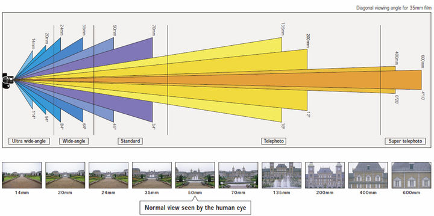

人眼的水平视场的范围，±30°是中央视野区域，±60°是双眼水平视场。所以游戏中的FOV也遵循这个规则，能够修改的范围通常都在60 - 120之间。

而FOV的高低会很大程度上的会影响角色表现，特别是特写时的面部区域。卡通角色更适用于在较低的FOV中表现效果，而第三人称视角中通常使用到的FOV数值要远大于适合卡通表现的FOV。

很多卡通角色的模型在制作时面部正面会选择做扁，一部分原因就是为了抵消高FOV带来的面部轮廓变形。

<br>

<br>

------

### 卡通脸部制作特征

<br>

卡通角色为了画面表现的常常会有夸张的形变，同时也有上述FOV的问题，所以在卡通角色头部时会有不同于写实角色头部的制作技巧。

说到底动画人物的脸在三维上是不成立的。“夸张”和“省略”提升了角色的表现力，不如说，很多情况下不成立的部分正是魅力所在。

动漫风格的脸 = 极端和“超现实”的变形。因此，很难将其完全还原为立体形象。应当认清无法还原是不可避免的，使用变形器或骨骼修正是比较现实的方式。不过在模型层面上尽可能的接近理想的外观，能做的事情有很多。

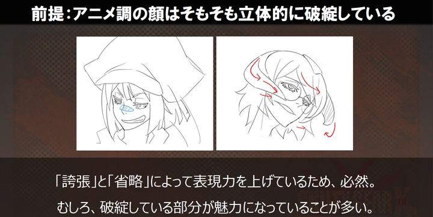

这种方式的逻辑是，在正面与侧面上还原外观都是可行的，但是如果想要各个方向的外观都成立，难度就瞬间飙升。所以就不能继续使用三视图的制作方式了，这里非常考验模型师的能力。而斜面是展示频率最高的角度，真正使用到正面与侧面的构图反而是很少的。另外也有很多从正面与侧面看不出来的表现点。并且作为中间角度的斜面脸型成立的话，正面与侧面之间的其他角度也很容易成立。

「让斜脸造型成立 = 打造有立体感的脸，兼顾动画变形与立体感的脸才能最大程度的减少违和感」

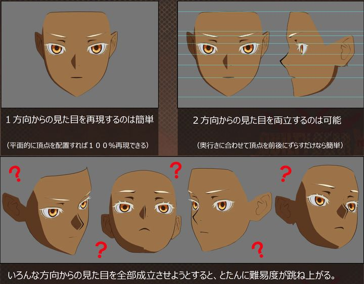

<br>

#### 斜脸时制作的注意点

1. 脸颊的线条（粉紫线）
2. 嘴部的收缩（蓝线）
3. 眉眼的立体感（黄线）
4. 下巴的线条（绿线）

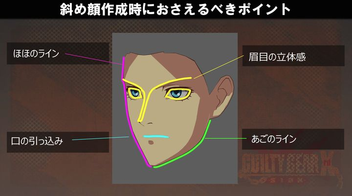

<br>

- ##### 脸颊的线条

正面和侧面看不到的线条，很大程度上决定了角色尖锐、柔软、粗略的印象，可以看作制作美型、美少女角色时候的生命线。

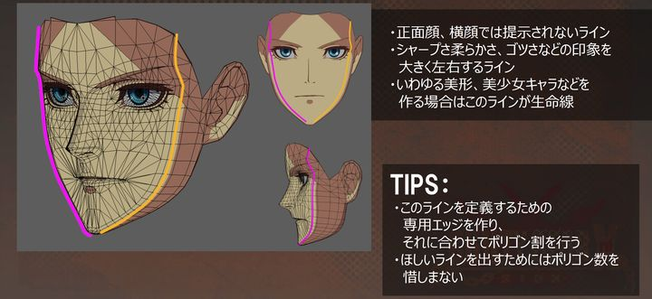

<br>

- ##### 嘴部的收缩

动画中常见的情况，在斜脸的时候把嘴部画的偏后，可以使用变形或骨骼修正，不过在模型阶段也能做一些努力。将嘴角向后收缩，可以一定程度表现出这种纵深感。（这几年二次元画风更加丰富了，有些更加贴近写实，并不倾向于在半侧面时把嘴靠后画，所以看情况而定。）

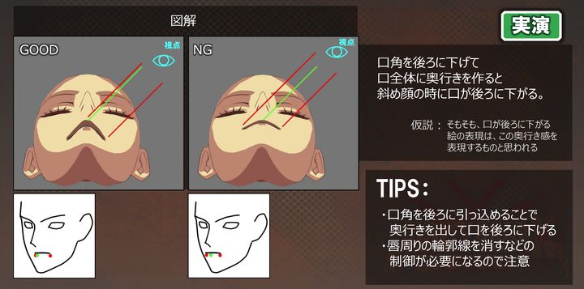

<br>

- ##### 眉眼的立体感

人们常说的眉清目秀的重要要素，特别是眼睛周围容易吸引视线，即使有一点错误也容易产生违和感。

眼角到眉间的高度落差就是所谓的周边深度，虽然容易被”额头是平的“先入为主的观念影响，但只有中间的部分才是平坦的。越靠近脸中间，额头与眼睛的落差是越深的。（这里的意思应该是，眼角区域与眉间的落差是很大的）

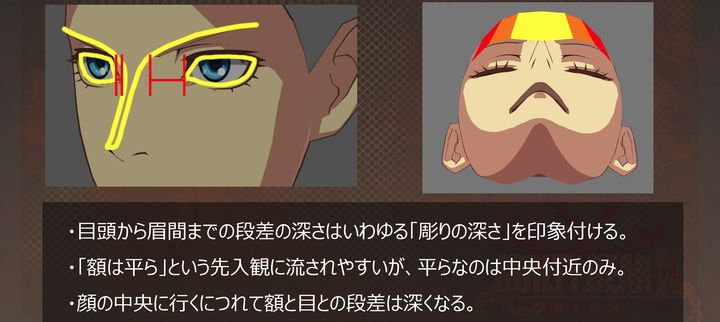

动画中，通常会夸张两个眼睛之间的宽度差距，以此来营造立体感。把眼睛整部分倾斜，会在侧面获得一个还不错的效果，但是在其他方向上会导致各种问题。所以只让眼角向后倾斜，既可以获得立体感，得到侧面两个眼睛之间具有比较大宽度差距的效果，也能不影响其他角度的面部形态。

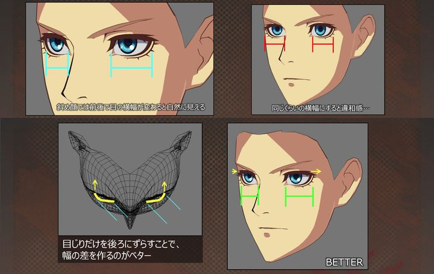

<br>

- ##### 下巴的线条

和脸颊的线条一起形成了面部的轮廓，和脸颊的线条一样很大程度上也左右着尖锐、生硬等形象。

在制作中的一个常见问题，模型的正面与侧面是符合三视图特征的，但是在斜面就会显得脸横向拉长。

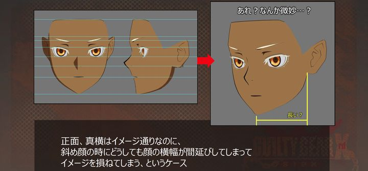

解决这个问题的方式不是压平面部减少横向宽度，而是要向内收窄下巴轮廓，这样就可以在不改变正面脸和侧脸的外观的情况下，调整斜脸的面部轮廓。

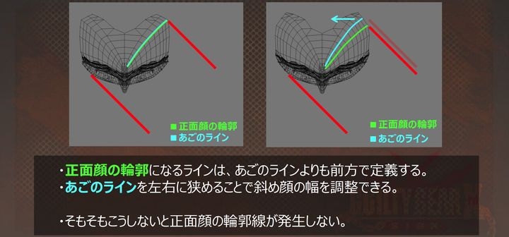

<br>

#### 总结

既然以“超越现实的表现”为目标，一定程度的违和就不可避免。通过变形器或骨骼变形的目前最好的方式。但是通过模型制作时的努力可以在一定程度上缓解。重点在于变形与立体感的兼容性，在不影响变形效果的范围内，在立体感上下功夫。

<br>

<br>

------

### 基于视角的面部形态修正

只靠模型制作是很难达到理想效果的，这个时候就需要辅助手段，根据视角去修正面部形态，保证面部在镜头中的形态是好看的。为了某个相机角度的视觉美观，甚至可以专门调整五官到物理错误的位置。可以使用BS或骨骼根据摄像机位置混合对应的变形。变形方式也可以有多种。

也算是赛璐璐方面的一些优势。它的Mesh已经夸张到非常奇怪了，但是它的2D表现还是非常好的。这就说明赛璐璐风格虽然抹掉了色阶，但是其实它也忽略了Mesh的物理结构。我们可以通过一些非常夸张的Mesh在一些镜头下做出好看的2D效果，它会更接近于我们2D手绘的效果。

#### 局部变形微调

下图是罪恶装备角色一击必杀的剧情场景。一开始，制作的是从哪个方向看都说得过去的外表一样的表情，初期印象的设定图不同表现的地方很多。因此，驱动Rig，调整目鼻口的位置和角度。因为追求从摄像机里看的印象是要一样的，实现了角色有效果的演出。

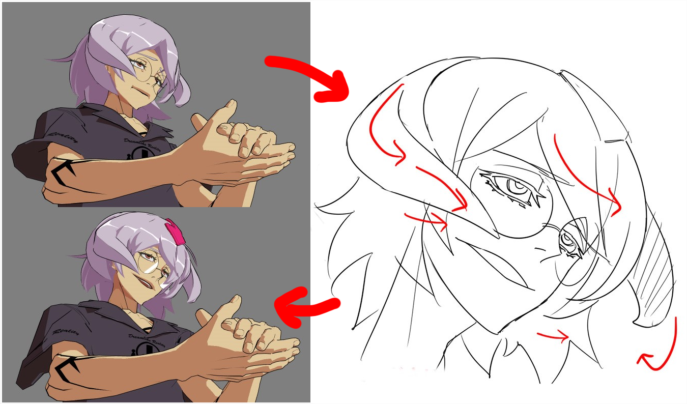

如果是自由的摄像机角度，还可以考虑使用Blend Shape或其他方法事先把模型在各个摄像机角度的变形调节好，然后再通过实时运算来对齐效果。

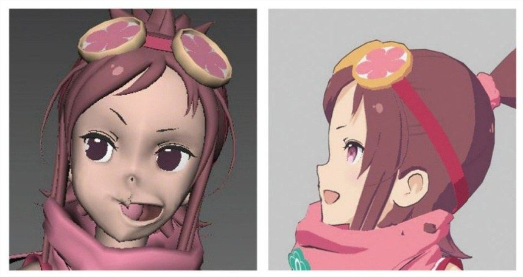

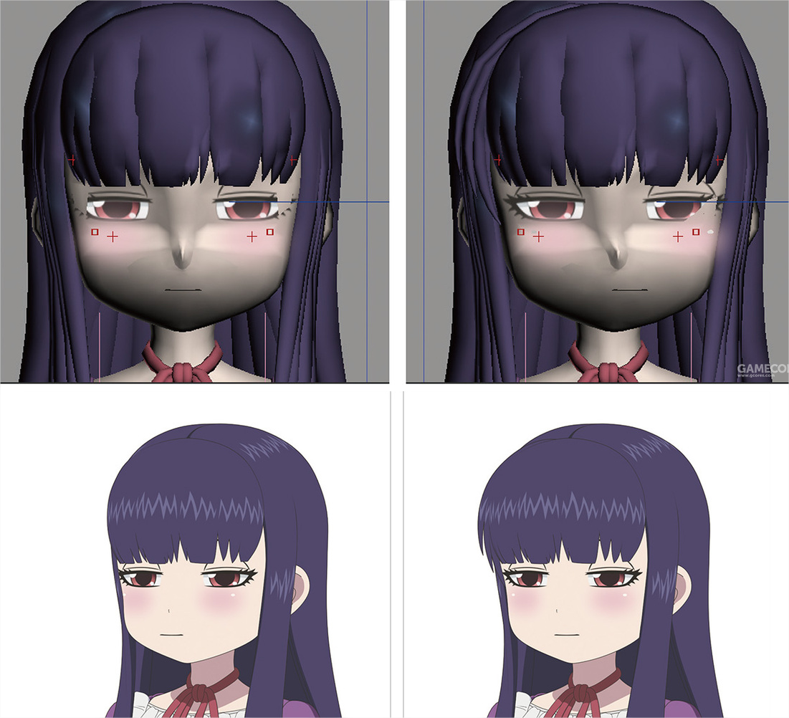

*↑扭曲修正前后对比*


*↑动态效果展示*

<br>

贴片制作的五官会导致侧面会穿帮。许多游戏是使用贴片的方式来绘制五官的，这也需要对不同角度的五官面片进行换图和扭曲操作。

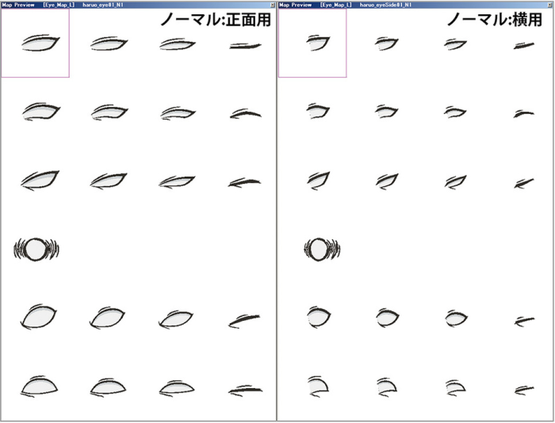

*↑同一个状态下的正面图和侧面图对比*

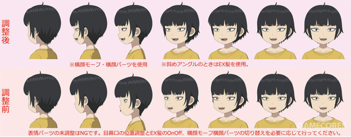

*↑通过位移扭曲和换图来修正效果*

<br>

#### 头部整体压扁

由于建模时经常处于平行视角，切换到引擎内透视视角时容易有明显的脸部凸出问题，前后差异感在卡通风格角色上会特别明显。对此，也有根据视角动态压扁头部的做法，本质上是对低FOV的模拟。

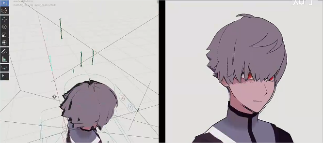

*↑无任何处理，脸部中心凸出*

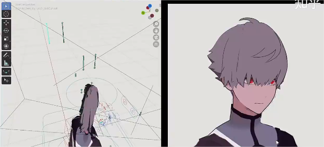

*↑压扁头部处理，不过似乎鼻子的深度勾边损失了*

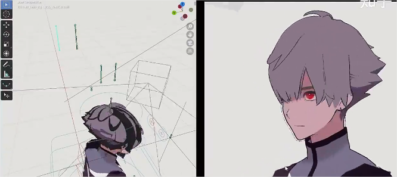

*↑压扁头部处理，另一个角度*

<br>

#### 纯2D思路

已经超出3D建模范畴的[Live2D的做法](https://www.bilibili.com/video/BV17x411m79t?from=search&seid=16718950334246774402)参考，360°都照顾到了，只是不清楚做起来有多麻烦，另外可能不兼容动态光影：

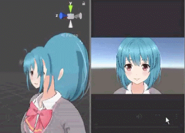

<br>

<br>

------

### 整体矩阵透视修正

<br>

参考原神的编队界面，当同屏幕出现多个角色时，处于相机外侧的角色会出现明显的变形，即便相机在fov 40度情况下，也会很明显。 读者肯定想到了说要用正交投影，但是正交投影，角色会完全失去透视关系，尤其注意角色的鞋会发现后边的跑到前边，因为透视关系丢失了，而这并不是美术想要的，美术还是希望有透视关系。说白了也就是美术希望站在外侧的角色效果也能和屏幕中间的那个一样，没有出现透视的影响。

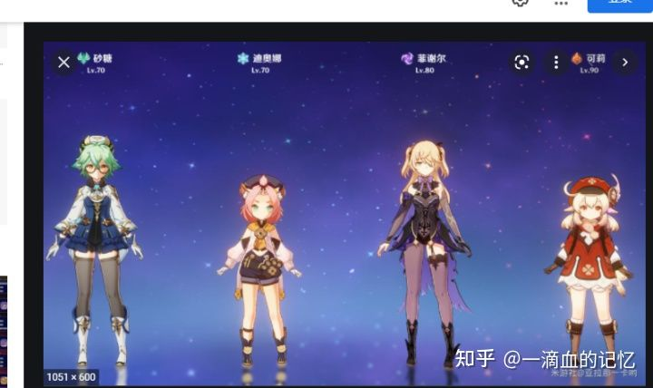

一套实现思路，将透视矩阵的前两行的X和Y偏移值改为固定值，可能就是由于这两个值和fov透视有关系，才导致的近大远小的结果，才导致外侧的角色看起来透视明显的原因。

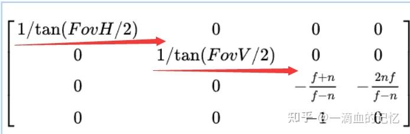

Unity中代码实现：

```glsl
half _ShiftX;//可以C#传入进去，在X方向上的偏移，由美术调节
half _ShiftY;//可以C#传入进去，在Y方向上的偏移，由美术调节

v2f vert (appdata v)
{
	v2f o;

	float4 positionVS = mul(UNITY_MATRIX_MV, v.vertex);
	float4x4 PMatrix = UNITY_MATRIX_P;
	PMatrix[0][2] = _ShiftX;
	PMatrix[1][2] = _ShiftY;
	o.pos = mul(PMatrix, positionVS);
}

```

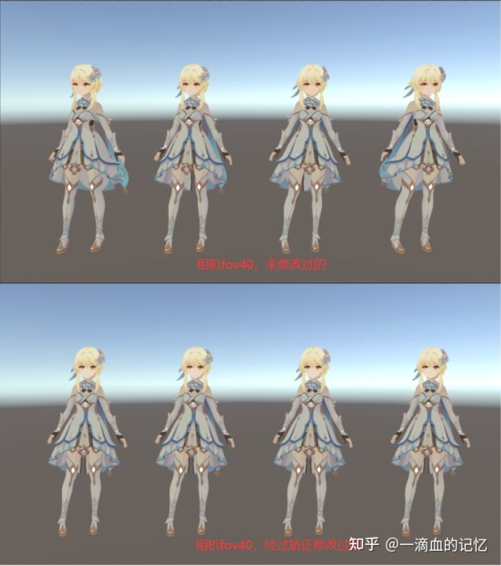

<br>

<br>

------

### FOV最佳角色表现参考区间

<br>

早期闪暖在开发镜头的时候也遇到过瓶颈，就是在选择镜头蓝本的时候。大家知道《闪耀暖暖》是个竖屏游戏，而且也是一个决定版的选人界面，所以找了很多游戏的选人界面来参考，但是大部分游戏没有借鉴价值，因为很多游戏都是横屏的。

调整了下思路，换个领域，并带着全身、半身、面部、好看这四个问题去寻求方案。很快就分析出了方向——发现杂志和人物海报都可以满足上面这四个要求。所以找了摄影的朋友，了解拍摄这些素材时会用到的技巧，很快就从这些经验中提取到了很多有价值的东西。

镜头比较关注两个点，一个是对焦点，一个是FOV。

全身的镜头，FOV在25°到30°之间。半身的镜头，FOV大概是22°到25°之间。面部的效果，FOV大概是18°到20°之间。

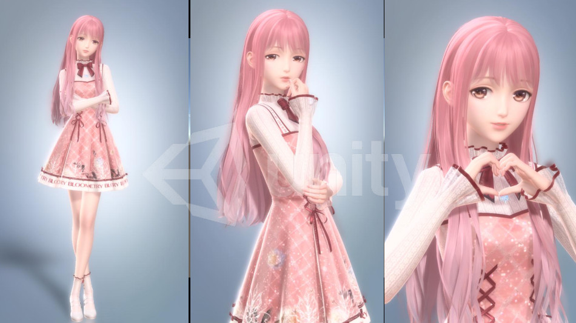

<br>

<br>


<br>

<br>

------


