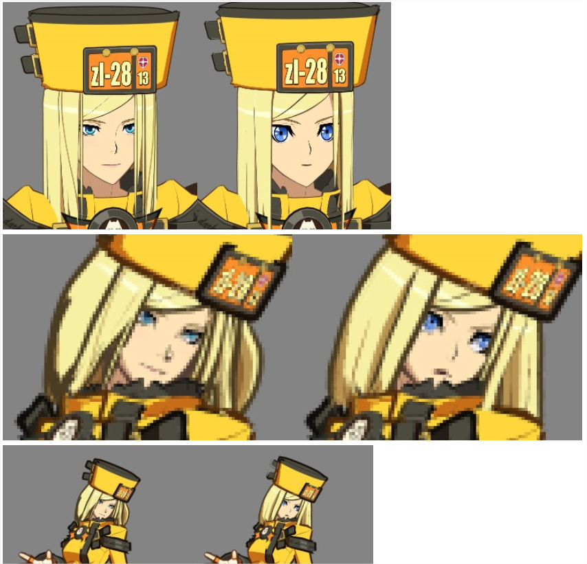
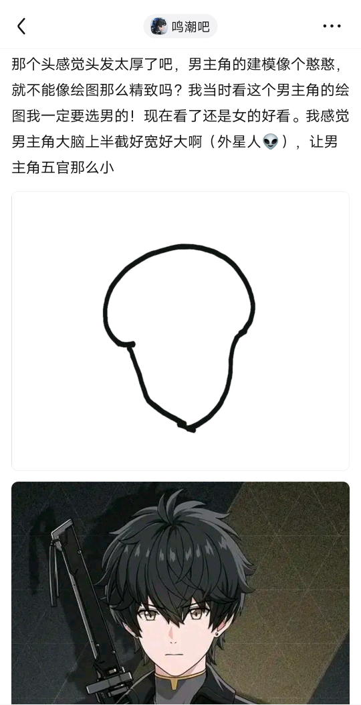
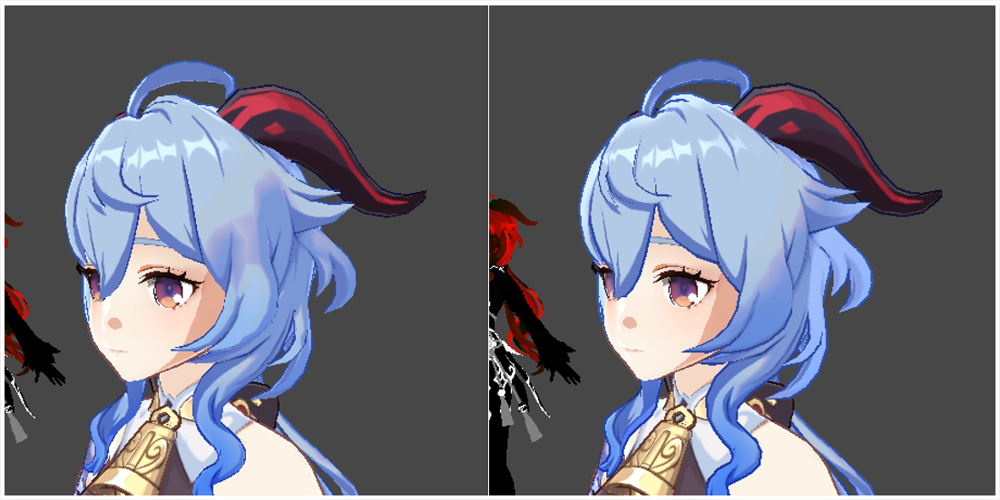
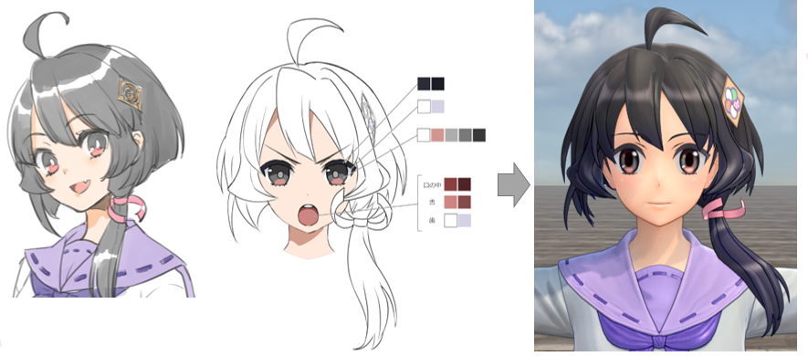

# Toon Shading Collection 

## CH16 - Character Modeling 建模要点

 

暂时随手记一些建模要注意的地方。

 

------

### 渲染影响角色设计语言

卡通风格的贴图里，其实很多元素本质都是一种边缘信息。跟勾边一样，缩小了就混在一起变成某种不明所以的东西，只会成为一片模糊。

而游戏里，你在高清大小下画多好都没意义，缩小了效果其实很差。

所以，和插画不同，游戏模型一般会要求人物使用尽量简单的设计，而不是像插画那样要求尽量多的细节，因为人物在游戏里往往是没有立绘插画那么大的。这样缩小后才能看到基本的边缘细节，而不是让细节全部糊掉。

所以通常也会限制人物在画面里的缩放范围。

赛璐璐的好处也就在这里。赛璐璐在缩放的时候兼容性是很强的。

但是卡通渲染的3D角色依然需要考虑到设计元素的造型和缩放。

 

 

------

### 远近不同模

*↑有意图的把眼睛变的很大的情况*

卡通角色占屏幕面积很小时，五官变得过于的细小，角色的个性和表情变得很难表现的好。

战斗远景用的3D模型，要强调角色的表情、角色的服装和饰品这种有象征性部分的细节，建议把近景用的3D模型和造型进行改变。

算是卡通渲染专用LOD方案。罪恶装备是专门给头部使用不同的建模。

这是横板战斗游戏常用的手段，开放视角的3D游戏倒没咋听说过这种处理，不过其实也因为大部分二次元游戏都是大眼睛画风吧。

 

 

------

### 头型发型相关

二次元头顶普遍尖一点，整体轮廓是鸡蛋型。不知道为啥俺们厂美术同事就喜欢把头做成灯泡型，显得头顶头发过于膨胀。

去年写本文的时候没有找到合适的图（有工作图但不该发），今年终于给我找到了，玩家简笔画归纳得简直跟我之前上班画的分析图一模一样。实在没想到某厂已经做过十分成功的二游竟然还犯这种低级错误，建模师是新来的？

 

头发比较建议主体映射成球形法线，试了下自动计算法线，果然比较难看。

*↑左自动平滑法线，右球面法线*

还有一些比较小的点，比如每一个头发的下缘都有一个小切角。如果这个角色从正面打光，你必须要给这个头发的底部一个暗部，否则头发就会像一个薄薄的纸片贴在头上。有了这种小切角，就可以给它人为做一个假光影，因为我们默认这个角色不会经常做一些倒立、或者奇怪的光影姿势，90%的状态都是站在那儿看着你。它这个光影在正常状态下，都会有一个看起来比较自然的明暗关系。

 

 

------

### 原画和建模的一致性

新樱花大战为什么可以把这么萌的妹纸设计稿改得那么丑那么土？！

这个原画明显接近原神风格，如果直接按原神标准来建模，最终效果的萌度绝对可以吹爆。

为了3D画风统一（为久保带人画风）而抛弃美感，这合理吗？！

 

 

------

 

 

------

 

 

------

