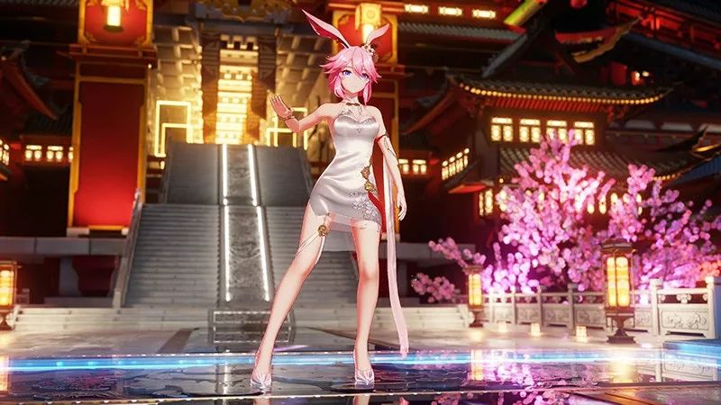
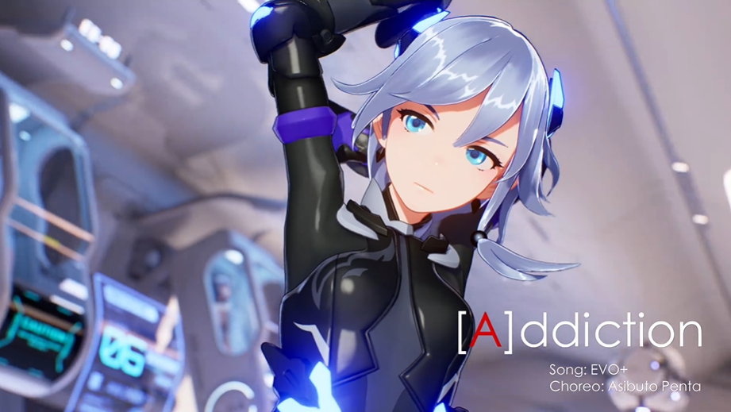
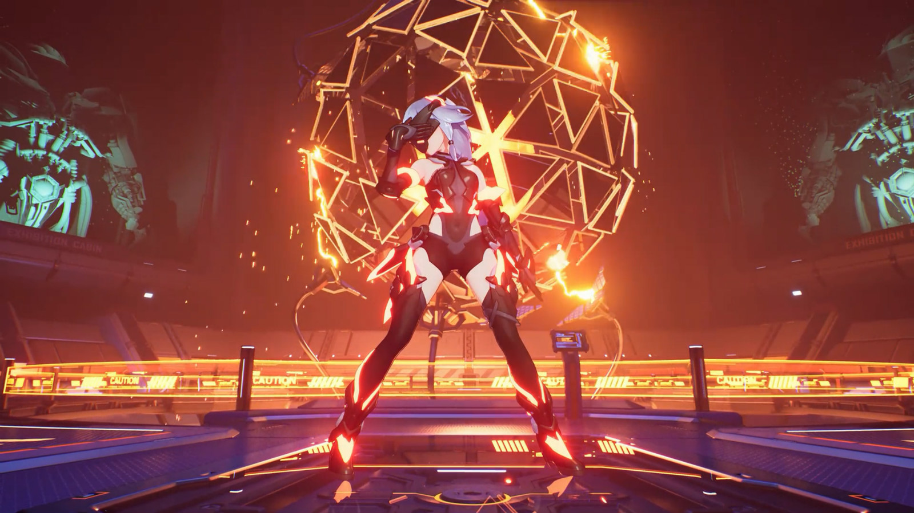
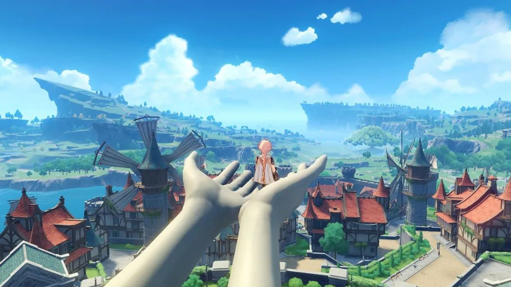

# Toon Shading Collection 

## CH17 - Pipeline 管线优化

 

主要是看下米哈游的理解。

 

------

### Unity HDRP

在Unity的默认管线下，我们无法灵活控制很多渲染——例如：Camera depth texture、Camera depth normal texture、Camera motion vector texture等，这些Screen space textures通常是由Unity使用Replacement shader来渲染的，对用户来说几乎是完全黑盒的。

为了实现风格化的卡通渲染，我们需要高度定制化这些纹理的渲染。

角色渲染需要使用额外的Pass来实现描边效果，而Replacement shader无法支持多pass渲染，这使得很多屏幕特效在描边处会有问题，例如DOF、TAA、SSAO等。

尤其是，描边区域对TAA的质量有很大影响，为了为描边区域渲染正确的Motion vector，我们需要拿到前一帧Skinned mesh的normal、tangent等数据。如果使用了ABC格式的网格或者对偶四元数，我们甚至需要更多的数据。

我们无法在Unity的默认管线下方便地拿到这些数据。但是在HDRP高清晰渲染管线下，我们可以通过自定义的Lightmode和Shader来完全控制这些纹理的渲染，极大地方便了我们的开发。

此外，HDRP高清晰渲染管线让我们可以在场景中使用大量实时光源，Hybrid Deferred & Forward rendering大大增加了渲染的灵活性。得益于Tile & cluster lighting，即便是需要使用forward rendering的物体，也可以高效地使用大量实时光进行渲染。

SSR和SSAO等一些屏幕后处理效果，在HDRP高清晰渲染管线下可以同时正确地应用于Deferred和Forward rendering上。而在Unity的默认渲染管线中，这些效果对Forward rendering都很不友好。

灵活的渲染管线可以让我们高度定制许多风格化效果，例如风格化的Lighting、雾效、Decal system等。

总体而言，原先Unity默认的渲染管线由于高度封装性给渲染开发造成了很多障碍，使得很多效果的高效实现变得束手束脚，甚至无法实现。

新的HDRP高清晰渲染管线使用了更加先进和通用的渲染架构，给了开发人员极大的自由度和开放性，这对于实现高品质的游戏或影视渲染都是至关重要的。

尽管目前HDRP仍有很多底层渲染是黑盒的，很多渲染API也仍未开放，功能也尚未完全稳定，但我们相信对于有能力的开发团队来说，HDRP高清晰渲染管线绝对是未来Unity下高品质渲染的最佳选择。

 

 

------

### Unreal4

此次，米哈游使用了Unreal引擎来探索次世代卡通渲染的各种技术。据了解，他们这次还尝试在全局光照、反射、阴影等各种功能上引入光线追踪技术，并深度整合了基于次世代卡通的渲染风格，同时做到了实时运行。

场景中大量光滑表面都运用了反射效果，而人物运动后地面也会呈现出对应的反射效果。

人物面部能看到明显的动态阴影。

同样，还能看到多种静态光源、反射光、体积光、动态光源同时出现的复杂环境。

主要在光线追踪方面，验证了光线追踪技术在游戏实时渲染和高品质CG渲染方面应用的可行性。由于这次没有使用任何预烘培光照，场景制作流程上有极大加速。

我们重写了引擎现有光追的全局光照(GI)及反射(Reflection)的算法，在降噪和GPU利用率上都有较大提升。并且实现了SSGI，RTGI，SSR和RT反射混合使用的选项，使得实时渲染的性能有较大提升。

最终通过设置不同的光追参数基本可以做到实时1080p 50fps及4K下每秒4张的高精度CG渲染。

光线追踪技术与次世代卡通渲染的整合难度还是有的，需要修改光追模型才能实现。场景要能采样到角色渲染，需要在光追的光照模型中添加我们自己的卡通渲染信息。

另外角色本身也要体现出光追带来的GI，AO和反射的影响。由于卡通渲染对于色彩和细节质感构成方面要求比较多，这方面我们针对卡通渲染对光追的实现加入较多的定制化处理。

之前三部的光照都依赖于预先烘培，较难做出动态的全局光照变化，且制作过程迭代较为繁琐。这次对于光追的尝试验证了光线追踪技术在卡通渲染游戏和实时CG渲染领域应用的潜力。

 

 

------

### 技术取舍

取舍的核心，就是我们在有限的资源下面，如何更好地去提升游戏的品质，毕竟当时时间人力限制都大，不过即便时间和人力充足了，你始终会追求更高的品质，想做更好的东西。所以实际开发还是需要取舍。

一个比较新的例子是，PS5的光线追踪和SSD特性是大家比较关注的地方。做PS5版时，我们希望玩家尽快玩到原生PS5版《原神》，这个前提下，我们认为光线追踪如果要做，确实能对光影产生改变，但对于《原神》这个风格的游戏，一定要让技术融合到美术风格里。

如果仅仅把光追做出来，当成炫技放到游戏里，鉴于《原神》的美术风格以及我们需要投入的资源来看，很难在短期内对游戏品质做到比较大的提升。所以我们会很慎重地对待光影的改造，会反复跟美术磨合来决定如何做。尤其是对场景复杂的部分，这个迭代的时间会更长。因此我们决定不急于实现光线跟踪，而是把有限的资源投入在性价比更高的地方。

相比之下，在资源有限的情况下，用定制化文件加载系统能更好地发挥SSD性能，能够提供更好的游戏体验，那就值得优先做。

什么情况下会挑战技术的上限和新的技术点？一个上线的项目，最高优先级一是提高游戏稳定性和性能表现，另一个是给玩家更多的内容、提高游戏可玩性。所以在考虑问题的时候，这两点都会作为前提，摆在很重要的位置，这个基础上要加什么东西，就看各个团队的需求，如果有就走流程去实现。

 

 

------

### 经典方案

罪恶装备：

Rendering(渲染)方式是一般的Forward（前渲染），没有使用近些年流行的Deferred(延迟渲染)的方式。Deferred是处理大量光源时有效的手法，但Anime调的"2D风格"是不需要的。

但是，为了提前Culling的Zbuffer Rendering（※Z-Prepass。先得到深度值）是有实行的。总之，所有的3D模型对应的几何体渲染(Geometry Rendring)最少也要运行2次。而且，对角色来说，为了附加上Anime风格的轮廓线，还要追加一次几何体渲染。

1个场景大约总的Texture容量是160MB以下，1个场景大概的Shader Program总数，Vertex Shader60~70个左右，Pixel Shader70~80个左右。

 

 

------

